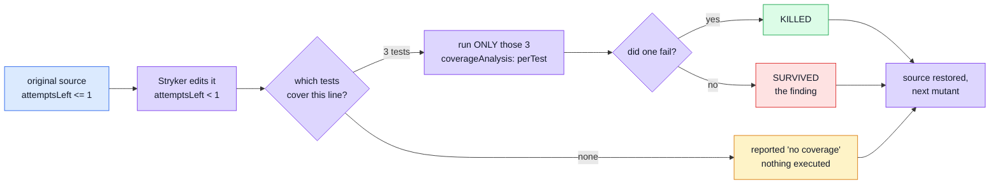
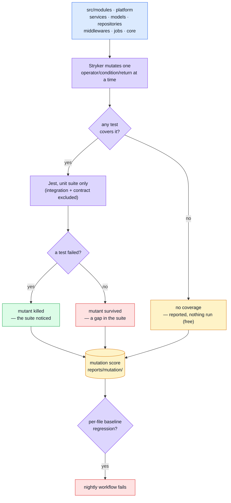
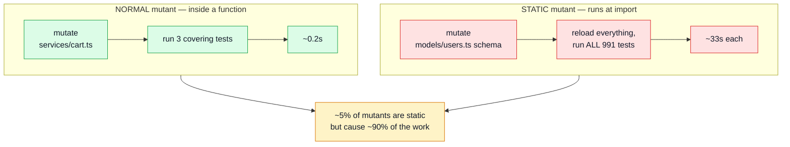
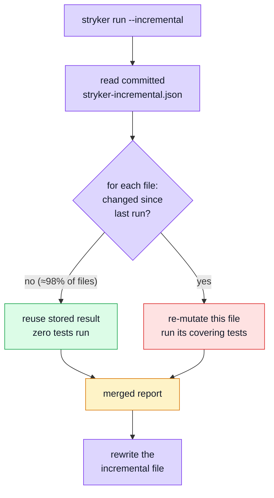
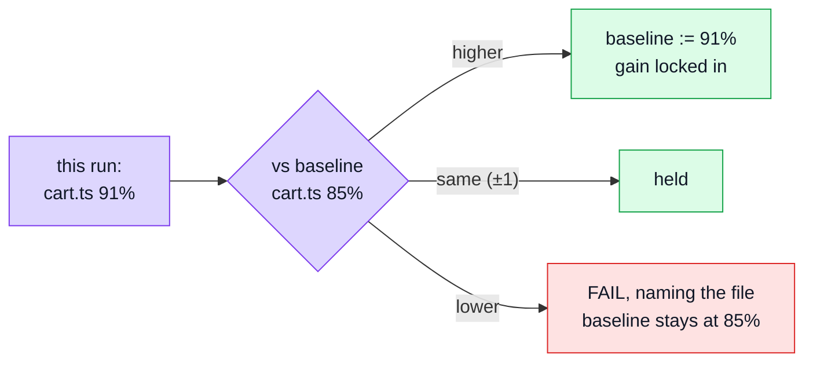

# Mutation Testing

Every other layer on this site answers "does the code do the right thing?" This one answers a different question: **do the _tests_ actually notice when it doesn't?** Line coverage can be satisfied by executing a line without asserting anything about its result; mutation testing can't — it edits the source thousands of times (`>` to `>=`, `&&` to `||`, a function body emptied out) and reports every edit the suite failed to catch. A **surviving mutant** is a bug the tests are structurally blind to.

## Glossary

Read this first. The rest of the page uses these words precisely, and several of them mean something narrower than they sound.

| Term                   | What it means here                                                                                                                                                                                                                                                                       |
| ---------------------- | ---------------------------------------------------------------------------------------------------------------------------------------------------------------------------------------------------------------------------------------------------------------------------------------- |
| **Mutant**             | One deliberate edit to one place in the source. `a > b` becomes `a >= b`. Stryker makes thousands, one at a time. See [What a mutant actually is](#what-a-mutant-actually-is).                                                                                                           |
| **Killed**             | At least one test failed when the mutant was active. Good — the suite noticed.                                                                                                                                                                                                           |
| **Survived**           | Every test still passed with broken code. **This is the finding.** It means no assertion anywhere depends on that behaviour.                                                                                                                                                             |
| **No coverage**        | No test executes that code at all, so Stryker doesn't even run anything — it reports the mutant immediately. Different from "survived": survived means tested-but-not-asserted, no-coverage means not-tested. **Costs nothing**, which is why untested files are cheap to keep in scope. |
| **Timeout**            | The mutant made the suite hang (a mutated loop condition, typically). Counted as **killed** — the suite did notice, just expensively.                                                                                                                                                    |
| **Mutation score**     | Killed ÷ (all viable mutants). Reported twice: over _everything_, and over _covered code only_. The gap between the two is the size of the untested surface.                                                                                                                             |
| **`break` threshold**  | The score below which the run fails. A backstop for "has this collapsed", not a target.                                                                                                                                                                                                  |
| **Baseline / ratchet** | `mutation-baseline.json` records what **each file** scored. Improvements are written back, regressions fail. See [The per-file ratchet](#the-per-file-ratchet).                                                                                                                          |
| **Nightly**            | A GitHub Actions workflow on a `cron` schedule (03:00 UTC) rather than on push. Nothing waits for it; it reports the next morning. Mutation lives here because a run takes minutes-to-hours.                                                                                             |
| **Concurrency**        | How many mutants Stryker tests **in parallel**. Each one is a separate OS process running a full test runner _and its own in-memory mongod_, so the limit is memory, not CPU cores.                                                                                                      |
| **`coverageAnalysis`** | Set to `perTest`: Stryker first records which tests touch which code, then runs **only the covering tests** for each mutant instead of the whole suite. This is the main reason a run is minutes and not days — except for static mutants, below.                                        |
| **Static mutant**      | A mutant in code that runs when the file is **imported**, not when a test calls it — a `new Schema({...})`, a repository built at module scope, a config object. See [Why a run is slow](#why-a-run-is-slow-static-mutants); it is the single biggest cost in this repo.                 |
| **Incremental**        | Stryker remembers per-mutant results in a committed file, so the next run only re-mutates what changed. **Enabled**, with the nightly passing `--force` to rebuild from scratch. See [Incremental mode](#incremental-mode--what-it-is).                                                  |

## What a mutant actually is

A mutant is **one small, deliberate edit to your source code**. Stryker makes it, runs the tests, and puts the code back. That is the whole idea.

Take a real line from this codebase:

```ts
// src/modules/cart/repository.ts
if (attemptsLeft <= 1 || !isDuplicateKey(error)) throw error;
```

Stryker generates a separate mutant for each thing it can change here:

| #   | Mutant                                        | What it is asking                                  |
| --- | --------------------------------------------- | -------------------------------------------------- |
| 1   | `attemptsLeft < 1`                            | Does any test pin the exact retry boundary?        |
| 2   | `attemptsLeft >= 1`                           | Same boundary, the other direction                 |
| 3   | `attemptsLeft <= 1 && !isDuplicateKey(error)` | Does anything depend on this being **or**?         |
| 4   | `isDuplicateKey(error)` (negation removed)    | Does a test cover the non-duplicate error path?    |
| 5   | `if (false) throw error;`                     | Does anything notice if we never give up retrying? |

Each one is run **on its own**, never together. Then:

- a test fails → **killed**. Some assertion depended on that behaviour. Good.
- every test passes → **survived**. You just broke the retry budget and nothing complained.

A survivor is not "a test is missing" in the abstract. It is a specific, reproducible statement: _this exact change to your code is invisible to your test suite._

### One mutant's lifecycle



The source on disk is never left mutated — Stryker works in a throwaway copy under `.stryker-tmp/`.

## Tools

| Tool                                   | Role                                                                          |
| -------------------------------------- | ----------------------------------------------------------------------------- |
| [Stryker](https://stryker-mutator.io/) | Generates mutants, re-runs the suite once per mutant, scores what survived    |
| `@stryker-mutator/jest-runner`         | Drives Jest as the test runner, against a narrowed subset of `jest.config.js` |

## Architecture



## Why only the unit suite runs

`stryker.config.json` restricts the Jest config Stryker drives to exclude `tests/integration/` and `tests/contract/`:

```json
"jest": {
    "config": {
        "testPathIgnorePatterns": ["/node_modules/", "<rootDir>/tests/integration/", "<rootDir>/tests/contract/"]
    }
}
```

Both drive the real app over HTTP against an in-memory Mongo — running either once per mutant would take hours.

**This is also why the controllers are not mutated.** They have no unit tests; they are covered by the contract and integration suites, which Stryker doesn't run. Put them in `mutate` and all ~35 files report ~0% — and that number would not mean "the controllers are untested", it would mean "they were measured with a ruler configured not to touch them". Worse, the ratchet would then record those zeros and defend them forever. Measuring controllers honestly requires running contract + integration under Stryker, which is an hours-per-run decision, not a glob.

## Why it never gates a PR

A run re-executes the unit suite once per mutant. `.github/workflows/mutation.yml` is a separate workflow from `ci.yml` — **nightly** (`cron: '0 3 * * *'`) plus manual dispatch. Kept structurally separate rather than folded into `ci.yml` behind a conditional: a separate file can't become a PR gate by accident.

## Why a run is slow — static mutants

This is the thing worth understanding, because it explains an otherwise baffling number.

`coverageAnalysis: perTest` means Stryker normally runs only the handful of tests that touch the mutated line. But some mutants are **static** — they live in code that executes when the module is _imported_ rather than when a test calls it:

```ts
export const userSchema = new Schema({ ... });        // runs at import
export const userRepository = createBaseRepository(); // runs at import
```

Stryker cannot swap those in and out per test. It has to reload the whole environment — and so, from its planner:

```js
else {  // static, and ignoreStatic is off
    return this.createMutantRunPlan(mutant, {
        netTime: this.timeSpentAllTests,
        testFilter: this.globalTestFilter,   // ← every test in the suite
    });
}
```

Visually, the difference:



**One static mutant runs the entire suite.** The share is worth measuring rather than guessing: the run's summary prints `tests per mutant on average`, and the JSON reporter labels each mutant `static`, so counting them per file names the handful that dominate the wall clock. No run has measured the current `mutate` scope yet, so there are no numbers here to read — the first full run is what fills this in.

It also inflates timeouts, because the timeout is derived from how long the tests are expected to take:

```
timeout = timeoutFactor × netTime + timeoutMS + overhead
```

For a static mutant `netTime` is the whole suite, which is what makes those timeouts minutes rather than seconds. Every module's model and repository builds its objects at module scope, so the static surface here is large by design.

### What can be done about it — an open question

| Option                                   | Effect                                                            | Status                                                            |
| ---------------------------------------- | ----------------------------------------------------------------- | ----------------------------------------------------------------- |
| Raise `concurrency`                      | Near-linear speed-up, **changes no measurement**                  | **Done** — 8 locally, 3 in CI                                     |
| `incremental: true`                      | PR runs re-mutate only changed files                              | Not done                                                          |
| Split the nightly into one job per layer | Wall-clock becomes the slowest group, not the sum                 | Not done; probably unnecessary if the cost is fixed at the source |
| `ignoreStatic: true`                     | Removes the whole-suite reruns — but stops measuring some mutants | **Not enabled. Deliberately undecided — see below.**              |
| Move logic out of module scope           | The only fix that costs nothing in measurement                    | Invasive; module-scope schemas are idiomatic Mongoose             |

`ignoreStatic` is a real, documented Stryker option, and Stryker's own description of it says "it might make sense to ignore static mutants". But **its default is `false`**, and that default is a judgement by the people who wrote the tool: measuring those mutants is the safer behaviour.

Two things argue for caution before switching it on here:

1. **It is a trade-off, not a fix.** It buys speed by not measuring some code. On the frontend, 335 of 363 static mutants also have per-test coverage and would still be scored (only 28 would be dropped) — but the equivalent ratio for this repo **has not been measured**, and quoting the frontend's number as if it were this one would be exactly the sampling error this whole strategy exists to avoid.
2. **Soundness.** With `ignoreStatic` on, a static-but-covered mutant is activated at _runtime_ rather than at module load (`mutantActivation: 'runtime'` in the planner). A mutant whose only effect happens during import may then never actually trigger, and be reported as survived when it was never really tested. That is a quieter failure than a slow run.

The honest position: it is standard and supported, it is probably the right call eventually, and it should be decided from a measurement of _this_ repo — one run with the JSON reporter enumerating exactly which mutants would stop being measured, recorded in the config — rather than from the frontend's numbers.

## Incremental mode — what it is

**Enabled.** This is what makes mutation testing usable on a pull request rather than only in a nightly.

**The problem.** Every run starts from scratch. Change one line in one service, and Stryker still re-mutates every mutant across the whole codebase — including all the ones in files you did not touch, whose results will be identical to last time.

**The mechanism.** With `incremental: true`, Stryker writes every mutant's result to `reports/stryker-incremental.json` and **you commit that file**. On the next run it compares the new source against what the file remembers:

- file unchanged → reuse the stored result, run nothing
- file changed → re-mutate it properly
- a _test_ changed → re-run the mutants that test covers, because the answer may now be different



**What it changes in practice.** A pull request touching one service goes from every mutant in the repo to a few dozen — seconds instead of the full run. That is what turns mutation testing from "a nightly you read the next morning" into "a check on your PR".

**The catch, and why the nightly still runs in full.** The incremental file is a cache, and caches go stale — a refactor that moves code between files, a dependency upgrade, or a merge conflict resolved badly can leave it describing a codebase that no longer exists. So the intended shape is two runs with different jobs:

| Run     | Trigger | Setting             | Purpose                                    |
| ------- | ------- | ------------------- | ------------------------------------------ |
| PR      | push    | `incremental: true` | Fast feedback on what you actually changed |
| Nightly | cron    | `force: true`       | Full run; refreshes the file from scratch  |

`force: true` tells Stryker to ignore the stored results entirely, which is what stops staleness accumulating.

## Scope — what is mutated

```json
"mutate": [
    "src/infrastructure/**/*.ts",
    "src/app/**/*.ts",
    "src/kernel/**/*.ts",
    "src/modules/*/**/*.ts",
    "!src/modules/*/index.ts",
    "!src/modules/*/*.fragment.ts",
    "!src/modules/*/tests/**"
]
```

A counterintuitive but important consequence of the table above: **untested files are free to include.** A mutant with no covering test is reported `NoCoverage` without running anything, so a file at 0% costs nothing and honestly records the gap. The cost lives entirely in _well-covered_ code — especially static-and-covered code.

That is why the list above is so short. The bar for excluding something is **"a mutant here could not mean anything to anyone"**, not "our tests would not kill it" — an unkilled mutant is a finding, while a file missing from the report is a blind spot, since an absent file reads exactly like a file with no survivors. Only three things clear that bar: `*.fragment.ts` slices, which nothing imports (the assembled bundle is what runs, so a mutant there is unobservable by construction); a module's `index.ts`, a barrel whose mutants ask whether a re-export changed; and `tests/**`, which is not the code under test.

### Reading a 0%, and why it is kept

Everything else stays in scope, including code this runner cannot reach. `src/app/**` — the Express wiring — measured **0.00% across all eight files: 126 mutants, every one `NoCoverage`, not a single survivor.** That zero is kept on purpose, because it is a true statement: the wiring is exercised by `tests/integration` and `tests/contract`, both excluded from this _runner_ by `testPathIgnorePatterns` (they drive the real app against a live database and fail the dry run), and by no unit test at all.

The three outcomes are different findings, and the columns keep them apart:

| Outcome         | What happened                                 | What to do                                 |
| --------------- | --------------------------------------------- | ------------------------------------------ |
| **Killed**      | a test ran it and an assertion depended on it | nothing                                    |
| **Survived**    | a test ran it and nothing noticed             | sharpen the assertion                      |
| **No coverage** | nothing ran it                                | write a test, or accept the runner's reach |

Two shapes of unreached code show up differently, and it is worth knowing which you are looking at. Code that runs at **import time** — a route table literal, a schema built at module scope — executes as soon as any test imports the module, so its mutants are _covered_ and come back as **survivors**: `users/routes.ts` reports 36 of them. A **function body** only executes when called, so an uncalled one comes back as **no coverage**. Zero survivors alongside a high no-coverage count is the signature of a file nothing invokes.

Controllers illustrate why a blanket exclusion is the wrong instrument. They were once excluded wholesale on the assumption that only contract and integration tests reach them — but several are unit-tested directly as plain functions with fake `req`/`res` objects (`post-login`, `get-refresh-token`, `delete-account-request`, `delete-account-confirm`, `get-observability-metrics-overview`). The exclusion was therefore hiding real, working coverage as well as honest gaps.

## The per-file ratchet

Stryker's own thresholds are **global** — `high`, `low`, `break`, and nothing else. That is the same pooling failure that directory-shaped coverage thresholds have: a strong file carries a weak one, and the number that passes is an average nobody can act on. It gets worse as `mutate` widens, not better.

So `mutation-baseline.json` records a score **per file**, and `scripts/check-mutation-baseline.ts` compares each run against it. The file is not in the repository right now: the scope was repointed at the current module layout and no run has measured it, so the first `npm run test:mutation:check` after a full run writes it from that report and every run after that compares against it:

- a file that drops below its recorded score **fails**;
- a file that improves has its baseline **rewritten upward**, locking the gain in;
- a new file is recorded at whatever it first measures, **including `0`** — an honest zero in a diff beats a zero dissolved into a mean.



A regression **cannot be laundered**: running with `--update` on a regressed file keeps the higher value _and_ still exits non-zero.

A one-point tolerance absorbs the timeout/survivor race (whether a hanging mutant is recorded as a timeout or a survivor depends on machine load), not genuine weakening.

## Choosing what to strengthen next

A report ranked by score answers "where is the number lowest", which is almost never the same
question as "where would a test be worth most". Two filters come first.

### Agnostic before applicable

This repository is a boilerplate. The demo is a small shop, and a real shop built from it will have
far more product code than this — but that code is written once, by whoever forks it. What every
fork inherits _unchanged_ is the core: the cache adapter, the queue adapter, the upload pipeline,
the auth service, the error interpreter. A bug there ships to every project that ever started here.

So the order is by **blast radius**, not by percentage. `services/auth.ts` at 53% mattered more
than a lower-scoring model of an order line, because every application has logins and only this one
has orders.

### `total` versus `covered` — two different jobs

The report prints both, and the gap between them is the whole diagnosis:

| Reading                  | Meaning                                     | The work                                   |
| ------------------------ | ------------------------------------------- | ------------------------------------------ |
| both low, close together | tests run this code and do not assert on it | **assert harder** on what already executes |
| total ≪ covered          | most mutants have **no coverage**           | **write tests that reach it at all**       |
| both high                | done                                        | move on                                    |

Those are different pieces of work and the single percentage does not distinguish them. Of the four
files strengthened most recently, all four were the second kind — `cache.ts`'s entire
read/write/invalidate path reported _no coverage_, because exercising it needs a Redis and the unit
suite has none. The fix was a fake client, not sharper assertions.

### Then falsify, every time

A test written against a survivor is a test written to make a number move, which is exactly the
failure mode mutation testing exists to catch. So each one is checked the only way that means
anything: **break the source on purpose and confirm the suite goes red.**

```bash
# e.g. make a poison message requeue instead of being discarded
#   ch.nack(incoming, false, false)  →  ch.nack(incoming, false, true)
npx jest tests/unit/infrastructure/adapters/queue.test.ts     # must FAIL
```

Occasionally the mutation cannot be expressed at all — removing the null-delivery guard in
`consumeFromQueue` is a **compile** error, because the type is `ConsumeMessage | null`. That is a
finding worth keeping rather than working around: the guard is enforced by the type system, and no
test is needed to defend it.

## Thresholds — measured, not invented

`high` and `low` only colour the report. `break` is the one that fails a run, and it comes from a real measurement or it is not set at all — which is why it is currently `null`: the scope was repointed at the current module layout and nothing has measured it yet. The first full run supplies the number, and it goes in below that run's score, so it answers "has something collapsed" rather than "did the number move".

After that the rule is: raise `break` when a score **sustains** a higher band; never lower it to make a run pass. The single sanctioned exception is a change to `mutate` — which changes the population, so old and new numbers are not measurements of the same thing — re-recorded in the same commit with both numbers and the reason.

## File map

| Path                                 | Contents                                                                       |
| ------------------------------------ | ------------------------------------------------------------------------------ |
| `stryker.config.json`                | Scope (`mutate`), the narrowed Jest config, thresholds, concurrency, reporters |
| `mutation-baseline.json`             | Per-file scores. Committed. The ratchet's memory. Absent until the first run.  |
| `scripts/mutationBaseline.ts`        | Ratchet logic — scoring, comparison, the "never lower" rule                    |
| `scripts/check-mutation-baseline.ts` | CLI for the two commands below                                                 |
| `.github/workflows/mutation.yml`     | Nightly schedule + dispatch, uploads the report even on failure                |
| `reports/mutation/index.html`        | Human-readable report (generated per run)                                      |
| `reports/mutation/mutation.json`     | Machine-readable report the ratchet reads                                      |

## Commands

| Command                          | Effect                                                                           |
| -------------------------------- | -------------------------------------------------------------------------------- |
| `npm run test:mutation`          | Full run — slow, meant for a nightly or before a refactor, never mid-PR          |
| `npm run test:mutation:check`    | Compare the last run against the per-file baseline. Fails naming what regressed. |
| `npm run test:mutation:baseline` | Record the last run (improvements only). Use when `mutate` changed, and say why. |

## Related pages

- [Testing](./testing-and-docs.md) — suite overview
- [Unit Testing](./unit-testing.md) — the layer being mutated
