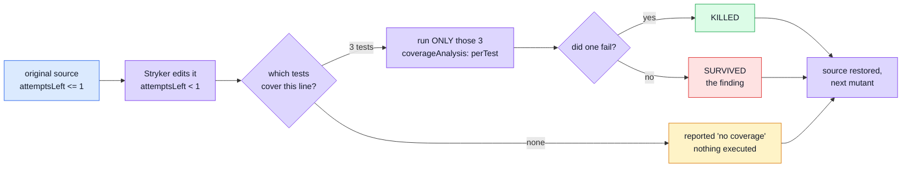
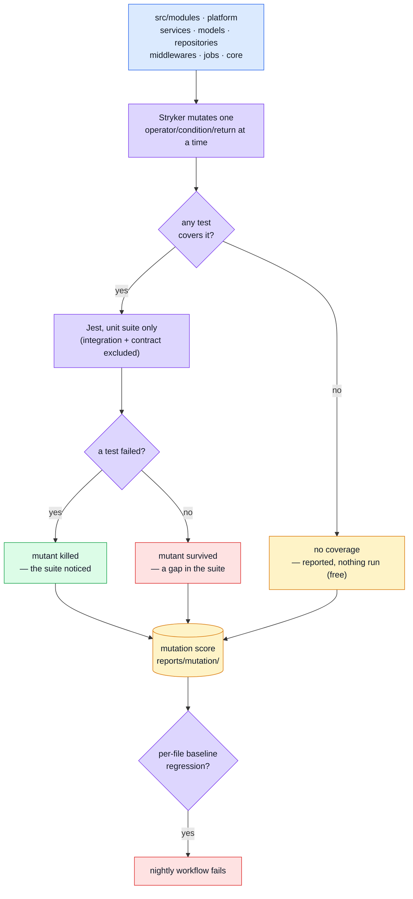
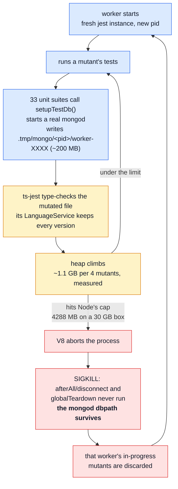
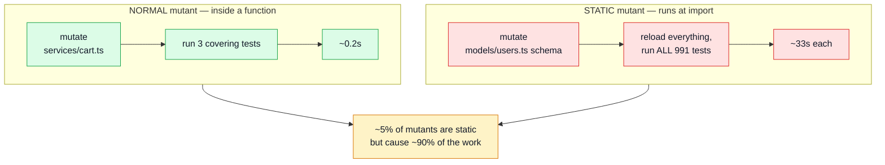
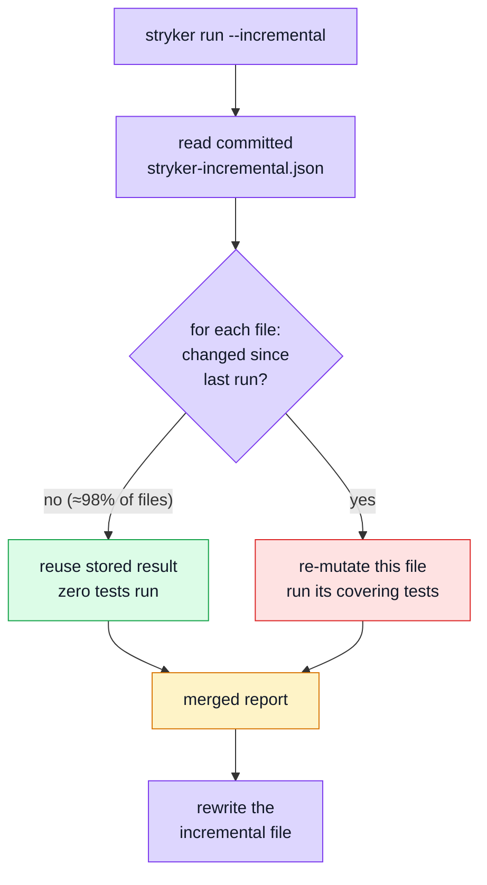
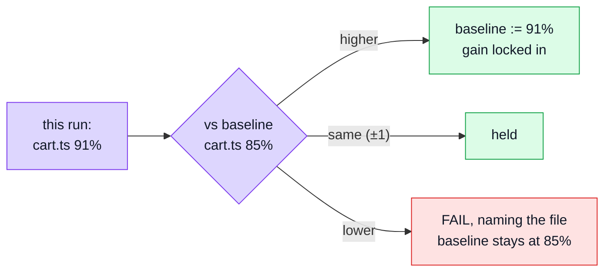

# Mutation Testing

Every other layer on this site answers "does the code do the right thing?" This one answers a different question: **do the _tests_ actually notice when it doesn't?** Line coverage can be satisfied by executing a line without asserting anything about its result; mutation testing can't — it edits the source thousands of times (`>` to `>=`, `&&` to `||`, a function body emptied out) and reports every edit the suite failed to catch. A **surviving mutant** is a bug the tests are structurally blind to.

## Glossary

Read this first. The rest of the page uses these words precisely, and several of them mean something narrower than they sound.

| Term                   | What it means here                                                                                                                                                                                                                                                                       |
| ---------------------- | ---------------------------------------------------------------------------------------------------------------------------------------------------------------------------------------------------------------------------------------------------------------------------------------- |
| **Mutant**             | One deliberate edit to one place in the source. `a > b` becomes `a >= b`. Stryker makes thousands, one at a time. See [What a mutant actually is](#what-a-mutant-actually-is).                                                                                                           |
| **Killed**             | At least one test failed when the mutant was active. Good — the suite noticed.                                                                                                                                                                                                           |
| **Survived**           | Every test still passed with broken code. **This is the finding.** It means no assertion anywhere depends on that behaviour.                                                                                                                                                             |
| **No coverage**        | No test executes that code at all, so Stryker doesn't even run anything — it reports the mutant immediately. Different from "survived": survived means tested-but-not-asserted, no-coverage means not-tested. **Costs nothing**, which is why untested files are cheap to keep in scope. |
| **Timeout**            | The mutant made the suite hang (a mutated loop condition, typically). Counted as **killed** — the suite did notice, just expensively.                                                                                                                                                    |
| **Mutation score**     | Killed ÷ (all viable mutants). Reported twice: over _everything_, and over _covered code only_. The gap between the two is the size of the untested surface.                                                                                                                             |
| **`break` threshold**  | The score below which the run fails. A backstop for "has this collapsed", not a target.                                                                                                                                                                                                  |
| **Baseline / ratchet** | `mutation-baseline.json` records what **each file** scored. Improvements are written back, regressions fail. See [The per-file ratchet](#the-per-file-ratchet).                                                                                                                          |
| **Nightly**            | A GitHub Actions workflow on a `cron` schedule (03:00 UTC) rather than on push. Nothing waits for it; it reports the next morning. Mutation lives here because a run takes minutes-to-hours.                                                                                             |
| **Concurrency**        | How many mutants Stryker tests **in parallel**. Each one is a separate OS process running a full test runner _and its own in-memory mongod_, so the limit is memory, not CPU cores.                                                                                                      |
| **`coverageAnalysis`** | Set to `perTest`: Stryker first records which tests touch which code, then runs **only the covering tests** for each mutant instead of the whole suite. This is the main reason a run is minutes and not days — except for static mutants, below.                                        |
| **Static mutant**      | A mutant in code that runs when the file is **imported**, not when a test calls it — a `new Schema({...})`, a repository built at module scope, a config object. See [Why a run is slow](#why-a-run-is-slow-static-mutants); it is the single biggest cost in this repo.                 |
| **Incremental**        | Stryker remembers per-mutant results in a committed file, so the next run only re-mutates what changed. **Enabled**, with the nightly passing `--force` to rebuild from scratch. See [Incremental mode](#incremental-mode--what-it-is).                                                  |

## What a mutant actually is

A mutant is **one small, deliberate edit to your source code**. Stryker makes it, runs the tests, and puts the code back. That is the whole idea.

Take a real line from this codebase:

```ts
// src/modules/cart/repository.ts
if (attemptsLeft <= 1 || !isDuplicateKey(error)) throw error;
```

Stryker generates a separate mutant for each thing it can change here:

| #   | Mutant                                        | What it is asking                                  |
| --- | --------------------------------------------- | -------------------------------------------------- |
| 1   | `attemptsLeft < 1`                            | Does any test pin the exact retry boundary?        |
| 2   | `attemptsLeft >= 1`                           | Same boundary, the other direction                 |
| 3   | `attemptsLeft <= 1 && !isDuplicateKey(error)` | Does anything depend on this being **or**?         |
| 4   | `isDuplicateKey(error)` (negation removed)    | Does a test cover the non-duplicate error path?    |
| 5   | `if (false) throw error;`                     | Does anything notice if we never give up retrying? |

Each one is run **on its own**, never together. Then:

- a test fails → **killed**. Some assertion depended on that behaviour. Good.
- every test passes → **survived**. You just broke the retry budget and nothing complained.

A survivor is not "a test is missing" in the abstract. It is a specific, reproducible statement: _this exact change to your code is invisible to your test suite._

### One mutant's lifecycle



The source on disk is never left mutated — Stryker works in a throwaway copy under `.stryker-tmp/`.

## Tools

| Tool                                   | Role                                                                          |
| -------------------------------------- | ----------------------------------------------------------------------------- |
| [Stryker](https://stryker-mutator.io/) | Generates mutants, re-runs the suite once per mutant, scores what survived    |
| `@stryker-mutator/jest-runner`         | Drives Jest as the test runner, against a narrowed subset of `jest.config.js` |

## Architecture



## Why only the unit suite runs

`stryker.config.json` restricts the Jest config Stryker drives to exclude `tests/integration/` and `tests/contract/`:

```json
"jest": {
    "config": {
        "testPathIgnorePatterns": ["/node_modules/", "<rootDir>/tests/integration/", "<rootDir>/tests/contract/"]
    }
}
```

Both drive the real app over HTTP against an in-memory Mongo — running either once per mutant would take hours.

**The exclusion does not do as much as its name suggests.** 33 files under `src/modules/*/tests/unit/`
call `setupTestDb()`, which starts a real `mongod` and connects mongoose to it. They are excluded by
neither pattern, because they are named `unit`. So a mutation run starts and stops a database
thousands of times, and the cost the two ignore patterns were written to avoid is paid anyway — just
by a different directory. Find them with:

```bash
grep -rl "setupTestDb\|MongoMemoryServer" src/modules/*/tests/unit tests/unit tests/cross-cutting | wc -l
```

That is the load-bearing fact behind the failure mode below.

**This is also why the controllers are not mutated.** They have no unit tests; they are covered by the contract and integration suites, which Stryker doesn't run. Put them in `mutate` and all ~35 files report ~0% — and that number would not mean "the controllers are untested", it would mean "they were measured with a ruler configured not to touch them". Worse, the ratchet would then record those zeros and defend them forever. Measuring controllers honestly requires running contract + integration under Stryker, which is an hours-per-run decision, not a glob.

## What to be wary of — per-file setup costs

Mutation testing multiplies whatever the suite does on setup by the mutant count. A cost that is
invisible at `npm test` becomes the whole run here.

The worked example, measured 2026-08-14. `setupTestDb()` runs in `beforeAll`, so it fired once per
test FILE — and it used to start a `MongoMemoryServer` each time:

|                         | per pass   | per run           |
| ----------------------- | ---------- | ----------------- |
| `npm test`              | 33 servers | 33                |
| `npm run test:mutation` | 33 servers | 33 × 6042 mutants |

Each server is a real `mongod` plus ~200 MB of dbpath and ~1 MB of driver buffers. Under `npm test`
the process exits and takes them; under Stryker the worker persists across mutants, so the buffers
accumulated to 1.08 GB — 45% of the heap — and the run stopped converging. Starting **one** server
per jest instance and giving each file its own DATABASE fixed it without touching a single test.

**The rule:** anything in `beforeAll` is paid once per file per mutant. Before adding a server, a
container, a browser or a fixture build there, ask what it costs multiplied by the mutant count —
and prefer one shared instance with per-file isolation over one instance per file.

**How to spot it:** run the suite outside Stryker first (`npx jest <scope> --runInBand`). If it is
fast and light there but heavy under mutation, the difference is setup being repeated, not your
tests being slow.

## When a run never finishes — the OOM/strand loop

A mutation run can fail in a way that looks like slowness and is not. Recognising it early is worth a
great deal, because the run will not converge no matter how long it is left alone.

### What you see

```
Mutation testing 3% (elapsed: ~1h 29m, remaining: ~36h 45m) 4478/6042 tested
WARN  ChildProcessProxy       Child process [pid 665821] ran out of memory.
INFO  RetryRejectedDecorator  Test runner process [665821] ran out of memory. You probably have a
                              memory leak in your tests.
```

Three tells, and any one of them is enough:

- **The ETA grows while you watch it.** A healthy run's estimate falls.
- **`ran out of memory` repeats** — every 15–25 seconds in the measured case.
- **The percentage and the mutant count disagree.** 3% against 4478/6042 means most of that "tested"
  count belongs to workers that died before reporting it, and will be redone.

### The mechanism



Measured 2026-08-14: **212 stranded data directories, 71 GB**, inside one sandbox, in under two hours
— 88 GB across `.stryker-tmp/` once earlier crashed runs were counted. The loop feeds itself: every
restart pays the full start-up cost again, so throughput falls as the mess grows.

### Why the cleanup did not catch it

The lifecycle in `tests/support/global-setup.ts` is deliberate and well-argued — each jest instance
owns `.tmp/mongo/<pid>` and deletes exactly that on the way out. It rests on one assumption:

> one jest instance per run, which reaches `globalTeardown`

Stryker breaks both halves. It starts a **new jest instance per restarted worker**, and it kills them,
so `globalTeardown` is the one step that never runs. Three consequences, each of which hid the mess:

| Design choice                     | What Stryker does to it                                                                                                                        |
| --------------------------------- | ---------------------------------------------------------------------------------------------------------------------------------------------- |
| `globalTeardown` deletes the root | Only on a clean exit — so every OOM strands a directory by definition                                                                          |
| The root comes from `__dirname`   | Under Stryker that resolves **inside the sandbox**, `.stryker-tmp/sandbox-XXXX/.tmp/`, where the documented `rm -rf .tmp` recovery never looks |
| Ownership is keyed by pid         | Correct for one instance; across hundreds of restarts each new pid simply claims a new directory beside the last                               |

### The strategy, in order

The trap to avoid has a name: **black-box tuning** — turning knobs from outside the process
(concurrency, heap cap, transform) and watching whether the symptom improves. It feels like progress
and it answers the wrong question. "Did it get better" cannot distinguish a fix from a postponement,
which is how the same investigation produces three different conclusions in an afternoon.

1. **Decide the SHAPE before hunting a cause.** Two very different problems present identically:

    |                         | Symptom                                   | Test                                                     | Fix                       |
    | ----------------------- | ----------------------------------------- | -------------------------------------------------------- | ------------------------- |
    | **Unbounded growth**    | dies at any ceiling                       | lower the ceiling — it still dies, just sooner           | find what is retained     |
    | **Bounded working set** | dies only when the ceiling is close to it | lower the ceiling — it stabilises just under the new one | cap it, or shrink the set |

    V8 does not collect eagerly. Given a ceiling far above what a program needs, it will happily
    drift toward it, so "RSS is climbing" is **not** evidence of a leak on its own.

2. **Reproduce small.** One file, one worker. A problem you can trigger in ninety seconds is one you
   can test a hypothesis against.
3. **Bisect one variable.** Change exactly one thing between two otherwise-identical runs — the
   control below used two files of near-identical size, one whose tests open a database and one
   whose tests do not.
4. **Open the box.** Everything above is still black-box. A heap snapshot says what is actually in
   memory, and until you have one you are guessing.
5. **Re-measure the same way after changing anything**, or you have swapped one guess for another.

### Reading the heap itself

Node writes a snapshot at the moment it is about to die:

```bash
NODE_OPTIONS="--max-old-space-size=1400 --heapsnapshot-near-heap-limit=1" \
  npx stryker run --mutate 'src/infrastructure/http/response.ts' --concurrency 1
```

Lower `--max-old-space-size` to make that moment arrive sooner — the composition of the heap is the
same, it just gets there faster. The file lands in the working directory, which under Stryker is the
sandbox, so:

```bash
find . -name '*.heapsnapshot'
npx tsx scripts/heap-report.ts <file.heapsnapshot>                       # what is in there
NODE_OPTIONS=--max-old-space-size=10240 \
  npx tsx scripts/heap-retainers.ts <file.heapsnapshot>                  # who is holding it
```

`scripts/heap-report.ts` groups every object by kind and prints the largest. **One dominant kind is a
finding; an even spread is a working set** — and that single line is the difference between "we have
a leak" and "this suite is simply heavy".

Then run `scripts/heap-retainers.ts`, and do not skip it. Knowing the kind tells you nothing about
the owner: the dominant kind here was megabyte-sized binary buffers, which look exactly like network
I/O and were not. The second script walks the graph backwards and names the variable holding them.
Chrome DevTools reads the same file and computes true dominators, which is better still once you
know which objects to ask about.

### Finding the culprit

Reproduce small before reproducing large. One file, one worker, is enough:

```bash
npx stryker run --mutate 'src/modules/orders/repository.ts' --concurrency 1
```

Watch a worker grow while it runs:

```bash
watch -n5 'ps -o pid,etime,rss,args -p $(pgrep -f child-process-proxy-worker) | cut -c1-100'
```

**Read `ELAPSED`, not only `RSS`** — it is the fastest diagnosis on this page. If the parent `stryker`
process has been up for hours while its workers are minutes old, they are being restarted and the run
is in this loop rather than making progress.

Count the damage as it accumulates:

```bash
ls .stryker-tmp/sandbox-*/.tmp/mongo/ | wc -l     # one entry per instance that died
du -sh .stryker-tmp/                              # what it has cost so far
grep -c "ran out of memory" <run log>             # restarts, when the log was kept
```

Mind the dot: `.tmp` is hidden, so a plain `du -sh .stryker-tmp/sandbox-*/*` misses the entire problem
and reports a few megabytes of source.

Then narrow it with jest's own instruments, which answer different questions:

| Command                                       | Answers                                                                    |
| --------------------------------------------- | -------------------------------------------------------------------------- |
| `npx jest <suite> --runInBand --logHeapUsage` | does the heap grow from one test FILE to the next                          |
| `npx jest <suite> --detectOpenHandles`        | what still holds the process open — sockets, timers, an unstopped `mongod` |
| `npx jest <suite> --detectLeaks`              | whether a suite's module registry survives collection after teardown       |

The shape of the answer matters. Growth **across files within one jest run** points at module-level
state. Growth **only across mutants** points at something the process keeps that a module-registry
reset does not clear.

### What it turned out to be — and how the control proved it

Measured 2026-08-14. The decisive experiment was a **control with one variable changed**: mutate
`src/infrastructure/http/response.ts` (206 lines, whose covering tests open no database) instead of
`src/modules/orders/repository.ts` (204 lines, whose tests do). Near-identical size, opposite
database dependency.

The no-database control leaked just as fast — **3963 → 4447 → 5045 MB across four mutants**, past
Node's cap. So Mongo is a bystander, and Stryker's own hint (`You probably have a memory leak in
your tests`) points at the wrong layer.

**ts-jest was the first suspect and it is not the answer.** It does two jobs — translate TypeScript,
and type-check it — and the second holds a `LanguageService` cache that looked like an obvious
candidate. Replacing it with swc (see below) roughly halved the suite's wall-clock and lowered the
run's footprint, but the growth continued. A plausible mechanism that improves the symptom is not a
diagnosis, and treating it as one cost an hour.

**The measurement that should have come first: run the suite OUTSIDE the tool.**

```bash
NODE_OPTIONS="--max-old-space-size=900 --heapsnapshot-near-heap-limit=1" \
  npx jest --config jest.config.mutation.js tests/unit tests/cross-cutting 'src/modules/.*/tests/unit' --runInBand
```

All 109 suites and 1500 tests — including the 37 that reach a real `mongod` — complete in ~13
seconds and never approach a 900 MB ceiling. **The suite is not heavy.** Whatever consumes gigabytes
is the harness around it, which narrows the search from "our code" to "how Stryker runs our code"
and rules out every theory about the tests themselves in one command.

**What the heap actually holds**, dumped at the moment of death and grouped by kind:

```
heap total 2404.1 MB across 15,028,338 objects

     bytes        count  kind
 1081.8 MB          958  native system / JSArrayBufferData     <- 45% of the heap
  358.5 MB      194,035  array (object properties)
  272.0 MB    5,078,346  closure
   55.4 MB    1,079,266  object system / Context
```

Everything after the first line is an even spread — millions of small objects, which is what a
running program looks like. The first line is 958 raw binary buffers. That single group-by is what
turns "something leaks" into "these bytes, of this kind".

It does **not** turn it into "these bytes, held by this code" — and the gap between those two
sentences is where this investigation lost most of its time. Buffers of roughly a megabyte look like
network and database I/O, so that is what they were assumed to be, and three fixes were built on the
assumption before anything tested it. See
[the case study](#case-study-the-buffers-were-not-io-at-all) for what they actually were.

**One trap to avoid when repeating this measurement:** take the reading during the MUTATION phase,
not the dry run. The dry run executes the whole suite once — including every database-backed
suite — so a worker reaches gigabytes there regardless of which file is being mutated, and a
sample taken then says nothing about the file under test. Watch for `0/N tested` in the progress
line; while it reads zero, the number on screen is the dry run's.

**And take it the same way every time.** `--heapsnapshot-near-heap-limit` fires when V8's old space
approaches its cap, which is a moment you do not control and — for this leak — may never arrive at
all, because the bytes sit outside old space. Two readings taken at different triggers are not
comparable, and comparing them produced a confident wrong answer here. Prefer
`--heapsnapshot-signal=SIGUSR2`, which lets you choose the moment:

```bash
NODE_OPTIONS="--max-old-space-size=4096 --heapsnapshot-signal=SIGUSR2" npx stryker run --concurrency 1 &
# wait for the progress line to reach a chosen mutant, then:
kill -USR2 "$(pgrep -f child-process-proxy-worker | head -1)"
```

Pick a cap high enough that the worker does not restart mid-measurement: a restart resets the
accumulation, and a snapshot of a freshly restarted worker looks like a heap that never grew.

### Case study: the buffers were not I/O at all

A short account of a four-hypothesis investigation, kept because the wrong turns are the reusable
part. Measured 2026-08-14 on a 16-core / 30 GB machine.

**The symptom.** `npm run test:mutation` grew until Node killed the worker, restarted it having
finished nothing, and reported a remaining time that climbed rather than fell — 36 hours after 90
minutes at 3%. A heap dump said half the process was ~1000 raw binary buffers of about a megabyte
each.

**The three hypotheses that were wrong.** Each was plausible, each improved the symptom, and none was
the cause — which is precisely why "it got better" is not a diagnosis:

| Hypothesis                  | What was built                        | What happened                                              |
| --------------------------- | ------------------------------------- | ---------------------------------------------------------- |
| ts-jest's type-check cache  | swapped the transform to swc          | suite got ~2× faster; growth continued                     |
| a `mongod` started per file | one shared server for the whole run   | 88 GB of stranded data directories fixed; growth continued |
| per-file mongoose connects  | planned: share one socket via `useDb` | never built — the measurement below killed it              |

All three shared one unexamined premise: that megabyte-sized buffers must be I/O. They looked like
network buffers, so the search stayed inside the database stack for hours.

**The measurement that broke it.** The premise is testable in one line of reasoning: if the buffers
come from database connections, running fewer database suites must leave fewer buffers. So the same
run was taken three times — with all 37 database-backed suites, with 10, and with none — every
reading at the identical point (end of the dry run, one full suite pass), under a cap high enough
that no worker restarted mid-measurement:

| database-backed suites | buffers | buffer bytes | heap total |
| ---------------------- | ------- | ------------ | ---------- |
| 37                     | 431     | 511.6 MB     | 1251.6 MB  |
| 10                     | 430     | 511.5 MB     | 1225.4 MB  |
| 0                      | 423     | 511.1 MB     | 1220.0 MB  |

Removing **every** database suite changed the buffer count by 8 and the bytes by 0.5 MB. Repeated
five mutants into the mutation phase the curve is not merely flat but non-monotonic — 1329 buffers
with no database against 1185 with all of them. There is no relationship to connections in either
phase, and the `useDb` work would have been a week spent on 0.1% of the problem.

**What they actually were.** A heap snapshot forces a full GC before it is written, so everything in
one is genuinely reachable rather than merely uncollected. Walking the reference graph _backwards_
from the buffers — which `scripts/heap-report.ts` cannot do, since it aggregates nodes and never
reads edges — named the owner immediately:

```
1326.0 MB   78   ArrayBuffer .backing_store  <-  Buffer .buffer  <-  system / Context .buffer
```

78 buffers, 95% of all buffer bytes, **17.0 MB each**, held by a variable named `buffer` in a module
scope. That is `node_modules/bson/lib/bson.cjs`:

```js
const MAXSIZE = 1024 * 1024 * 17;
let buffer = ByteUtils.allocate(MAXSIZE); // allocated on every evaluation of the module
```

`bson` reserves a 17 MiB scratch buffer the moment it is loaded — enough for MongoDB's 16 MiB
document ceiling. Jest gives every test **file** a fresh module registry, because that is what test
isolation means, so every file that reaches mongoose evaluates `bson` again and pays 17 MiB again. A
normal `npm test` never notices: files run in worker processes that exit and return the memory.
Stryker does not exit — it runs the suite once per mutant inside one long-lived worker — so the
copies accumulate, roughly ten per mutant.

**Why every earlier fix missed it.** The buffer belongs to the library that _encodes_ documents, not
to any connection: it is allocated at import time, before a connection exists and whether or not one
ever does. Sharing a server could not touch it, sharing a connection could not either, and removing
the database suites did not — because unit tests still import models, models import mongoose, and
mongoose imports bson.

**Why the heap cap never contained it.** `--max-old-space-size` bounds V8's old space.
`ArrayBuffer` backing stores are external to it, so V8 sees a comfortable heap, feels no pressure to
collect, and the process grows regardless: a worker capped at 1400 MB was measured at 6.6 GB RSS.
The cap only ever decided _when_ the worker died, never _whether_ it grew.

**What is left.** The repo cannot share one `bson` across registries: jest routes even
`createRequire` through its own resolver, and `process` and the core-module objects are re-created
per test file, so every channel a shim could use is isolated by design. The remaining levers are
Stryker's `maxTestRunnerReuse` (restart the runner every _n_ mutants — supported, and documented
upstream for exactly this situation) and an upstream report against `bson`.

**The lever that looks right and is not.** Jest's `workerIdleMemoryLimit` recycles a worker once it
passes a memory bound, which is the plain-jest analogue of `maxTestRunnerReuse` and the first thing
anyone reaches for here. It cannot work for this leak, for the same reason `--max-old-space-size`
could not: the child reports `process.memoryUsage().heapUsed` and nothing else —
`node_modules/jest-worker/build/processChild.js`, one line — so the bound is measured against the
one number that excludes `ArrayBuffer` backing stores. A worker holding 78 copies of a 17 MiB
buffer looks small to it. Checked 2026-08-15, jest 30; check it again rather than assuming, but do
not spend a day rediscovering it.

**The rule this earns.** Group-by tells you _what_ is in a heap; only the edges tell you _who holds
it_. Identifying a kind of object and then guessing its owner from what that kind is usually for is
not a diagnosis — it is the same guess with a number attached to it.

### Related: the same arithmetic kills a plain `npm test`

Stryker is where the accumulation becomes unbounded, but the per-worker cost exists in an ordinary
run too, and it is enough on its own. A worker peaks at 772–905 MB here; jest's default worker count
is `logical CPUs - 1`, which on a 16-core/32-thread machine is 31 of them. Measured 2026-08-15 over
the 98 unit suites:

| workers | wall | peak RSS |
| ------- | ---- | -------- |
| 31      | 20s  | 17.6 GB  |
| 12      | 14s  | 9.0 GB   |
| 8       | 13s  | 6.3 GB   |

At 17.6 GB on a 30.5 GB machine that also runs the docker stack, the OOM killer takes two workers
and jest reports `A jest worker process was terminated by another process: signal=SIGKILL` while
every test passes — a message that names the symptom and nothing else.

Note that eight workers were **faster** than thirty-one: past the point where the machine can hold
them, extra workers buy contention rather than throughput, so there is no speed being traded away.
The number is a property of the machine, so it lives in `.env` as `JEST_WORKERS`, exactly like
`STRYKER_CONCURRENCY`; `jest.config.js` falls back to `logical CPUs - 2` when it is unset.

### The fix

`jest.config.mutation.js` swaps the transform to `@swc/jest` for the mutation run only. swc
translates and checks nothing, so it retains nothing between mutants. Types are still checked — once,
by `npm run ts-check` inside `npm run complete`, which is the right number of times: a mutant
changes an expression, not a signature, so re-checking per mutant cannot return a different answer.

It is also simply faster. The same 110 suites and 1527 tests:

| Transform                                         | Time       |
| ------------------------------------------------- | ---------- |
| ts-jest (`jest.config.js`, the normal run)        | ~21 s      |
| swc (`jest.config.mutation.js`, the mutation run) | **~9.7 s** |

**One compatibility note, and it is a real semantic difference rather than a quirk.** TypeScript
emits each `require` where its `import` stood; swc follows ESM and hoists imports to the top. A
`jest.mock` factory that reads a `const` declared between the two therefore works under ts-jest and
throws `Cannot access '<name>' before initialization` under swc. The fix is to reach the variable
from inside a function — a getter, or a wrapping arrow — so the read happens on access rather than
at factory time. `tests/unit/infrastructure/adapters/mailer-dispatch.test.ts` carries a worked
example in its comments.

### Preventing it

- **Sweep before the run, not only after it.** A killed process cannot clean up after itself, so the
  next start has to.
- **Keep the data root out of the sandbox.** An absolute path passed in through the environment
  survives the copy; a `__dirname`-derived one does not.
- **Sweep dead siblings at `globalSetup`.** A directory named for a pid that no longer exists belongs
  to a dead instance and is safe to remove, which bounds accumulation _within_ a run rather than only
  between runs.
- **Cap the worker heap deliberately** instead of inheriting Node's default. That default is derived
  from total system RAM, so a bigger machine hands each worker a longer runway before the same crash.

**A cap is containment, not a fix** — and for this leak it is weaker containment than it looks.
`--max-old-space-size` bounds V8's old space only; `ArrayBuffer` backing stores live outside it, so a
worker capped at 1400 MB was measured at 6.6 GB RSS. Against external memory the cap does not decide
how much a worker accumulates, only how early V8 panics about the part it can see.

## Why it never gates a PR

A run re-executes the unit suite once per mutant. `.github/workflows/mutation.yml` is a separate workflow from `ci.yml` — **nightly** (`cron: '0 3 * * *'`) plus manual dispatch. Kept structurally separate rather than folded into `ci.yml` behind a conditional: a separate file can't become a PR gate by accident.

## Why a run is slow — static mutants

This is the thing worth understanding, because it explains an otherwise baffling number.

`coverageAnalysis: perTest` means Stryker normally runs only the handful of tests that touch the mutated line. But some mutants are **static** — they live in code that executes when the module is _imported_ rather than when a test calls it:

```ts
export const userSchema = new Schema({ ... });        // runs at import
export const userRepository = createBaseRepository(); // runs at import
```

Stryker cannot swap those in and out per test. It has to reload the whole environment — and so, from its planner:

```js
else {  // static, and ignoreStatic is off
    return this.createMutantRunPlan(mutant, {
        netTime: this.timeSpentAllTests,
        testFilter: this.globalTestFilter,   // ← every test in the suite
    });
}
```

Visually, the difference:



**One static mutant runs the entire suite.** The share is worth measuring rather than guessing: the run's summary prints `tests per mutant on average`, and the JSON reporter labels each mutant `static`, so counting them per file names the handful that dominate the wall clock. No run has measured the current `mutate` scope yet, so there are no numbers here to read — the first full run is what fills this in.

It also inflates timeouts, because the timeout is derived from how long the tests are expected to take:

```
timeout = timeoutFactor × netTime + timeoutMS + overhead
```

For a static mutant `netTime` is the whole suite, which is what makes those timeouts minutes rather than seconds. Every module's model and repository builds its objects at module scope, so the static surface here is large by design.

### What can be done about it — an open question

| Option                                   | Effect                                                            | Status                                                            |
| ---------------------------------------- | ----------------------------------------------------------------- | ----------------------------------------------------------------- |
| Raise `concurrency`                      | Near-linear speed-up, **changes no measurement**                  | **Done** — 8 locally, 3 in CI                                     |
| `incremental: true`                      | PR runs re-mutate only changed files                              | Not done                                                          |
| Split the nightly into one job per layer | Wall-clock becomes the slowest group, not the sum                 | Not done; probably unnecessary if the cost is fixed at the source |
| `ignoreStatic: true`                     | Removes the whole-suite reruns — but stops measuring some mutants | **Not enabled. Deliberately undecided — see below.**              |
| Move logic out of module scope           | The only fix that costs nothing in measurement                    | Invasive; module-scope schemas are idiomatic Mongoose             |

`ignoreStatic` is a real, documented Stryker option, and Stryker's own description of it says "it might make sense to ignore static mutants". But **its default is `false`**, and that default is a judgement by the people who wrote the tool: measuring those mutants is the safer behaviour.

Two things argue for caution before switching it on here:

1. **It is a trade-off, not a fix.** It buys speed by not measuring some code. On the frontend, 335 of 363 static mutants also have per-test coverage and would still be scored (only 28 would be dropped) — but the equivalent ratio for this repo **has not been measured**, and quoting the frontend's number as if it were this one would be exactly the sampling error this whole strategy exists to avoid.
2. **Soundness.** With `ignoreStatic` on, a static-but-covered mutant is activated at _runtime_ rather than at module load (`mutantActivation: 'runtime'` in the planner). A mutant whose only effect happens during import may then never actually trigger, and be reported as survived when it was never really tested. That is a quieter failure than a slow run.

The honest position: it is standard and supported, it is probably the right call eventually, and it should be decided from a measurement of _this_ repo — one run with the JSON reporter enumerating exactly which mutants would stop being measured, recorded in the config — rather than from the frontend's numbers.

## Incremental mode — what it is

**Enabled.** This is what makes mutation testing usable on a pull request rather than only in a nightly.

**The problem.** Every run starts from scratch. Change one line in one service, and Stryker still re-mutates every mutant across the whole codebase — including all the ones in files you did not touch, whose results will be identical to last time.

**The mechanism.** With `incremental: true`, Stryker writes every mutant's result to `reports/stryker-incremental.json` and **you commit that file**. On the next run it compares the new source against what the file remembers:

- file unchanged → reuse the stored result, run nothing
- file changed → re-mutate it properly
- a _test_ changed → re-run the mutants that test covers, because the answer may now be different



**What it changes in practice.** A pull request touching one service goes from every mutant in the repo to a few dozen — seconds instead of the full run. That is what turns mutation testing from "a nightly you read the next morning" into "a check on your PR".

**The catch, and why the nightly still runs in full.** The incremental file is a cache, and caches go stale — a refactor that moves code between files, a dependency upgrade, or a merge conflict resolved badly can leave it describing a codebase that no longer exists. So the intended shape is two runs with different jobs:

| Run     | Trigger | Setting             | Purpose                                    |
| ------- | ------- | ------------------- | ------------------------------------------ |
| PR      | push    | `incremental: true` | Fast feedback on what you actually changed |
| Nightly | cron    | `force: true`       | Full run; refreshes the file from scratch  |

`force: true` tells Stryker to ignore the stored results entirely, which is what stops staleness accumulating.

## Scope — what is mutated

```json
"mutate": [
    "src/infrastructure/**/*.ts",
    "src/kernel/**/*.ts",
    "src/modules/*/**/*.ts",
    "!src/modules/*/index.ts",
    "!src/modules/*/*.fragment.ts",
    "!src/modules/*/tests/**"
]
```

A counterintuitive but important consequence of the table above: **untested files are free to include.** A mutant with no covering test is reported `NoCoverage` without running anything, so a file at 0% costs nothing and honestly records the gap. The cost lives entirely in _well-covered_ code — especially static-and-covered code.

That is why the list above is so short. The bar for excluding something is **"a mutant here could not mean anything to anyone"**, not "our tests would not kill it" — an unkilled mutant is a finding, while a file missing from the report is a blind spot, since an absent file reads exactly like a file with no survivors. Only three things clear that bar: `*.fragment.ts` slices, which nothing imports (the assembled bundle is what runs, so a mutant there is unobservable by construction); a module's `index.ts`, a barrel whose mutants ask whether a re-export changed; and `tests/**`, which is not the code under test.

### Reading a 0% — and the one case where it was excluded instead

Everything else stays in scope, including code this runner cannot reach, because a 0% is usually a
true statement worth keeping in front of people.

`src/app/**` is the exception, and it is worth understanding why it is not a precedent. The Express
wiring measured **0.00% across all eight files: 126 mutants, every one `NoCoverage`, not a single
survivor** — because it is exercised by `tests/integration` and `tests/contract`, both excluded from
this _runner_ by `testPathIgnorePatterns` (they drive the real app against a live database and fail
the dry run), and by no unit test at all.

That made it a different animal from an honest zero. An honest zero is code a suite _could_ reach
and none does — a finding, and actionable. These 126 mutants had **no test that could ever kill
them**, so they dragged the global number down permanently while telling nobody anything, and they
put a global `break` of 70 out of reach by construction rather than by neglect.

So the tier was excluded, taking the global score from ~65.7% to ~68.3%. What is lost is a standing
reminder, and it is recorded here and in `stryker.config.json` instead: **the Express wiring has no
unit tests.** If that changes, put it back in scope — then its number would mean something.

The bar this cleared, and that a future exclusion has to clear too: _no configured suite can reach
this code at all._ "Our tests would not kill it" is not that bar. The paired frontend answers the
same question the same way for `.vue` files, on mirror-image reasoning — Stryker cannot mutate
template expressions, so a score there would imply coverage nobody has.

The three outcomes are different findings, and the columns keep them apart:

| Outcome         | What happened                                 | What to do                                 |
| --------------- | --------------------------------------------- | ------------------------------------------ |
| **Killed**      | a test ran it and an assertion depended on it | nothing                                    |
| **Survived**    | a test ran it and nothing noticed             | sharpen the assertion                      |
| **No coverage** | nothing ran it                                | write a test, or accept the runner's reach |

Two shapes of unreached code show up differently, and it is worth knowing which you are looking at. Code that runs at **import time** — a route table literal, a schema built at module scope — executes as soon as any test imports the module, so its mutants are _covered_ and come back as **survivors**: `users/routes.ts` reports 36 of them. A **function body** only executes when called, so an uncalled one comes back as **no coverage**. Zero survivors alongside a high no-coverage count is the signature of a file nothing invokes.

Controllers illustrate why a blanket exclusion is the wrong instrument. They were once excluded wholesale on the assumption that only contract and integration tests reach them — but several are unit-tested directly as plain functions with fake `req`/`res` objects (`post-login`, `get-refresh-token`, `delete-account-request`, `delete-account-confirm`, `get-observability-metrics-overview`). The exclusion was therefore hiding real, working coverage as well as honest gaps.

## The per-file ratchet

Stryker's own thresholds are **global** — `high`, `low`, `break`, and nothing else. That is the same pooling failure that directory-shaped coverage thresholds have: a strong file carries a weak one, and the number that passes is an average nobody can act on. It gets worse as `mutate` widens, not better.

So `mutation-baseline.json` records a score **per file**, and `scripts/check-mutation-baseline.ts` compares each run against it. The file is not in the repository right now: the scope was repointed at the current module layout and no run has measured it, so the first `npm run test:mutation:check` after a full run writes it from that report and every run after that compares against it:

- a file that drops below its recorded score **fails**;
- a file that improves has its baseline **rewritten upward**, locking the gain in;
- a new file is recorded at whatever it first measures, **including `0`** — an honest zero in a diff beats a zero dissolved into a mean.



A regression **cannot be laundered**: running with `--update` on a regressed file keeps the higher value _and_ still exits non-zero.

A one-point tolerance absorbs the timeout/survivor race (whether a hanging mutant is recorded as a timeout or a survivor depends on machine load), not genuine weakening.

## Choosing what to strengthen next

A report ranked by score answers "where is the number lowest", which is almost never the same
question as "where would a test be worth most". Two filters come first.

### Agnostic before applicable

This repository is a boilerplate. The demo is a small shop, and a real shop built from it will have
far more product code than this — but that code is written once, by whoever forks it. What every
fork inherits _unchanged_ is the core: the cache adapter, the queue adapter, the upload pipeline,
the auth service, the error interpreter. A bug there ships to every project that ever started here.

So the order is by **blast radius**, not by percentage. `services/auth.ts` at 53% mattered more
than a lower-scoring model of an order line, because every application has logins and only this one
has orders.

### `total` versus `covered` — two different jobs

The report prints both, and the gap between them is the whole diagnosis:

| Reading                  | Meaning                                     | The work                                   |
| ------------------------ | ------------------------------------------- | ------------------------------------------ |
| both low, close together | tests run this code and do not assert on it | **assert harder** on what already executes |
| total ≪ covered          | most mutants have **no coverage**           | **write tests that reach it at all**       |
| both high                | done                                        | move on                                    |

Those are different pieces of work and the single percentage does not distinguish them. Of the four
files strengthened most recently, all four were the second kind — `cache.ts`'s entire
read/write/invalidate path reported _no coverage_, because exercising it needs a Redis and the unit
suite has none. The fix was a fake client, not sharper assertions.

### Then falsify, every time

A test written against a survivor is a test written to make a number move, which is exactly the
failure mode mutation testing exists to catch. So each one is checked the only way that means
anything: **break the source on purpose and confirm the suite goes red.**

```bash
# e.g. make a poison message requeue instead of being discarded
#   ch.nack(incoming, false, false)  →  ch.nack(incoming, false, true)
npx jest tests/unit/infrastructure/adapters/queue.test.ts     # must FAIL
```

Occasionally the mutation cannot be expressed at all — removing the null-delivery guard in
`consumeFromQueue` is a **compile** error, because the type is `ConsumeMessage | null`. That is a
finding worth keeping rather than working around: the guard is enforced by the type system, and no
test is needed to defend it.

## Thresholds — measured, not invented

`high` and `low` only colour the report. `break` is the one that fails a run, and it comes from a real measurement or it is not set at all — which is why it is currently `null`: the scope was repointed at the current module layout and nothing has measured it yet. The first full run supplies the number, and it goes in below that run's score, so it answers "has something collapsed" rather than "did the number move".

After that the rule is: raise `break` when a score **sustains** a higher band; never lower it to make a run pass. The single sanctioned exception is a change to `mutate` — which changes the population, so old and new numbers are not measurements of the same thing — re-recorded in the same commit with both numbers and the reason.

### The measurement backlog

`break` wants to be **70**, with `high: 80` as the aspirational band. Getting there is a sequence,
and doing it out of order is how a threshold becomes something everyone passes `--force` past.

The last completed full run was 2026-08-12 — **65.69% overall, 72.22% on covered code** — and it is
now several feature commits stale. It also predates two changes that move the number in opposite
directions: thirteen modules of newer code that has never been measured, and the `src/app/**`
exclusion above (~+2.6 points, and a change of population, so it is not comparable to the 65.69%
at all).

| Area                    | Mutants | Score | Note                                        |
| ----------------------- | ------- | ----- | ------------------------------------------- |
| `src/kernel/**`         | 127     | 80.3% | already past the target                     |
| `src/infrastructure/**` | 1584    | 72.2% |                                             |
| `src/modules/**`        | 1404    | 63.0% | where the remaining points and findings are |

**The order:**

1. **Take a fresh baseline.** `mutation-baseline.json` is absent deliberately — its keys were
   pre-migration paths, and the ratchet seeds a fresh one from the first report rather than being
   edited into shape. `npm run test:mutation` is the step; nothing gates on it, because `break` is
   `null` until a real run supplies a number.
2. **Work the `src/modules/**` number\*\*, which is the only area below the target.
3. **Then** move `break`, once a run has actually sustained the new floor.

Two files also lost their coverage floor in the modular migration and have not had it restored —
`src/modules/account/tokens.ts` (was floored by `src/services/**`) and
`src/modules/users/validation.ts` (was `src/models/**`). `jest.config.js` floors `model.ts`,
`repository.ts` and `service.ts` per module, and the newer per-module files (`audit.ts`,
`metrics.ts`, `seeds.ts`, `events.ts`, `routes.ts`) have never had floors and may not need them.
Left alone on purpose: the floors are being redone from the ground up once this sequence completes,
and a floor moved twice is worse than a floor moved once.

## File map

| Path                                 | Contents                                                                       |
| ------------------------------------ | ------------------------------------------------------------------------------ |
| `stryker.config.json`                | Scope (`mutate`), the narrowed Jest config, thresholds, concurrency, reporters |
| `mutation-baseline.json`             | Per-file scores. Committed. The ratchet's memory. Absent until the first run.  |
| `scripts/mutationBaseline.ts`        | Ratchet logic — scoring, comparison, the "never lower" rule                    |
| `scripts/check-mutation-baseline.ts` | CLI for the two commands below                                                 |
| `scripts/heap-report.ts`             | Groups a `.heapsnapshot` by kind — what a runaway worker is holding            |
| `scripts/heap-retainers.ts`          | Walks the same snapshot backwards — which code is holding it                   |
| `.github/workflows/mutation.yml`     | Nightly schedule + dispatch, uploads the report even on failure                |
| `reports/mutation/index.html`        | Human-readable report (generated per run)                                      |
| `reports/mutation/mutation.json`     | Machine-readable report the ratchet reads                                      |

## Commands

| Command                          | Effect                                                                           |
| -------------------------------- | -------------------------------------------------------------------------------- |
| `npm run test:mutation`          | Full run — slow, meant for a nightly or before a refactor, never mid-PR          |
| `npm run test:mutation:check`    | Compare the last run against the per-file baseline. Fails naming what regressed. |
| `npm run test:mutation:baseline` | Record the last run (improvements only). Use when `mutate` changed, and say why. |

## Related pages

- [Testing](./testing-and-docs.md) — suite overview
- [Unit Testing](./unit-testing.md) — the layer being mutated
