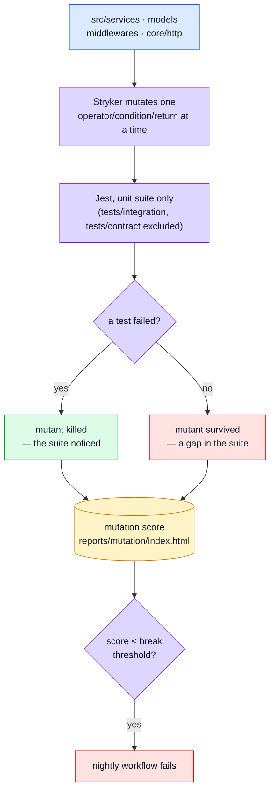

# Mutation Testing

Every other layer on this site answers "does the code do the right thing?" This one answers a different question: **do the _tests_ actually notice when it doesn't?** Line coverage can be satisfied by executing a line without asserting anything about its result; mutation testing can't — it edits the source thousands of times (`>` to `>=`, `&&` to `||`, a function body emptied out) and reports every edit the suite failed to catch. A **surviving mutant** is a bug the tests are structurally blind to.

## Tools

| Tool                                   | Role                                                                            |
| -------------------------------------- | ------------------------------------------------------------------------------- |
| [Stryker](https://stryker-mutator.io/) | Generates mutants, re-runs the suite once per mutant, scores what survived      |
| `@stryker-mutator/jest-runner`         | Drives Jest as the test runner, against a narrowed subset of `jest.config.json` |

## Architecture



## Why only the unit suite runs

`stryker.config.json` restricts the Jest config Stryker drives to exclude `tests/integration/` and `tests/contract/`:

```json
"jest": {
    "config": {
        "testPathIgnorePatterns": ["/node_modules/", "<rootDir>/tests/integration/", "<rootDir>/tests/contract/"]
    }
}
```

Both of the excluded layers drive the real app over HTTP against an in-memory Mongo ([Integration Testing](./integration-testing.md), [Contract Testing](./contract-testing.md), [Contract-Derived Request Data](./contract-request-data.md)) — running either once per mutant would take hours and would mostly re-measure what the unit suite's mutation score already answers. This is also why `tests/contract/request-contract.test.ts` needed no extra exclusion when it was added: the whole directory was already out of scope.

## Why it never gates a PR

A run re-executes the unit suite once per mutant. `.github/workflows/mutation.yml` is a separate workflow from `ci.yml` — nightly (`cron: '0 3 * * *'`, half an hour before the frontend's own mutation run, so the two don't compete for shared runners) plus `workflow_dispatch`. Kept structurally separate rather than folded into `ci.yml` behind a conditional: a separate file can't become a PR gate by accident the way a "just this once" addition to the aggregate CI job could.

## Scope — why `mutate` is narrow

```json
"mutate": [
    "src/services/**/*.ts",
    "src/models/**/*.ts",
    "src/middlewares/**/*.ts",
    "src/core/http/**/*.ts"
]
```

The generated `api/` directory, config, and infrastructure bootstrapping are excluded on purpose — they produce mutation noise without a meaningful "did the tests notice" question behind them.

## Thresholds — measured, not invented

```json
"thresholds": { "high": 65, "low": 42, "break": 38 }
```

Measured 2026-08-05: 41.84% total / 60.93% of covered code, 1379 mutants, ~15 minutes. `stryker.config.json`'s own comment is explicit that the gap between those two numbers is itself a finding: several files have **no unit test at all** (`core/http/request.ts`, `uploads.ts`, `errors.ts`; middlewares `authorizations.ts`, `token.ts`, `cookie.ts`, `security.ts`) and nobody noticed, because they're exercised through the integration and contract suites instead — which is exactly why the mutation report's `# no cov` column exists: it names the files line coverage alone would never have flagged.

`break` sits below the measured score on purpose, to catch a real regression rather than normal run-to-run drift. Raise it when the score rises for real; never lower it to make a run pass.

## File map

| Path                             | Contents                                                                            |
| -------------------------------- | ----------------------------------------------------------------------------------- |
| `stryker.config.json`            | Scope (`mutate`), the narrowed Jest config, thresholds, reporters                   |
| `.github/workflows/mutation.yml` | Nightly schedule + `workflow_dispatch`, uploads `reports/mutation/` even on failure |
| `reports/mutation/index.html`    | HTML report (git-ignored, generated per run)                                        |

## Commands

| Command                 | Effect                                                                           |
| ----------------------- | -------------------------------------------------------------------------------- |
| `npm run test:mutation` | Full mutation run — slow, meant for a nightly or before a refactor, never mid-PR |

## Related pages

- [Testing](./testing-and-docs.md) — suite overview
- [Unit Testing](./unit-testing.md) — the layer being mutated
