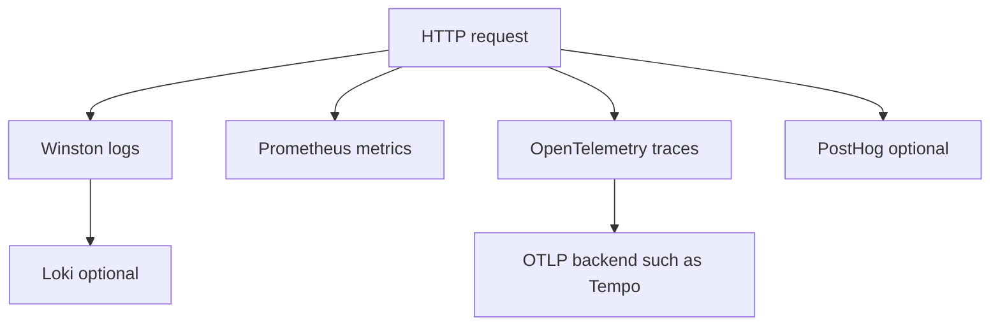

# Observability & Quality

## Observability stack

| Tool | Why it is here |
| --- | --- |
| Winston | structured app logs |
| Loki | optional central log shipping |
| Prometheus / prom-client | counters, histograms, gauges, `/metrics` |
| OpenTelemetry | trace context and distributed tracing |
| PostHog | optional product analytics |

## Observability visual

## Quality and maintenance tools

| Tool | Why it is here |
| --- | --- |
| Jest | unit and integration test coverage |
| ESLint | code consistency and correctness checks |
| Prettier | predictable formatting |
| VitePress | documentation site |
| Mermaid + vitepress-plugin-mermaid | ADHD-friendly visual diagrams in docs |

## Maintenance mindset

- Observability should help explain the same request from many angles.
- Quality tooling should keep the boilerplate easy to copy and evolve.
- Docs should stay visual, short, and linked back to [Theory](../theory/) and [API](../api/).

## Related pages

- Want the flow? See [Theory / Request Flow](../theory/request-flow.md).
- Want contract tooling? See [API / OpenAPI Workflow](../api/openapi-workflow.md).
