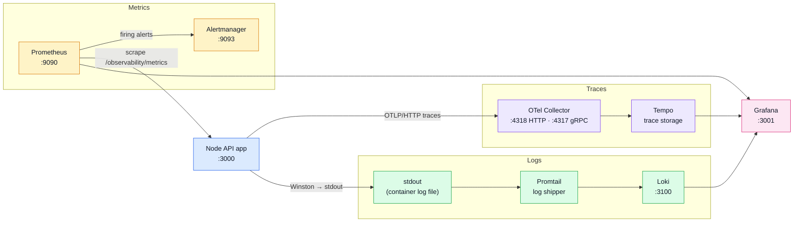

# Observability Stack Reference

This page is the quick map of the boilerplate observability stack and the most common config settings.

## Architecture at a glance

### Signal roles at a glance

| Signal      | Path                                                        | Storage                 | Query UI                                                  | Dedicated page                                            |
| ----------- | ----------------------------------------------------------- | ----------------------- | --------------------------------------------------------- | --------------------------------------------------------- |
| **Traces**  | App → OTel Collector → Tempo                                | Tempo volume            | Grafana → Explore → Tempo                                 | [OpenTelemetry](./opentelemetry.md) · [Tempo](./tempo.md) |
| **Metrics** | Prometheus scrapes `/observability/metrics` → Prometheus DB | Prometheus volume (7 d) | Grafana → Explore → Prometheus or `http://localhost:9090` | [Prometheus](./prometheus.md)                             |
| **Logs**    | Winston → stdout → Promtail → Loki                          | Loki volume (7 d)       | Grafana → Explore → Loki                                  | [Winston](./winston.md) · [Loki](./loki.md)               |
| **Alerts**  | Prometheus evaluates rules → Alertmanager                   | in-memory               | `http://localhost:9093`                                   | [Prometheus](./prometheus.md)                             |

## Tool-by-tool config reference

### Prometheus

**What it does:** scrapes metrics, evaluates alert rules, forwards alerts.

Repo files: [`/.docker/observability/prometheus.config.yaml`](../../.docker/observability/prometheus.config.yaml), [`/.docker/observability/prometheus.alert-rules.yaml`](../../.docker/observability/prometheus.alert-rules.yaml)

| Config section                                  | What it does                             | Why local value                                | Common tweak                   | Dev vs prod                             |
| ----------------------------------------------- | ---------------------------------------- | ---------------------------------------------- | ------------------------------ | --------------------------------------- |
| `global.scrape_interval`, `evaluation_interval` | scrape/evaluate cadence                  | `15s` keeps feedback quick                     | increase to reduce laptop load | prod often 15-60s by target criticality |
| `scrape_configs`                                | scrape targets (`app`, `otel-collector`) | static docker service names are simple locally | add more jobs/targets          | prod usually uses service discovery     |
| `rule_files`                                    | loads alert rules                        | keeps rules versioned in repo                  | split rules by domain          | prod often adds recording rules         |
| `alerting.alertmanagers`                        | sends firing alerts                      | points to local Alertmanager                   | switch target/HA endpoints     | prod commonly has multiple replicas     |

### Alertmanager

**What it does:** groups/routes alerts to notification receivers.

Repo file: [`/.docker/observability/alertmanager.config.yaml`](../../.docker/observability/alertmanager.config.yaml)

| Config section                                             | What it does                       | Why local value                                  | Common tweak                     | Dev vs prod                             |
| ---------------------------------------------------------- | ---------------------------------- | ------------------------------------------------ | -------------------------------- | --------------------------------------- |
| `route.group_by/group_wait/group_interval/repeat_interval` | groups and throttles notifications | avoids spam while testing                        | adjust batching cadence          | prod tunes by team/on-call needs        |
| `route.receiver` + `receivers`                             | final notification destination     | `null` receiver prevents accidental emails/Slack | add Slack/email/webhook receiver | prod uses real receivers + secrets      |
| `global.resolve_timeout`                                   | resolve timeout behavior           | safe default (`5m`)                              | tune for noisy alerts            | prod often aligned with incident policy |

### Grafana

**What it does:** unified UI for metrics, logs, traces.

Repo files: [`/.docker/observability/grafana.datasources.yaml`](../../.docker/observability/grafana.datasources.yaml), [`/.docker/observability/grafana.dashboard-providers.yaml`](../../.docker/observability/grafana.dashboard-providers.yaml), [`/.docker/observability/grafana/dashboards/api-traces.json`](../../.docker/observability/grafana/dashboards/api-traces.json)

| Config section                                       | What it does                                | Why local value                    | Common tweak                         | Dev vs prod                                |
| ---------------------------------------------------- | ------------------------------------------- | ---------------------------------- | ------------------------------------ | ------------------------------------------ |
| `datasources[]`                                      | provisions Tempo/Prometheus/Loki at startup | no manual UI setup on each restart | add auth headers / extra datasources | prod often adds RBAC, auth, cloud backends |
| `tracesToLogsV2`, `tracesToMetrics`, `derivedFields` | enables cross-signal jumps                  | fast local debugging workflow      | map labels to your service naming    | prod requires strict label consistency     |
| `providers[].options.path`                           | auto-loads dashboard JSON files             | keeps dashboards in git            | add folders/providers                | prod may split folders/org permissions     |

### Tempo

**What it does:** stores and serves distributed traces.

Repo file: [`/.docker/observability/tempo.config.yaml`](../../.docker/observability/tempo.config.yaml)

| Config section                         | What it does                | Why local value              | Common tweak                       | Dev vs prod                                 |
| -------------------------------------- | --------------------------- | ---------------------------- | ---------------------------------- | ------------------------------------------- |
| `distributor.receivers.otlp`           | listens for OTLP ingest     | accepts gRPC+HTTP locally    | disable unused protocol            | prod often fronted by gateway/load balancer |
| `storage.trace.backend/local/wal`      | trace persistence paths     | simple local filesystem      | move to bigger local volume        | prod usually object storage (S3/GCS/etc.)   |
| `compactor.compaction.block_retention` | retention/compaction window | `24h` keeps disk usage small | increase for longer local analysis | prod often much longer retention            |

### Loki

**What it does:** stores indexed logs and serves LogQL queries.

Repo file: [`/.docker/observability/loki.config.yaml`](../../.docker/observability/loki.config.yaml)

| Config section                                                   | What it does                  | Why local value                      | Common tweak                          | Dev vs prod                                  |
| ---------------------------------------------------------------- | ----------------------------- | ------------------------------------ | ------------------------------------- | -------------------------------------------- |
| `schema_config`                                                  | index/storage schema config   | TSDB `v13` is current local baseline | update when upgrading Loki            | prod changes need planned migrations         |
| `storage_config.filesystem`                                      | where chunks/index are stored | low-friction local disk              | mount persistent volume               | prod usually object storage + index shipper  |
| `limits_config.retention_period` + `compactor.retention_enabled` | log retention enforcement     | `168h` keeps one week logs           | shorter retention if disk constrained | prod retention follows compliance/cost rules |
| `ruler.alertmanager_url`                                         | forwards Loki alerts          | wired to local Alertmanager          | add rule files and enable alerts      | prod typically HA Alertmanager               |

### Promtail

**What it does:** tails log files and pushes entries to Loki.

Two config files ship with the repo — one per container runtime:

| File                                                                                                            | Runtime                              | Log format           |
| --------------------------------------------------------------------------------------------------------------- | ------------------------------------ | -------------------- |
| [`/.docker/observability/promtail.config.yaml`](../../.docker/observability/promtail.config.yaml)               | Docker (`json-file` driver)          | Docker JSON envelope |
| [`/.docker/observability/promtail.podman.config.yaml`](../../.docker/observability/promtail.podman.config.yaml) | Podman (`k8s-file` driver, rootless) | CRI format           |

The `docker-compose.podman.yml` override selects `promtail.podman.config.yaml` and mounts the correct host log path automatically when running `npm run podman:*` scripts.

| Config section                     | What it does                          | Why local value                                     | Common tweak                     | Dev vs prod                                      |
| ---------------------------------- | ------------------------------------- | --------------------------------------------------- | -------------------------------- | ------------------------------------------------ |
| `scrape_configs[].labels.__path__` | filesystem path to tail               | Docker or Podman log path depending on runtime      | add extra paths/jobs             | prod often uses Kubernetes discovery             |
| `pipeline_stages`                  | transforms/parses entries before send | `json` stages for Docker; `cri` + `json` for Podman | add json/timestamp/labels stages | prod pipelines are usually richer and normalized |
| `positions.filename`               | stores read offsets                   | avoids rereading on restart                         | change to persistent mount       | prod keeps positions on durable storage          |

### OpenTelemetry Collector

**What it does:** receives telemetry, processes it, exports it to backends.

Repo file: [`/.docker/observability/otel-collector.config.yaml`](../../.docker/observability/otel-collector.config.yaml)

| Config section                                | What it does                                   | Why local value                        | Common tweak                       | Dev vs prod                                          |
| --------------------------------------------- | ---------------------------------------------- | -------------------------------------- | ---------------------------------- | ---------------------------------------------------- |
| `receivers.otlp`                              | ingest endpoint from instrumented apps         | gRPC+HTTP support for flexibility      | keep only one protocol if desired  | prod often receives from many services               |
| `processors.batch`                            | batches spans before export                    | better performance with low complexity | add memory/resource processors     | prod commonly adds resource/attributes/tail sampling |
| `exporters.otlp` + `service.pipelines.traces` | sends traces to Tempo and wires trace pipeline | direct local network path              | add extra exporters (vendor/cloud) | prod often fans out to multiple backends             |

## Common tasks

- **View traces:** [Grafana](./grafana.md) → Explore → [Tempo](./tempo.md) → query `service.name="api"`. See [TraceQL](https://grafana.com/docs/tempo/latest/traceql/) for advanced queries.
- **Query metrics:** Grafana Explore ([Prometheus](./prometheus.md)) or `http://localhost:9090` with `up{job="api"}`. See [PromQL basics](https://prometheus.io/docs/prometheus/latest/querying/basics/) for query syntax.
- **Filter logs:** Grafana Explore ([Loki](./loki.md)) with `{job="containerlogs"} |= "error"`. See [LogQL](https://grafana.com/docs/loki/latest/query/) for query syntax.
- **Create alerts:** add/modify rules in [`prometheus.alert-rules.yaml`](../../.docker/observability/prometheus.alert-rules.yaml), then reload/restart [Prometheus](./prometheus.md) and verify in Alertmanager UI (`http://localhost:9093`).

## FAQ / troubleshooting

- **No traces visible in Grafana**
    - Check app env `OTEL_EXPORTER_OTLP_ENDPOINT=http://otel-collector:4318`.
    - Check collector and tempo containers are running.
- **No logs in Loki**
    - Check Promtail can read `/var/lib/docker/containers/*/*-json.log`.
    - Verify `clients.url` points to `http://loki:3100/loki/api/v1/push`.
- **Prometheus target is down**
    - Open Prometheus → _Status > Targets_ and verify `app:3000/observability/metrics`.
    - Confirm app container and `/observability/metrics` endpoint are up.
- **Too much local alert noise**
    - Increase alert `for:` windows and/or lower local scrape frequency.
    - Keep Alertmanager on `null` receiver in local dev.

## Related tool pages

- [Prometheus](./prometheus.md)
- [OpenTelemetry](./opentelemetry.md)
- [Tempo](./tempo.md)
- [Grafana](./grafana.md)
- [Loki](./loki.md)
