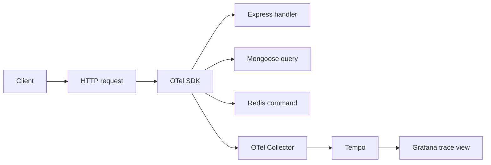

# OpenTelemetry

## Why it is here

OpenTelemetry (OTel) is the **trace** layer of this boilerplate.
A trace is the timeline of a single request: HTTP in, every Mongoose query, every Redis call, the response out.

We use OTel **auto-instrumentation**: there is no per-request code to write.

## What is instrumented out of the box

| Library     | Source                                                                                                             | Spans you get                                |
| ----------- | ------------------------------------------------------------------------------------------------------------------ | -------------------------------------------- |
| HTTP server | [`@opentelemetry/instrumentation-http`](https://www.npmjs.com/package/@opentelemetry/instrumentation-http)         | one root span per incoming request           |
| Express     | [`@opentelemetry/instrumentation-express`](https://www.npmjs.com/package/@opentelemetry/instrumentation-express)   | one child span per route handler/middleware  |
| Mongoose    | [`@opentelemetry/instrumentation-mongoose`](https://www.npmjs.com/package/@opentelemetry/instrumentation-mongoose) | one child span per query (`find`, `save`, …) |
| Redis       | [`@opentelemetry/instrumentation-redis`](https://www.npmjs.com/package/@opentelemetry/instrumentation-redis)       | one child span per Redis command             |

All of this is wired in `src/utils/tracing.ts`. `startTracing()` is called at the very top of `src/app.ts`, before Express and any instrumented libraries are imported — this is required for auto-instrumentation to work.

## Configuration

| Env var                       | Effect                                                                                        |
| ----------------------------- | --------------------------------------------------------------------------------------------- |
| `OTEL_EXPORTER_OTLP_ENDPOINT` | OTLP/HTTP base URL of the **OTel Collector**. When unset, traces are simply not exported.    |
| `OTEL_EXPORTER_OTLP_HEADERS`  | Optional `key=value,key=value` for auth/tenant headers.                                       |
| `NODE_SERVICE_NAME`           | The `service.name` resource attribute used by Tempo/Grafana (default `api`).                  |

Local docker-compose sets `OTEL_EXPORTER_OTLP_ENDPOINT=http://otel-collector:4318` automatically.

## Trace flow (with OTel Collector)

The **OTel Collector** decouples the app from backend choices. You can add exporters (Jaeger, OTLP/cloud) in the collector config without touching app code.

## OTel Collector config

The collector config lives at `.docker/observability/otel-collector-config.yaml`.

It currently:
- Receives OTLP/HTTP on `:4318` and OTLP/gRPC on `:4317`
- Batches spans via the `batch` processor
- Exports traces to Tempo via OTLP/gRPC

## How logs and traces correlate

Every slim access log and every error log carries a `trace_id` field.
Copy that ID into Grafana → Explore → Tempo to jump straight to the trace for that request.
In Loki, filter by `{service="api"} | json | trace_id="<id>"`.

## Useful links

- [OpenTelemetry concepts](https://opentelemetry.io/docs/concepts/)
- [JavaScript SDK getting started](https://opentelemetry.io/docs/languages/js/getting-started/nodejs/)
- [OTel Collector documentation](https://opentelemetry.io/docs/collector/)
- [OTLP/HTTP protocol](https://opentelemetry.io/docs/specs/otlp/#otlphttp)

## Related pages

- [Tempo](./tempo.md)
- [Grafana](./grafana.md)
- [Winston & Audit Logs](./winston.md)
