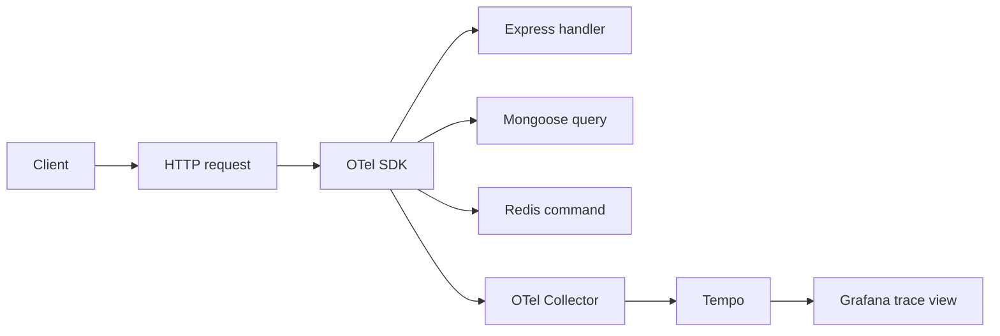

# OpenTelemetry

## Why it is here

OpenTelemetry (OTel) is the **trace** layer of this boilerplate.
A trace is the timeline of a single request: HTTP in, every Mongoose query, every Redis call, the response out.

We use OTel **auto-instrumentation**: there is no per-request code to write.

## What is instrumented out of the box

| Library     | Source                                                                                                             | Spans you get                                |
| ----------- | ------------------------------------------------------------------------------------------------------------------ | -------------------------------------------- |
| HTTP server | [`@opentelemetry/instrumentation-http`](https://www.npmjs.com/package/@opentelemetry/instrumentation-http)         | one root span per incoming request           |
| Express     | [`@opentelemetry/instrumentation-express`](https://www.npmjs.com/package/@opentelemetry/instrumentation-express)   | one child span per route handler/middleware  |
| Mongoose    | [`@opentelemetry/instrumentation-mongoose`](https://www.npmjs.com/package/@opentelemetry/instrumentation-mongoose) | one child span per query (`find`, `save`, …) |
| Redis       | [`@opentelemetry/instrumentation-redis`](https://www.npmjs.com/package/@opentelemetry/instrumentation-redis)       | one child span per Redis command             |

All of this is wired in `src/utils/tracing.ts`. `startTracing()` is called at the very top of `src/app.ts`, before Express and any instrumented libraries are imported — this is required for auto-instrumentation to work.

## Configuration

| Env var                       | Effect                                                                                    |
| ----------------------------- | ----------------------------------------------------------------------------------------- |
| `OTEL_EXPORTER_OTLP_ENDPOINT` | OTLP/HTTP base URL of the **OTel Collector**. When unset, traces are simply not exported. |
| `OTEL_EXPORTER_OTLP_HEADERS`  | Optional `key=value,key=value` for auth/tenant headers.                                   |
| `NODE_SERVICE_NAME`           | The `service.name` resource attribute used by Tempo/Grafana (default `api`).              |

Local docker-compose sets `OTEL_EXPORTER_OTLP_ENDPOINT=http://otel-collector:4318` automatically.

## Trace flow (with OTel Collector)

The **OTel Collector** decouples the app from backend choices. You can add exporters (Jaeger, OTLP/cloud) in the collector config without touching app code.

## OTel Collector config

The collector config lives at `.docker/observability/otel-collector.config.yaml`.

It currently:

- Receives OTLP/HTTP on `:4318` and OTLP/gRPC on `:4317`
- Batches spans via the `batch` processor
- Exports traces to Tempo via OTLP/gRPC

## How logs and traces correlate

The OTel SDK maintains a **trace context** for the duration of each request. [Winston](./winston.md) reads that context automatically and stamps `trace_id` on every log line it writes — no manual code needed in routes or controllers.

This means the three signals stay linked without extra effort:

1. A request comes in → OTel opens a root span and sets the active `trace_id`.
2. Winston picks up the active context → every log line for this request gets `trace_id=abc123`.
3. Mongoose queries and Redis commands fire → OTel wraps each as a child span under the same trace.
4. The request ends → all spans are flushed to the OTel Collector → Tempo.
5. [Loki](./loki.md) has the log lines. [Tempo](./tempo.md) has the span tree. Both share the same `trace_id`.

In [Grafana](./grafana.md): find the log line in Loki Explore → click the `trace_id` link → land on the exact Tempo trace. Or go the other way: find a slow Tempo span → click "Loki logs" → see the surrounding log lines. → [Trace ↔ log correlation](./loki.md#trace--log-correlation)

## Works with

- **[Winston](./winston.md)** — OTel injects `trace_id` into Winston's context automatically. Every log line carries the trace ID for free. → [How logs and traces correlate](#how-logs-and-traces-correlate)
- **[MongoDB & Mongoose](./mongodb-mongoose.md)** — every `find`, `save`, `aggregate` call becomes a child span with DB name, collection, and operation. Slow queries appear as wide bars in the Tempo trace tree, immediately visible alongside the HTTP span.
- **[Redis Cache](./redis-cache.md)** — every Redis command (`GET` for cache reads, `SET` for writes, `DEL` for invalidations) becomes a child span. A cache hit appears as a short Redis span with no following Mongoose span — the trace makes the cache benefit visible.
- **[Tempo](./tempo.md)** — spans are batched by the OTel Collector and written to Tempo. Tempo is the storage backend; Grafana is the query UI.

## External references

- [OpenTelemetry concepts](https://opentelemetry.io/docs/concepts/) — signals, spans, context propagation
- [OTel Collector configuration](https://opentelemetry.io/docs/collector/configuration/) — receivers, processors, exporters reference

## Related pages

- [Observability Reference](./observability-reference.md)
- [Tempo](./tempo.md)
- [Grafana](./grafana.md)
- [Winston & Audit Logs](./winston.md)
