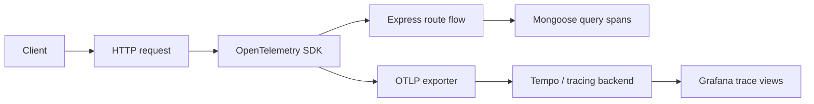

# OpenTelemetry

## Why OpenTelemetry is here

OpenTelemetry gives the boilerplate **trace context** and distributed-tracing support.
It helps answer: _which request path was slow, and where did the time go?_

## Trace flow

## Why it matters in this repo

- tracing starts early in app boot,
- HTTP and Express are instrumented,
- database spans and correlation helpers already exist,
- it works nicely with logs and metrics together.

## Related pages

- [Prometheus](./prometheus.md)
- [Grafana](./grafana.md)
- [Winston & Audit Logs](./winston.md)
