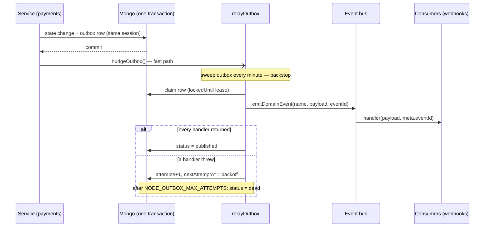

# Transactional Outbox

## The problem it solves

A payment settles: the money moved, the order is `paid`, the stock is committed. Then the process
dies. Nobody ever emitted `payment.succeeded`, so webhook subscribers never hear about a payment
that went through. The in-process [event bus](./events-and-logging.md#the-domain-event-bus-and-what-it-is-not)
cannot help: it has no durability, so a crash mid-dispatch loses the event.

The outbox writes the event **in the same Mongo transaction as the state change**. It exists if and
only if the change committed. A separate relay publishes it afterwards, and retries until it lands.



## What it guarantees

| Property              | How                                                                                       |
| --------------------- | ----------------------------------------------------------------------------------------- |
| Atomic with the write | `enqueueOutboxEvent(name, payload, aggregateId, session)` — the session is required       |
| At-least-once         | A row is `published` only after every consumer returned. A crash in between redelivers it |
| Idempotent consumers  | Every delivery of one event carries the same `meta.eventId` (the row's id)                |
| Ordered per aggregate | The oldest unpublished row of an aggregate blocks its later rows                          |
| Retries with backoff  | 5s, doubling, capped at 1h                                                                |
| Poison handling       | After the last attempt the row is `dead`: metric, alert, log — and it stops blocking      |
| Cleanup               | Published rows expire by TTL (`NODE_OUTBOX_RETENTION_DAYS`). Dead rows stay for a human   |

**Exactly-once is not promised.** A consumer that must not act twice dedupes on `meta.eventId`.
`webhooks` does: a unique `(subscriptionId, eventId)` index turns a redelivered fan-out into a
no-op — see [Consumers](#writing-a-consumer).

## Where the code is

| Piece                                     | File                                                   |
| ----------------------------------------- | ------------------------------------------------------ |
| Model, `enqueueOutboxEvent`, relay, nudge | `src/kernel/outbox.ts`                                 |
| `meta.eventId` on the bus                 | `src/kernel/events.ts` (`DomainEventMeta`)             |
| Backstop relay, every minute              | `scripts/ops/sweep-outbox.ts` (`npm run sweep:outbox`) |
| Counters                                  | `src/infrastructure/observability/metrics-outbox.ts`   |
| First user: `payment.succeeded`           | `src/modules/payments/services/announce.ts`            |

No new queue, no new dependency. The relay hands rows to the same in-process bus every module
already subscribes to, so no AsyncAPI channel is involved: nothing here crosses a process boundary
that was not already crossed by `webhooks`' own queue.

## Using it

```ts
await withTransaction((session) =>
    repository
        .markThing(id, session)
        .then(() => enqueueOutboxEvent('thing.happened', { id }, id, session))
);
nudgeOutbox(); // AFTER the commit, never inside it
```

Rules of thumb:

- **Same session as the state change.** A write made without it is not part of the transaction.
- **Pick the aggregate carefully.** Events that must stay in order share an `aggregateId`.
- **Nudge after commit.** Skipping it only delays delivery to the next sweep.
- **Declare the event** on `DomainEventMap` in the module's `events.ts`, as for any domain event.

## Why `payment.succeeded` is written when the marker clears

`settlePayment` sets `pendingEffects: ['commit']` when it writes `succeeded`. Announcing at that
write would announce an order that is then found lost and refunded. So the announcement is written
in the transaction that **clears the marker** — once the stock commit landed.

| Where the settlement dies                | What happens                                                              |
| ---------------------------------------- | ------------------------------------------------------------------------- |
| Before the `succeeded` write             | Nothing charged; provider redelivers                                      |
| After it, before the commit or the clear | Marker stays. `sweep:payment-effects` commits, then writes the outbox row |
| After the clear transaction              | Row exists. The relay publishes it                                        |
| Order cancelled in between               | Sweep marks a refund owed and announces nothing                           |

`clearPendingEffectsOnce` reports whether **this** call removed the marker, so a settlement racing
the sweep enqueues once.

## Writing a consumer

A handler on the bus receives `(payload, meta)`. Rules:

- **Throw (or reject) to ask for a retry.** The bus logs it and answers `false`; the relay
  reschedules. Do not swallow errors you want retried.
- **Be idempotent on `meta.eventId`.** `webhooks/services/publish.ts` is the reference: a unique
  index plus "duplicate key means already done".
- **Attempt every target, then fail.** `fanOut` uses `Promise.allSettled` so one bad subscription
  does not starve the rest, then throws so the relay retries; already-created rows are skipped.

## Poison events

A row is `dead` after `NODE_OUTBOX_MAX_ATTEMPTS` failed dispatches. `OutboxEventsDead` fires on
`outbox_events_dead_total`. To inspect:

```js
db.outboxevents.find({ status: 'dead' });
```

Fix the consumer, then set the row back with `status: 'pending', attempts: 0, nextAttemptAt: new Date()`.
There is deliberately no admin API: dead events are a defect to fix, not a queue to manage.

## Operating it

| Variable                     | Default | Meaning                                                       |
| ---------------------------- | ------- | ------------------------------------------------------------- |
| `NODE_OUTBOX_MAX_ATTEMPTS`   | `10`    | Failed dispatches before `dead`                               |
| `NODE_OUTBOX_LEASE_SECONDS`  | `60`    | A relay's claim on one row. Keep above the slowest consumer   |
| `NODE_OUTBOX_RETENTION_DAYS` | `7`     | Days a published row is kept (TTL index; `db:sync` to change) |

| Signal                          | Meaning                                                        |
| ------------------------------- | -------------------------------------------------------------- |
| `outbox_pending_events`         | Rows waiting, backing-off ones included. Growing means a stall |
| `outbox_events_published_total` | Delivered (a redelivery counts again)                          |
| `outbox_events_retried_total`   | Failed dispatches rescheduled                                  |
| `outbox_events_dead_total`      | Parked. Above zero is the alert                                |

`sweep:outbox` is covered by `FrequentSweepStale`. It calls `registerModules` first, and
`relayOutbox` refuses to run in any process where no module has subscribed — otherwise it would
mark rows published with nobody listening.

## Limits, on purpose

- **Order across aggregates is not promised.** Per aggregate only.
- **Order is by write time** (`createdAt`, then `_id`). Two transactions on one aggregate that
  commit out of order are ordered by when they wrote, not when they committed.
- **Same-process consumers.** The relay dispatches on the in-process bus. A consumer in another
  service needs a queue in front, as `webhooks` has — see [RabbitMQ](./rabbitmq.md).
- **One event so far.** `payment.failed`, `payment.refunded` and `order.*` still emit fire-and-forget.
  Moving one is a `withTransaction` + `enqueueOutboxEvent` at its call site.
