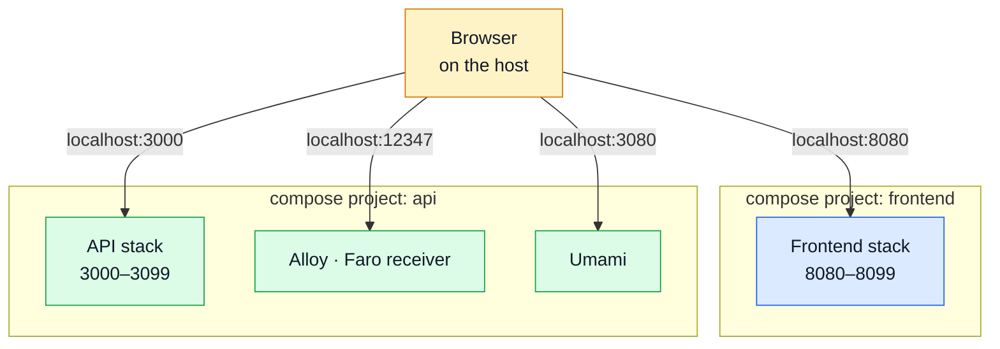

# Pairing & Ports

How this API and the paired frontend run side by side, and which host port everything claims.

## The integration contract is two disjoint port blocks



The two stacks stay **independent** — separate compose projects, separate networks, nothing to
join. The only thing crossing the boundary is the user's browser, which runs on the host: it
resolves the frontend's `VITE_API_URL` itself, so the frontend always addresses this API through a
**host** port (`http://localhost:3000`), never a compose service name.

That is the whole reason the port blocks must not overlap, and it is why there is no shared
network anywhere in either compose file.

**Start this stack first.** It owns the API, plus the Alloy Faro receiver and Umami that the
frontend's browser code posts to.

## What has to line up

| This repo (`.env`)                           | Frontend (`.env`)                    |
| -------------------------------------------- | ------------------------------------ |
| `NODE_PORT=3000`                             | `VITE_API_URL=http://localhost:3000` |
| `NODE_CORS_ORIGIN` contains `:8080`, `:8085` | dev server `8080`, e2e server `8085` |
| `ALLOY_FARO_PORT=12347`                      | `VITE_FARO_URL=…:12347/collect`      |
| `UMAMI_PORT=3080`                            | `VITE_UMAMI_SRC=…:3080/script.js`    |
| `UMAMI_WEBSITE_ID`                           | `VITE_UMAMI_WEBSITE_ID` (same UUID)  |

The shipped defaults on both sides already match; the table is for when you move a port.

## Host port map

This repo owns **`3000–3099`**, plus the well-known ports of the infrastructure images it runs.
The paired frontend owns **`8080–8099`**.

| Service                      | Host port         | Env var                                           |
| ---------------------------- | ----------------- | ------------------------------------------------- |
| API                          | `3000`            | `NODE_PORT`                                       |
| Grafana                      | `3001`            | `GRAFANA_PORT`                                    |
| Umami dashboard / tracker    | `3080`            | `UMAMI_PORT`                                      |
| Docs (VitePress + Nginx)     | `3090`            | `DOCS_PORT`                                       |
| Loki                         | `3100`            | `LOKI_PORT`                                       |
| OTel Collector (HTTP / gRPC) | `4318` / `4317`   | `OTEL_OTLP_HTTP_PORT` / `OTEL_OTLP_GRPC_PORT`     |
| RabbitMQ (AMQP / management) | `5672` / `15672`  | `RABBITMQ_AMQP_PORT` / `RABBITMQ_MANAGEMENT_PORT` |
| Redis                        | `6379`            | `NODE_REDIS_PORT`                                 |
| Prometheus                   | `9090`            | `PROMETHEUS_PORT`                                 |
| Alertmanager                 | `9093`            | `ALERTMANAGER_PORT`                               |
| Alloy (Faro receiver / UI)   | `12347` / `12345` | `ALLOY_FARO_PORT` / `ALLOY_UI_PORT`               |
| MongoDB                      | `27017`           | `NODE_MONGODB_PORT`                               |

New services belong inside `3000–3099`. Every entry is overridable through the env var in the
right-hand column if a port is already taken.

::: danger `DOCS_PORT` must never go back to `4173`
That is VitePress's own `preview` default, which the paired frontend uses on the host. The two
docs containers and the frontend's e2e Vite server all collided there once; this port map exists
because of it.
:::

## Keeping the pair in step

`openapi.yaml` is the canonical contract for **both** repositories, and this one produces it.

- After any contract edit, regenerate the derived artefacts (`npm run gen:api`) and commit the
  generated `api/` changes — see [Regenerating After a Change](../api/regenerating.md).
- Keep paired branches aligned before merging a contract change: a backend branch and the frontend
  branch that consumes it are one change in two repositories.
- `npm run check:spec-identity` is the guard. It reports the shared bundles as forked when the two
  sides disagree, which is exactly what you want to see before a merge rather than after.

## Reaching the stack from another device on the Wi-Fi

Publish to all interfaces rather than to loopback, then reach the host by its LAN address:

```bash
podman ps                      # confirm the mapping is 0.0.0.0:3000->3000/tcp
ip -4 addr | grep inet          # find the host's LAN address
```

Two things usually block it after that: the host firewall, and `NODE_CORS_ORIGIN` — a phone
browsing `http://192.168.1.x:8080` is a different origin from `http://localhost:8080`, so the API
rejects it until that origin is added.

::: warning Only on a network you trust
The shipped `.env` is a development configuration: permissive CORS, seeded demo credentials, and
datastores with default passwords. Do not do this on a public or shared network.
:::
