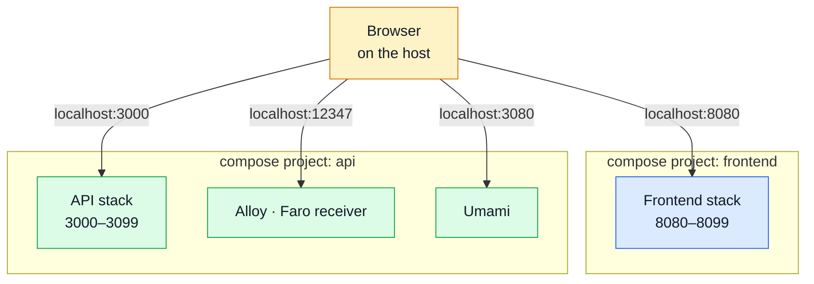

# Pairing & Ports

How this API and the paired frontend run side by side, and which host port everything claims.

## The integration contract is two disjoint port blocks



The two stacks stay **independent** — separate compose projects, separate networks, nothing to
join. The only thing crossing the boundary is the user's browser, which runs on the host: it
resolves the frontend's `VITE_API_URL` itself, so the frontend always addresses this API through a
**host** port (`http://localhost:3000`), never a compose service name.

That is the whole reason the port blocks must not overlap, and it is why there is no shared
network anywhere in either compose file.

**Start this stack first.** It owns the API, plus the Alloy Faro receiver and Umami that the
frontend's browser code posts to.

## What has to line up

| This repo (`.env`)                           | Frontend (`.env`)                    |
| -------------------------------------------- | ------------------------------------ |
| `NODE_PORT=3000`                             | `VITE_API_URL=http://localhost:3000` |
| `NODE_CORS_ORIGIN` contains `:8080`, `:8085` | dev server `8080`, e2e server `8085` |
| `ALLOY_FARO_PORT=12347`                      | `VITE_FARO_URL=…:12347/collect`      |
| `UMAMI_PORT=3080`                            | `VITE_UMAMI_SRC=…:3080/script.js`    |
| `UMAMI_WEBSITE_ID`                           | `VITE_UMAMI_WEBSITE_ID` (same UUID)  |

The shipped defaults on both sides already match; the table is for when you move a port.

## Host port map

This repo owns **`3000–3099`**, plus the well-known ports of the infrastructure images it runs.
The paired frontend owns **`8080–8099`**.

| Service                      | Host port         | Env var                                           |
| ---------------------------- | ----------------- | ------------------------------------------------- |
| API                          | `3000`            | `NODE_PORT`                                       |
| Grafana                      | `3001`            | `GRAFANA_PORT`                                    |
| Umami dashboard / tracker    | `3080`            | `UMAMI_PORT`                                      |
| Docs (VitePress + Nginx)     | `3090`            | `DOCS_PORT`                                       |
| Loki                         | `3100`            | `LOKI_PORT`                                       |
| OTel Collector (HTTP / gRPC) | `4318` / `4317`   | `OTEL_OTLP_HTTP_PORT` / `OTEL_OTLP_GRPC_PORT`     |
| RabbitMQ (AMQP / management) | `5672` / `15672`  | `RABBITMQ_AMQP_PORT` / `RABBITMQ_MANAGEMENT_PORT` |
| Redis                        | `6379`            | `NODE_REDIS_PORT`                                 |
| Prometheus                   | `9090`            | `PROMETHEUS_PORT`                                 |
| Alertmanager                 | `9093`            | `ALERTMANAGER_PORT`                               |
| Alloy (Faro receiver / UI)   | `12347` / `12345` | `ALLOY_FARO_PORT` / `ALLOY_UI_PORT`               |
| MongoDB                      | `27017`           | `NODE_MONGODB_PORT`                               |

New services belong inside `3000–3099`. Every entry is overridable through the env var in the
right-hand column if a port is already taken.

::: danger `DOCS_PORT` must never go back to `4173`
That is VitePress's own `preview` default, which the paired frontend uses on the host. The two
docs containers and the frontend's e2e Vite server all collided there once; this port map exists
because of it.
:::

## Keeping the pair in step

`openapi.yaml` is the canonical contract for **both** repositories, and this one produces it.

- After any contract edit, regenerate the derived artefacts (`npm run gen:api`) and commit the
  generated `api/` changes — see [Regenerating After a Change](../api/regenerating.md).
- Keep paired branches aligned before merging a contract change: a backend branch and the frontend
  branch that consumes it are one change in two repositories.
- `npm run check:spec-identity` is the guard. It reports the shared bundles as forked when the two
  sides disagree, which is exactly what you want to see before a merge rather than after.

## The shared-file list, and what earns a place on it

`scripts/spec-identity.ts` holds the files that must be **byte-identical** in both checkouts. The
test for membership is not "are these the same today" — a dozen more files happen to match, from
favicons to `.prettierrc` — but **"does a fork cause a silent bug?"** Everything on the list fails
quietly: both sides keep building, keep passing their own suites, and disagree only in production
or in a live-API run.

Two files are on it, and the rule is one line: **produced here, copied there.** Each one is an
_output_ on the frontend's side, which is what makes a fork answerable — there is one correct
resolution, and `npm run sync:frontend` applies it without asking. Editing the copy is the failure
this list is worst at describing and best at catching: the next regeneration reverts it, and the
diff looks like the backend broke something.

| Produced here          | Lands over there as                                                                                     |
| ---------------------- | ------------------------------------------------------------------------------------------------------- |
| `openapi.yaml`         | `openapi.yaml`                                                                                          |
| `asyncapi.public.yaml` | `asyncapi.yaml` — the shared subset is the whole of the async contract as far as that repo is concerned |

A third entry used to sit here: the analytics event names the frontend emitted. It emits none any
more — pageviews are automatic and everything with a request behind it is reported from the handler
here that decided it — so there is no catalogue to publish and nothing to keep in step. See
[Product Analytics](./analytics.md#one-namespace-two-repositories).

**A `check:spec-identity` failure right after switching which backend you're pairing with is usually
not a new defect.** The frontend compares against whichever backend its own `.env` names in
`BACKEND_PATH` — not whichever one last ran `sync:frontend` — so the fix is to point that at this
backend (unset, or `../boilerplate-node-backend`, is the default) and then run `sync:frontend` from
here, in that order. The two backends' bundles are function-identical, and this one bundles
byte-stably; the PHP twin does not, which is why the frontend's own check compares YAML parsed
rather than as raw bytes. See the frontend's `docs/reference/contracts.md#keeping-the-pair-in-step`
for the full mechanism.

Deliberately **not** on it: `public/favicon/*`, `.prettierrc`, `.dockerignore`, `.husky/*`,
`.docker/nginx.docs.conf`, `docs/.vitepress/theme/*`. They are identical by convention, not by
requirement — either repo may legitimately change its own icon or formatting width, and a gate that
fails on that trains people to ignore it.

### Convenience is not necessity

The list used to carry a second kind of entry, flagged `owner: 'mirror'`: files both repos
maintained by hand and kept identical because it was convenient — `spectral.yaml` and three shared
scripts (`check-mutation-baseline.ts`, `report-test-results.ts`, `generate-asyncapi-types.ts`). A fork in one of
those was a question no script could answer, so `sync:frontend` could only report it and walk away.

They were removed, and the flag with them. Nothing breaks _silently_ when two repos lint under
rulesets that have drifted apart — one job is simply stricter, and it says so on the run. A gate
that cannot resolve what it reports is a gate people learn to skip, and every entry on this list
costs a manual step per contract change. The files still exist on both sides; nothing compares them
any more, and nothing needs to.

### Nothing regenerable belongs on it

A copy that either repo can rebuild from a file already listed carries no fact the list does not
already compare, and every entry costs a manual step per contract change. Two things are out for
exactly that reason:

| Excluded                          | Why                                                                                                                                                                                                                       | Guarded instead by                                                                                                       |
| --------------------------------- | ------------------------------------------------------------------------------------------------------------------------------------------------------------------------------------------------------------------------- | ------------------------------------------------------------------------------------------------------------------------ |
| `src/types/asyncapi.generated.ts` | An output of `gen:asyncapi`, whose every input is compared already. The two outputs are **not** identical and are not meant to be — this repo's is generated from the full contract and carries the queue payloads.       | Nothing — it's gitignored, never committed, regenerated by postinstall and the pre-commit hook before anything else runs |
| `contract.<tool>.*`               | Generated from `openapi.yaml`, which is compared above. Identical spec plus deterministic generator means a frontend copy could never disagree without the spec disagreeing first — so the frontend holds no copy at all. | `contract-bundles.test.ts`                                                                                               |

### It treats the symptom

Identity, not equivalence — two specs that mean the same thing but differ in key order are still a
fork in the making, because the next person to regenerate gets a diff nobody asked for. The cure is
one source of truth: a package both repos consume, or a third repo. That is a bigger decision than
a CI job, and until it is made this fails the build on the commit that forks a shared file rather
than on the release that ships the mismatch.

## Reaching the stack from another device on the Wi-Fi

Publish to all interfaces rather than to loopback, then reach the host by its LAN address:

```bash
podman ps                      # confirm the mapping is 0.0.0.0:3000->3000/tcp
ip -4 addr | grep inet          # find the host's LAN address
```

Two things usually block it after that: the host firewall, and `NODE_CORS_ORIGIN` — a phone
browsing `http://192.168.1.x:8080` is a different origin from `http://localhost:8080`, so the API
rejects it until that origin is added.

::: warning Only on a network you trust
The shipped `.env` is a development configuration: permissive CORS, seeded demo credentials, and
datastores with default passwords. Do not do this on a public or shared network.
:::
