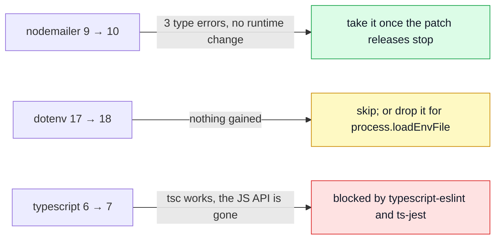

# Pending Major Upgrades

Three majors are deliberately not taken yet: `nodemailer` 10, `dotenv` 18 and `typescript` 7.
Each row below says what breaks, what it costs, and when to move. Measured 2026-09-30 by installing
the candidate over a clean checkout, type-checking, and running the affected suites — nothing was
merged.



| Package      | Now      | Latest    | Verdict                                | Effort |
| ------------ | -------- | --------- | -------------------------------------- | ------ |
| `nodemailer` | `9.1.1`  | `10.0.13` | **Take it**, after the releases settle | S      |
| `dotenv`     | `17.3.1` | `18.0.4`  | **Skip**, or replace with Node itself  | S      |
| `typescript` | `6.0.3`  | `7.0.2`   | **Wait** for 7.1 and the tools above   | M–L    |

## nodemailer 10

| Question        | Answer                                                                                                                                                           |
| --------------- | ---------------------------------------------------------------------------------------------------------------------------------------------------------------- |
| Breaking change | Node 20 or newer (this repo requires `^24`). The package is now written in TypeScript with ESM and CommonJS builds.                                              |
| Types           | It ships its own declarations, so `@types/nodemailer` is redundant once it is taken.                                                                             |
| What broke here | `SentMessageInfo` now requires `envelope`. Three spots stop type-checking: `mailer.ts` (two) and `email.worker.test.ts` (three stub returns).                    |
| Runtime         | The four suites that `jest.mock('nodemailer')` still pass (98 tests). The mock replaces the module, so the new dual build never loads under Jest.                |
| Risk            | Low for behaviour. The churn is the risk: thirteen patch releases in four weeks, most of them linear-time rewrites of the address and MIME parsers.              |
| Recommendation  | Take it once a fortnight passes with no release. Then: bump, drop `@types/nodemailer`, widen the three stubs to the full `SentMessageInfo`, run `mailer` suites. |
| Effort          | S — under an hour, plus one live send through `NODE_MAIL_TRANSPORT=smtp` against Mailpit.                                                                        |

## dotenv 18

| Question          | Answer                                                                                                                                                                                             |
| ----------------- | -------------------------------------------------------------------------------------------------------------------------------------------------------------------------------------------------- |
| Breaking change   | Preloading (`node -r dotenv/config`) removed, `.env.vault` removed, the "injected env" line moves from stdout to stderr and the tips are gone.                                                     |
| Added             | A `dotenv run -- cmd` CLI, and an opt-in `fast: true` parser.                                                                                                                                      |
| Touches this repo | Nothing. `import 'dotenv/config'` is still an export (22 import sites); no vault, no preload flag, no CLI use.                                                                                     |
| What it buys      | Nothing this repo uses. That is why 18 was left alone.                                                                                                                                             |
| Better option     | Node 24 has `process.loadEnvFile()`, which also leaves an already-set variable alone — dotenv's own default. It would remove a dependency (CLAUDE.md: the runtime over a library).                 |
| Risk of that      | Parser differences on multi-line values, `export ` prefixes and inline comments. `.env-example` would need a read-through, and `tests/support/setup.ts` relies on the `dotenv/config` side effect. |
| Recommendation    | Do not take 18 for its own sake. If the dependency is wanted gone, that is a separate S-sized change with a test over `.env-example`.                                                              |
| Effort            | S either way.                                                                                                                                                                                      |

## TypeScript 7

7 is the native (Go) compiler. Trial: `tsc --noEmit -p tsconfig.json` with `typescript@7.0.2`
reports **zero errors** on this repo and finishes in 2.5 s, against 8.6 s for 6.0.3.

What is gone is the JavaScript API. The package root now exports only a version file; the
programmatic API lives under `typescript/unstable/*`, and 7.1 is where a stable one is promised.
Everything that calls `require('typescript')` breaks:

| Tool                                          | Uses the JS API for         | Position on 7                             |
| --------------------------------------------- | --------------------------- | ----------------------------------------- |
| `typescript-eslint` (parser, type-aware lint) | the whole type-checked lint | peer range `>=4.8.4 <6.1.0` — refuses 7   |
| `ts-jest`                                     | transpiling every test file | peer range `>=4.3 <7` — refuses 7         |
| `dependency-cruiser`                          | optional TS parsing         | not tried; check its own peer range first |
| `tsx`                                         | nothing (esbuild)           | unaffected                                |
| `tsc` itself (`npm run ts-check`)             | —                           | works; this is the part that is ready     |

| Question       | Answer                                                                                                                                                                                             |
| -------------- | -------------------------------------------------------------------------------------------------------------------------------------------------------------------------------------------------- |
| Blocked by     | `typescript-eslint` and `ts-jest` releasing a 7-compatible range, which depends on the 7.1 API.                                                                                                    |
| Half-step      | Alias 7 for the CLI only (`"typescript-7": "npm:typescript@7"`) and run `ts-check` through it, keeping `typescript@6` for the tools. Two compilers in one tree is the cost.                        |
| Recommendation | Wait for 7.1. Re-check `npm view typescript-eslint peerDependencies` and `npm view ts-jest peerDependencies` when it lands; the day both accept 7, the upgrade is a bump plus a lint and test run. |
| Effort         | M–L once unblocked: a `tsconfig` deprecation pass, then every rule in the type-aware lint re-run for changed diagnostics.                                                                          |

## Try it yourself

```sh
npm view nodemailer dist-tags.latest          # is 10 still moving?
npm view typescript-eslint peerDependencies   # does the range admit 7 yet?
npm view ts-jest peerDependencies
```

See also: [Dependency Vetting](./dependency-vetting.md) for what is checked before any upgrade,
[Package Dependencies](./package-dependencies.md) for what each package is for.
