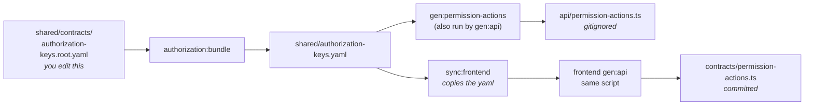

# Permission Actions

The action vocabulary (`read`, `create`, `update`, `delete`, `checkout`, ...) is written **once**,
as `actions:` in `shared/authorization-keys.yaml`, and generated into both repos.

## One list, generated twice

| Side     | Reads                                                 | Writes                                       | Committed?            |
| -------- | ----------------------------------------------------- | -------------------------------------------- | --------------------- |
| Backend  | `shared/authorization-keys.yaml`                      | `api/permission-actions.ts`                  | no, like `api/`       |
| Frontend | `<frontend>/contracts/authorization-keys.yaml` (copy) | `<frontend>/contracts/permission-actions.ts` | yes, like `routes.ts` |

`regenerate` runs `gen:permission-actions` **before** `contracts:bundle`: the bundler loads the kernel,
and the kernel imports this generated file, so on a clean checkout it has to exist first. `gen:api`
runs the same script again because its `rm -rf ./api` removes the file.

## What consumes it

- Backend: `kernel/permissions.ts` re-exports the `PermissionAction` type and hands
  `PERMISSION_ACTIONS` to the Zod schemas that validate every key in the shared file.
- Frontend: `PermissionAction` in `<frontend>/src/infrastructure/session.ts` is the generated type, so a screen
  can only ask `can()` for an action the backend declares.

## Adding an action

1. Add it to `actions:` in `shared/contracts/authorization-keys.root.yaml`, with the reason CRUD
   cannot say it.
2. Declare a key that carries it, in the module's `authorization.yaml`.
3. `npm run regenerate`. Nothing else is typed by hand.

## Guards

- Backend: `tests/cross-cutting/permission-actions.test.ts` (the generated array equals the yaml, no
  second list in the kernel) and `tests/unit/scripts/contracts/permission-actions-render.test.ts`.
- Frontend: `npm run check:permission-actions` compares the committed file with a fresh render.
- Pair: `check:spec-identity` fails when the yaml copy differs from the backend's.

The generator is a shared script, byte-identical in both repos, like `generate-error-codes.ts`.
