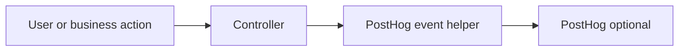

# PostHog

## Why PostHog is here

PostHog is the **product analytics** example in this boilerplate.
It is useful when you want business events, not just infra metrics.

## Event flow

## Role in the boilerplate

Examples like signup, login, product view, cart, checkout, and order events show where product analytics can live without polluting every file.

It is optional by design.
If PostHog is not configured, the app still works.

## External references

- [PostHog Node.js library](https://posthog.com/docs/libraries/node) — the client used in this repo

## Related pages

- [Request Flow](../theory/request-flow.md)
- [Prometheus](./prometheus.md)
- [Grafana](./grafana.md)
