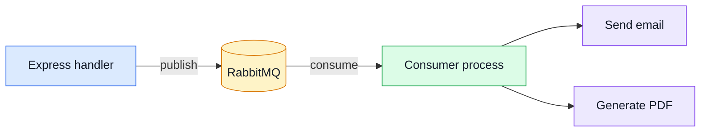
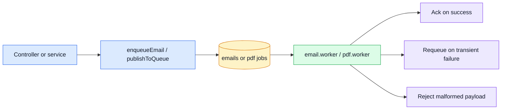

# RabbitMQ

[RabbitMQ](https://www.rabbitmq.com/) is used as a message broker to offload heavy or unreliable work (emails, PDF generation, webhooks, etc.) from the request/response cycle into background queues.

## Why a queue?

| Without queue                      | With queue                                     |
| ---------------------------------- | ---------------------------------------------- |
| Email sent inside the HTTP handler | Message published → handler responds instantly |
| Slow SMTP = slow API response      | Consumer retries independently                 |
| Failure loses the job              | Message is re-queued on failure                |

## Where the code lives

| Concern              | File                                            |
| -------------------- | ----------------------------------------------- |
| Connection & helpers | `src/utils/queue.ts`                            |
| Queue-aware dispatch | `src/utils/nodemailer.ts` → `enqueueEmail()`    |
| Email worker         | `src/workers/email.worker.ts`                   |
| PDF worker           | `src/workers/pdf.worker.ts`                     |
| Worker registration  | `src/workers/index.ts`                          |
| Startup hook         | `src/app.ts` → `startQueue` + `registerWorkers` |
| Shutdown hook        | `src/app.ts` → `stopQueue`                      |

## Architecture



## How it's used

### Emails (fire-and-forget)

All controllers that send emails use `enqueueEmail()` from `src/utils/nodemailer.ts`:

- **Queue enabled** → the email job is published to the `emails` queue. The `email.worker.ts` consumer picks it up and calls `nodemailer()` in the background.
- **Queue disabled** → falls back to calling `nodemailer()` directly (same behavior as before).

Controllers using it:

- `post-reset-request.ts` — password reset email
- `post-reset-confirm.ts` — password change confirmation
- `post-orders.ts` — order confirmation email
- `post-feedback-contact.ts` — contact form notification

### PDF generation (async)

The `pdf.worker.ts` consumer handles async PDF generation jobs (e.g. batch invoices, reports). The synchronous invoice endpoint (`GET /orders/:id/invoice`) still renders PDFs inline since it must return the file directly to the client.

## Job lifecycle



## Configuration

| Env var                 | Description                                               |
| ----------------------- | --------------------------------------------------------- |
| `NODE_RABBITMQ_URL`     | Full AMQP URI (preferred). Example: `******rabbitmq:5672` |
| `NODE_RABBITMQ_HOST`    | Hostname fallback when URL is not set.                    |
| `NODE_RABBITMQ_PORT`    | Port fallback (default `5672`).                           |
| `NODE_RABBITMQ_USER`    | Username fallback (default `guest`).                      |
| `NODE_RABBITMQ_PASS`    | Password fallback (default `guest`).                      |
| `NODE_RABBITMQ_ENABLED` | Set to `0` to disable even if URL is configured.          |

When none of the vars are set, all queue operations silently no-op — the rest of the app works normally.

## Docker Compose

The `docker-compose.yml` includes a `rabbitmq` service with the management plugin:

- **AMQP port**: `5672`
- **Management UI**: `http://localhost:15672` (guest / guest)

## Usage

### Publishing a message

```ts
import { publishToQueue } from '@utils/queue';

// Inside a controller or service:
await publishToQueue({
    queue: 'emails',
    payload: { to: 'user@example.com', template: 'welcome', data: { name: 'Alice' } }
});
```

### Consuming messages

```ts
import { consumeFromQueue } from '@utils/queue';

consumeFromQueue({
    queue: 'emails',
    prefetch: 5,
    handler: async (message) => {
        // Process the message; return true to ack, false to nack.
        await sendEmail(message);
        return true;
    }
});
```

### Options

| Publish option | Default | Description                     |
| -------------- | ------- | ------------------------------- |
| `durable`      | `true`  | Queue survives broker restarts. |
| `persistent`   | `true`  | Message is written to disk.     |

| Consume option | Default | Description                              |
| -------------- | ------- | ---------------------------------------- |
| `durable`      | `true`  | Queue survives broker restarts.          |
| `prefetch`     | `1`     | Unacknowledged messages allowed at once. |

## Graceful shutdown

`stopQueue()` is called during the app's graceful shutdown sequence (after the HTTP server closes). It closes the AMQP connection cleanly so in-flight messages are not lost.

## Useful links

- [RabbitMQ documentation](https://www.rabbitmq.com/docs)
- [amqplib API reference](https://amqp-node.github.io/amqplib/channel_api.html)
- [RabbitMQ tutorials (Node.js)](https://www.rabbitmq.com/tutorials)

## Related pages

- [Email & PDF Rendering](./email-and-rendering.md) — primary queue use case
- [Runtime](./runtime.md) — startup/shutdown lifecycle
- [AsyncAPI Workflow](../api/asyncapi-workflow.md) — async contracts for worker queues
- [Redis Cache](./redis-cache.md) — similar optional-infrastructure pattern
