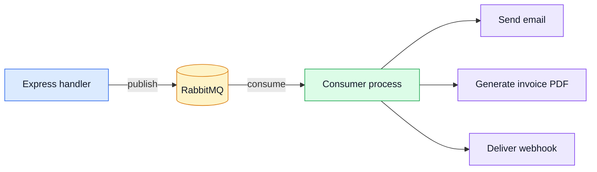
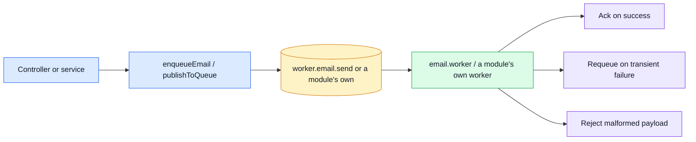
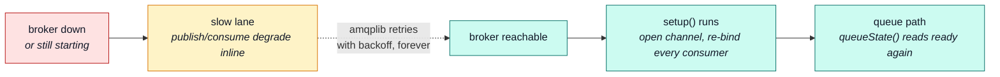

# RabbitMQ

[RabbitMQ](https://www.rabbitmq.com/) is used as a message broker to offload heavy or unreliable work (emails, PDF generation, webhooks, etc.) from the request/response cycle into background queues.

## Why a queue?

| Without queue                      | With queue                                     |
| ---------------------------------- | ---------------------------------------------- |
| Email sent inside the HTTP handler | Message published → handler responds instantly |
| Slow SMTP = slow API response      | Consumer retries independently                 |
| Failure loses the job              | Message is re-queued on failure                |

## Where the code lives

| Concern                     | File                                                                                                |
| --------------------------- | --------------------------------------------------------------------------------------------------- |
| Connection & helpers        | `src/infrastructure/adapters/queue.ts`                                                              |
| Queue-aware dispatch        | `src/infrastructure/adapters/mailer.ts` → `enqueueEmail()`                                          |
| Email worker (domainless)   | `src/infrastructure/adapters/email.worker.ts`                                                       |
| Invoice PDF worker (module) | `src/modules/orders/transport/invoice-pdf.ts`                                                       |
| Webhook delivery (module)   | `src/modules/webhooks/services/attempt.ts`                                                          |
| Worker registration         | `src/app/workers.ts` (domainless queues) + `kernel/registry.ts`'s `resolveConsumers` (module-owned) |
| Startup hook                | `src/app.ts` → `startQueue` + `registerWorkers`                                                     |
| Shutdown hook               | `src/app.ts` → `stopQueue`                                                                          |

## Architecture


```mermaid
%%{init: {'flowchart': {'nodeSpacing': 55, 'rankSpacing': 65}}}%%
flowchart LR
    API[Express handler] -->|publish| RMQ[(RabbitMQ)]
    RMQ -->|consume| Worker[Consumer process]
    Worker --> SMTP[Send email]
    Worker --> PDF[Generate invoice PDF]
    Worker --> Hook[Deliver webhook]

    classDef app fill:#dbeafe,stroke:#2563eb,color:#111827;
    classDef queue fill:#fef3c7,stroke:#d97706,color:#111827;
    classDef worker fill:#dcfce7,stroke:#16a34a,color:#111827;
    classDef outbound fill:#ede9fe,stroke:#7c3aed,color:#111827;
    class API app;
    class RMQ queue;
    class Worker worker;
    class SMTP,PDF,Hook outbound;
```

## How it's used

### Emails (fire-and-forget)

All controllers that send emails use `enqueueEmail()` from `src/infrastructure/adapters/mailer.ts`:

- **Queue enabled** → the email job is published to the `worker.email.send` queue. The `email.worker.ts` consumer picks it up and calls `nodemailer()` in the background.
- **Queue disabled** → falls back to calling `nodemailer()` directly (same behavior as before).

Controllers using it:

- `post-reset-request.ts` — password reset email
- `post-reset-confirm.ts` — password change confirmation
- `write-orders.ts` — order confirmation email
- `post-feedback-contact.ts` — contact form notification

### Invoice PDF generation (async, module-owned)

`orders`' own `worker.orders.invoice-generate` queue (`src/modules/orders/transport/invoice-pdf.ts`,
`asyncapi.internal.yaml`) is enqueued from the module's own `order.created` listener — fires exactly
once per order, whichever of the two creation paths made it. The worker resolves the order by id,
renders the same EJS template `GET /orders/:id/invoice` renders synchronously, writes the PDF to
private storage (`NODE_INVOICE_STORAGE_PATH`, never under `NODE_PUBLIC_PATH`), and flips
`Order.invoicePdfStatus` from `pending` to `ready`.

`GET /orders/:id/invoice` reads that status: `ready` streams the stored file, `pending` answers
`202` so the client can poll and grey out the download button, and an order that PREDATES this
field entirely (no queue was ever enqueued for it) falls back to the old synchronous render — the
behaviour every order had before this queue existed. No broker configured, or the queue publish
fails: the same fallback runs inline instead, right after the order is written, so a dev/demo
deployment with RabbitMQ off still gets every invoice generated.

## Job lifecycle


```mermaid
%%{init: {'flowchart': {'nodeSpacing': 50, 'rankSpacing': 65}}}%%
flowchart LR
    Producer[Controller or service] --> Publish[enqueueEmail / publishToQueue]
    Publish --> Queue[(worker.email.send or a module's own)]
    Queue --> Consume[email.worker / a module's own worker]
    Consume --> Ack[Ack on success]
    Consume --> Retry[Requeue on transient failure]
    Consume --> Drop[Reject malformed payload]

    classDef app fill:#dbeafe,stroke:#2563eb,color:#111827;
    classDef queue fill:#fef3c7,stroke:#d97706,color:#111827;
    classDef worker fill:#dcfce7,stroke:#16a34a,color:#111827;
    classDef result fill:#ede9fe,stroke:#7c3aed,color:#111827;
    class Producer,Publish app;
    class Queue queue;
    class Consume worker;
    class Ack,Retry,Drop result;
```

## Configuration

| Env var                 | Description                                               |
| ----------------------- | --------------------------------------------------------- |
| `NODE_RABBITMQ_URL`     | Full AMQP URI (preferred). Example: `******rabbitmq:5672` |
| `NODE_RABBITMQ_HOST`    | Hostname fallback when URL is not set.                    |
| `NODE_RABBITMQ_PORT`    | Port fallback (default `5672`).                           |
| `NODE_RABBITMQ_USER`    | Username fallback (default `guest`).                      |
| `NODE_RABBITMQ_PASS`    | Password fallback (default `guest`).                      |
| `NODE_RABBITMQ_ENABLED` | Set to `0` to disable even if URL is configured.          |

When none of the vars are set, all queue operations silently no-op — the rest of the app works normally.

## Docker Compose

The `docker-compose.yml` includes a `rabbitmq` service with the management plugin:

- **AMQP port**: `5672`
- **Management UI**: `http://localhost:15672` (guest / guest)

## Usage

### Publishing a message

```ts
import { publishToQueue, EMAIL_QUEUE } from '@infrastructure/adapters/queue';

// Inside a controller or service:
await publishToQueue({
    queue: EMAIL_QUEUE,
    payload: { to: 'user@example.com', template: 'welcome', data: { name: 'Alice' } }
});
```

Never a string literal. `EMAIL_QUEUE` and `IMAGE_QUEUE` are aliases of `WORKER_CHANNELS.EMAIL_SEND`
and `WORKER_CHANNELS.IMAGE_DIGEST`; a module-owned queue reads its own entry off `WORKER_CHANNELS`
directly (`webhooks`' `WORKER_CHANNELS.WEBHOOK_DELIVER`, `orders`' own
`WORKER_CHANNELS.ORDERS_INVOICE_GENERATE`) — all generated out of `asyncapi.yaml`, so the name a
producer publishes to, the name the consumer drains and the name the contract declares are one
string. A typo in a literal is not an error anywhere; it is a message on a queue nobody reads.

### Consuming messages

```ts
import { consumeFromQueue, EMAIL_QUEUE } from '@infrastructure/adapters/queue';

consumeFromQueue({
    queue: EMAIL_QUEUE,
    prefetch: 5,
    handler: async (message) => {
        // Return true to ack. Return false ONLY for a job that will never be processable —
        // it is dead-lettered permanently. Let anything transient reject: the broker requeues it.
        await sendEmail(message);
        return true;
    }
});
```

### Dead letters

Every work queue is declared with a dead-letter exchange, and every declaration also creates and
binds the queue the refusals land in:

| Name           | What it is                                                     |
| -------------- | -------------------------------------------------------------- |
| `dead-letter`  | A `direct` exchange. Every refused message is routed to it.    |
| `<queue>.dead` | The dead-letter queue for `<queue>`, bound under its own name. |

That is what makes the handler's three outcomes mean what they say:

| Handler does  | Broker call               | Where the message goes         |
| ------------- | ------------------------- | ------------------------------ |
| resolve true  | `ack`                     | deleted — the job is done      |
| resolve false | `nack(msg, false, false)` | `<queue>.dead`, for a human    |
| reject        | `nack(msg, false, true)`  | back on `<queue>`, tried again |

**Upgrading an existing broker.** `assertQueue` throws `PRECONDITION_FAILED` when a queue already
exists with different arguments — which is what adding the dead-letter policy, and later the
`x-max-priority` argument in [Priority](#priority), does to a broker holding queues declared
without them. The channel dies, is replaced, and fails the same way. Delete the old queues once
(`rabbitmqctl delete_queue worker.email.send`, and the same for `worker.image.digest` and any
module-owned queue) with the consumers stopped, then restart the app — the declarations are
recreated on the first publish.

### Priority

Every work queue is declared with `x-max-priority: 1`, so every message carries one of two
levels:

| `JobPriority` | Number | Meaning                                                                                                        |
| ------------- | ------ | -------------------------------------------------------------------------------------------------------------- |
| `'normal'`    | `0`    | Default. Everything informational.                                                                             |
| `'high'`      | `1`    | A person is actively blocked on this — jumps ahead of `'normal'` messages currently waiting on the same queue. |

`enqueueEmail()` defaults to `'normal'` and takes an optional fourth argument; the account
module's token-bearing links (password reset, account deletion, account setup, email
verification — all short-TTL, all a person is staring at an inbox for) pass `'high'`. Order
confirmations, delivery notices and the rest stay `'normal'`.

Two levels, deliberately: RabbitMQ's priority ordering is approximate under load — it reorders
within whatever the broker currently has buffered, not a strict global heap — so this is "give
the few urgent things a preference," not a real-time scheduler. See
[RabbitMQ: Priority Queue Support](https://www.rabbitmq.com/docs/priority).

### Options

| Publish option | Default    | Description                                                                                        |
| -------------- | ---------- | -------------------------------------------------------------------------------------------------- |
| `durable`      | `true`     | Queue survives broker restarts.                                                                    |
| `persistent`   | `true`     | Message is written to disk.                                                                        |
| `priority`     | `'normal'` | `'high'` jumps ahead of `'normal'` messages waiting on the same queue — see [Priority](#priority). |

| Consume option | Default | Description                              |
| -------------- | ------- | ---------------------------------------- |
| `durable`      | `true`  | Queue survives broker restarts.          |
| `prefetch`     | `1`     | Unacknowledged messages allowed at once. |

## Recovery

The connection recovers on its own — amqplib's opt-in `recovery` option
(`connect(url, { recovery: { setup } })`), not a hand-rolled retry loop. `setup` runs after every
successful (re)connect, first one included, and is what opens the one channel this process uses
and re-binds every consumer `consumeFromQueue` has ever registered — a fresh channel starts with
none of its own, whether it is boot's first one or a reconnect's.


```mermaid
%%{init: {'flowchart': {'nodeSpacing': 45, 'rankSpacing': 60}}}%%
flowchart LR
    D["broker down<br/><i>or still starting</i>"] --> S["slow lane<br/><i>publish/consume degrade inline</i>"]
    S -.->|"amqplib retries<br/>with backoff, forever"| R["broker reachable"]
    R --> U["setup() runs<br/><i>open channel, re-bind every consumer</i>"]
    U --> Q["queue path<br/><i>queueState() reads ready again</i>"]

    classDef bad fill:#fee2e2,stroke:#b91c1c,color:#111827;
    classDef wait fill:#fef3c7,stroke:#d97706,color:#111827;
    classDef done fill:#ccfbf1,stroke:#0f766e,color:#111827;
    class D bad;
    class S wait;
    class R,U,Q done;
```

Three rules the connection layer keeps because of how amqplib's own recovery works:

- **Boot never waits for the broker.** `connect(url, { recovery })`'s promise settles only once
  the FIRST connect succeeds — retrying forever underneath — so `startQueue()` never awaits it;
  awaiting it would stop the app booting until a broker answered.
- **Nothing waits for a channel during an outage.** `createChannel()` on the recovering
  connection parks the caller until reconnected, so `publishToQueue`/`consumeFromQueue` never call
  it directly — they read `currentChannel`, a plain variable `setup` sets and the channel's own
  `close` event clears, `undefined` meaning "take the slow lane".
- **A channel can die while the connection lives.** Recovery only reacts to a CONNECTION drop; an
  ordinary channel-level fault (a `PRECONDITION_FAILED`, say) is handled the same way it always
  was — `error`/`close` listeners on the channel itself.

`maxRetries` is `0` under `NODE_ENV=test`: amqplib's retry timer is never `.unref()`'d, so an
unreachable broker — the routine case locally, since `.env` names the compose hostname, which
resolves nowhere outside it — would otherwise keep a test process from exiting on its own.
Production keeps the library default, `Infinity`.

## Graceful shutdown

`stopQueue()` is called during the app's graceful shutdown sequence (after the HTTP server closes). It closes the AMQP connection cleanly so in-flight messages are not lost.

## Works with

- **[Email & PDF Rendering](./email-and-rendering.md)** — the primary use case for this queue. Controllers publish email jobs instead of calling Nodemailer directly; the `email.worker.ts` consumer sends the email independently. `orders`' own invoice PDF pipeline follows the same publish/consume shape, module-owned. → [How it's used](./rabbitmq.md#how-it-s-used)

## External references

- [amqplib channel API](https://amqp-node.github.io/amqplib/channel_api.html) — the client library used in `src/infrastructure/adapters/queue.ts`
- [RabbitMQ tutorials (Node.js)](https://www.rabbitmq.com/tutorials) — queue patterns with code examples

## Related pages

- [Email & PDF Rendering](./email-and-rendering.md) — primary queue use case
- [Runtime](./runtime.md) — startup/shutdown lifecycle
- [AsyncAPI Workflow](../api/asyncapi-workflow.md) — async contracts for worker queues
- [Redis Cache](./redis-cache.md) — similar optional-infrastructure pattern
