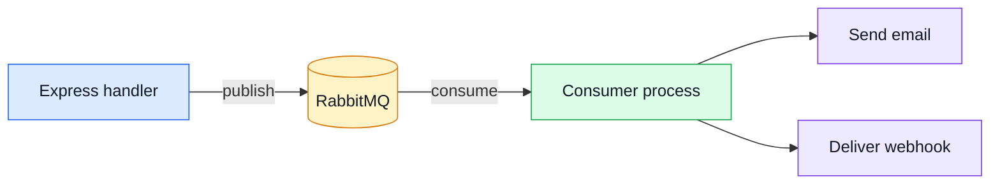
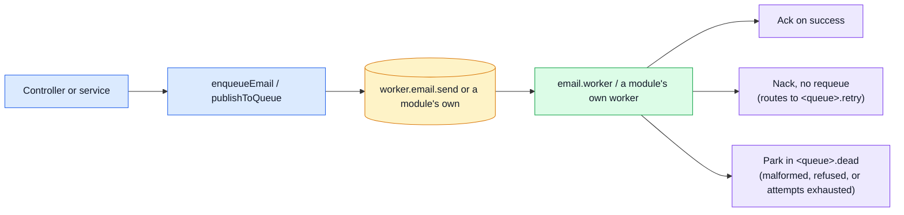
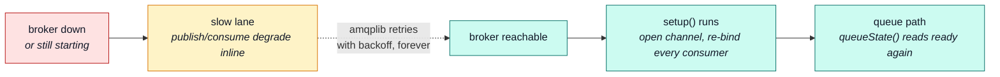

# RabbitMQ

[RabbitMQ](https://www.rabbitmq.com/) is used as a message broker to offload heavy or unreliable work (emails, webhook delivery, etc.) from the request/response cycle into background queues.

## Why a queue?

| Without queue                      | With queue                                     |
| ---------------------------------- | ---------------------------------------------- |
| Email sent inside the HTTP handler | Message published → handler responds instantly |
| Slow SMTP = slow API response      | Consumer retries independently                 |
| Failure loses the job              | Message is re-queued on failure                |

## Where the code lives

| Concern                   | File                                                                                                |
| ------------------------- | --------------------------------------------------------------------------------------------------- |
| Connection & helpers      | `src/infrastructure/adapters/queue.ts`                                                              |
| Queue-aware dispatch      | `src/infrastructure/adapters/mailer.ts` → `enqueueEmail()`                                          |
| Email worker (domainless) | `src/infrastructure/adapters/email.worker.ts`                                                       |
| Webhook delivery (module) | `src/modules/webhooks/services/attempt.ts`                                                          |
| Worker registration       | `src/app/workers.ts` (domainless queues) + `kernel/registry.ts`'s `resolveConsumers` (module-owned) |
| Startup hook              | `src/app.ts` → `startQueue` + `registerWorkers`                                                     |
| Shutdown hook             | `src/app.ts` → `stopQueue`                                                                          |

## Architecture


```mermaid
%%{init: {'flowchart': {'nodeSpacing': 55, 'rankSpacing': 65}}}%%
flowchart LR
    API[Express handler] -->|publish| RMQ[(RabbitMQ)]
    RMQ -->|consume| Worker[Consumer process]
    Worker --> SMTP[Send email]
    Worker --> Hook[Deliver webhook]

    classDef app fill:#dbeafe,stroke:#2563eb,color:#111827;
    classDef queue fill:#fef3c7,stroke:#d97706,color:#111827;
    classDef worker fill:#dcfce7,stroke:#16a34a,color:#111827;
    classDef outbound fill:#ede9fe,stroke:#7c3aed,color:#111827;
    class API app;
    class RMQ queue;
    class Worker worker;
    class SMTP,Hook outbound;
```

## How it's used

### Emails (fire-and-forget)

All controllers that send emails use `enqueueEmail()` from `src/infrastructure/adapters/mailer.ts`:

- **Queue enabled** → the email job is published to the `worker.email.send` queue. The `email.worker.ts` consumer picks it up and calls `sendTemplatedEmail()` in the background.
- **Queue disabled** → falls back to calling `sendTemplatedEmail()` directly (same behavior as before).

Controllers using it:

- `post-reset-request.ts` — password reset email
- `post-reset-confirm.ts` — password change confirmation
- `write-orders.ts` — order confirmation email
- `post-feedback-contact.ts` — contact form notification

### Invoice PDF rendering — NOT a queue

`GET /orders/:id/invoice` renders the PDF synchronously, on the request thread —
`src/modules/orders/services/invoice.ts`'s `renderInvoicePdf` — and streams the bytes back. There
is no queue, no worker and no stored status: the invoice is a view of the order, rendered when
someone asks for it, never a durable artefact this broker moves around.

## Job lifecycle


```mermaid
%%{init: {'flowchart': {'nodeSpacing': 50, 'rankSpacing': 65}}}%%
flowchart LR
    Producer[Controller or service] --> Publish[enqueueEmail / publishToQueue]
    Publish --> Queue[(worker.email.send or a module's own)]
    Queue --> Consume[email.worker / a module's own worker]
    Consume --> Ack[Ack on success]
    Consume --> Retry["Nack, no requeue<br/>(routes to &lt;queue&gt;.retry)"]
    Consume --> Drop["Park in &lt;queue&gt;.dead<br/>(malformed, refused, or attempts exhausted)"]

    classDef app fill:#dbeafe,stroke:#2563eb,color:#111827;
    classDef queue fill:#fef3c7,stroke:#d97706,color:#111827;
    classDef worker fill:#dcfce7,stroke:#16a34a,color:#111827;
    classDef result fill:#ede9fe,stroke:#7c3aed,color:#111827;
    class Producer,Publish app;
    class Queue queue;
    class Consume worker;
    class Ack,Retry,Drop result;
```

See [Retries and parking](#retries-and-parking) for what happens after the "nack" and "park" arms.

## Configuration

| Env var                 | Description                                               |
| ----------------------- | --------------------------------------------------------- |
| `NODE_RABBITMQ_URL`     | Full AMQP URI (preferred). Example: `******rabbitmq:5672` |
| `NODE_RABBITMQ_HOST`    | Hostname fallback when URL is not set.                    |
| `NODE_RABBITMQ_PORT`    | Port fallback (default `5672`).                           |
| `NODE_RABBITMQ_USER`    | Username fallback (default `guest`).                      |
| `NODE_RABBITMQ_PASS`    | Password fallback (default `guest`).                      |
| `NODE_RABBITMQ_ENABLED` | Set to `0` to disable even if URL is configured.          |

When none of the vars are set, all queue operations silently no-op — the rest of the app works normally.

## Docker Compose

The `docker-compose.yml` includes a `rabbitmq` service with the management plugin:

- **AMQP port**: `5672`
- **Management UI**: `http://localhost:15672` (guest / guest)

## Usage

### Publishing a message

```ts
import { publishToQueue, EMAIL_QUEUE } from '@infrastructure/adapters/queue';

// Inside a controller or service:
await publishToQueue({
    queue: EMAIL_QUEUE,
    payload: { to: 'user@example.com', template: 'welcome', data: { name: 'Alice' } }
});
```

Never a string literal. `EMAIL_QUEUE` and `IMAGE_QUEUE` are aliases of `WORKER_CHANNELS.EMAIL_SEND`
and `WORKER_CHANNELS.IMAGE_DIGEST`; a module-owned queue reads its own entry off `WORKER_CHANNELS`
directly (`webhooks`' `WORKER_CHANNELS.WEBHOOK_DELIVER`) — all generated out of `asyncapi.yaml`, so
the name a producer publishes to, the name the consumer drains and the name the contract declares
are one string. A typo in a literal is not an error anywhere; it is a message on a queue nobody
reads.

`publishToQueue`'s `true`/`false` answers the BROKER's own confirmation, not `sendToQueue`'s return
value — the channel it publishes on is a confirm channel
(`model.createConfirmChannel()`), and only the confirm callback resolves the promise (a 5s timeout
falls back to `false` if it never arrives). `sendToQueue` returning `false` on its own means "the
local write buffer is full, wait for `drain`" — never "failed" — so a caller reading THAT boolean
directly would run its inline fallback alongside a publish that was going to succeed anyway.

### Consuming messages

```ts
import { consumeFromQueue, EMAIL_QUEUE } from '@infrastructure/adapters/queue';

consumeFromQueue({
    queue: EMAIL_QUEUE,
    prefetch: 5,
    handler: async (message) => {
        // Return true to ack. Return false ONLY for a job that will never be processable —
        // it is dead-lettered permanently. Let anything transient reject: nack routes it to
        // `<queue>.retry` (TTL, no consumer), which expires back onto this queue — never an
        // immediate broker requeue.
        await sendEmail(message);
        return true;
    }
});
```

### Retries and parking

A failing job waits in a TTL queue and comes back on its own — the broker owns the delay, not an
app-side timer:

```
work queue ──(nack, requeue=false)──▶ <queue>.retry (TTL, no consumer) ──(expires)──▶ work queue
                                                                            attempts exhausted ──▶ <queue>.dead
```

Every work queue is declared with two companions, all through the same `dead-letter` exchange (a
`direct` exchange — a routing key names exactly one queue):

| Name            | What it is                                                                                                                             |
| --------------- | -------------------------------------------------------------------------------------------------------------------------------------- |
| `<queue>.retry` | No consumer. `x-message-ttl` set to `NODE_QUEUE_RETRY_DELAY_SECONDS`; dead-letters BACK to `<queue>` once a message sits out its wait. |
| `<queue>.dead`  | The parking lot. No consumer, no `x-dead-letter-*` of its own — nothing routes here automatically; the app publishes to it directly.   |

The work queue's OWN dead-letter target is `<queue>.retry`, never `<queue>.dead` — a
`nack(msg, false, false)` always means "try again later" now. That is what makes the handler's
outcomes mean what they say:

| Handler does                 | What happens                                                                                       |
| ---------------------------- | -------------------------------------------------------------------------------------------------- |
| resolve `true`               | `ack` — deleted, the job is done                                                                   |
| resolve `false`              | parked in `<queue>.dead` directly — a permanent business rejection, never retried                  |
| malformed / contract-invalid | parked in `<queue>.dead` directly — the bytes will never become valid on a retry                   |
| throws, attempts remain      | `nack(msg, false, false)` — routes to `<queue>.retry`, comes back once its TTL expires             |
| throws, attempts exhausted   | parked in `<queue>.dead`, logged once at `error` (the job's identifying fields, never the payload) |

**The attempt count is free.** RabbitMQ stamps an `x-death` array on a message every time it
dead-letters it, with a `count` per `(queue, reason)` pair. The consumer reads the entry for
`<queue>.retry` to know how many full retry cycles this delivery has already been through — no
custom header, no republish needed to track it.

**Parking is always a direct publish, confirmed.** Every "parked" outcome above goes through the
same internal helper: a `sendToQueue` straight to `<queue>.dead` (bypassing the retry queue and its
DLX chain entirely), and the original message is only acked once that publish is itself confirmed
by the broker — the same confirm-channel guarantee [Publishing a message](#publishing-a-message)
describes, so a parking failure can never silently drop a job.

**The two knobs**, deployment-wide defaults — a consumer that genuinely needs different numbers
declares them on its own `ConsumeOptions`, in code, next to its handler, rather than a second
environment variable:

| Env var                          | Default | Meaning                                         |
| -------------------------------- | ------- | ----------------------------------------------- |
| `NODE_QUEUE_MAX_ATTEMPTS`        | `5`     | Deliveries before a job is parked.              |
| `NODE_QUEUE_RETRY_DELAY_SECONDS` | `30`    | How long a failed job waits in `<queue>.retry`. |

One fixed delay per queue (not per message) is deliberate: RabbitMQ only expires a queue from the
head, so a 5s message queued behind a 10-hour one would otherwise wait 10 hours. One retry queue
per work queue sidesteps that entirely.

**Replaying a parked job** is a management-UI action today (move the message from `<queue>.dead`
back onto `<queue>`), not an app endpoint — a parked job is a morning's work to triage, not
something to automate blindly.

**Upgrading an existing broker.** `assertQueue` throws `PRECONDITION_FAILED` when a queue already
exists with different arguments — which is what this retry topology (and, before it, the
`x-max-priority` argument in [Priority](#priority)) does to a broker holding queues declared
without them. The channel dies, is replaced, and fails the same way. Delete the old queues once
(`rabbitmqctl delete_queue worker.email.send`, and the same for `worker.image.digest` and any
module-owned queue) with the consumers stopped, then restart the app — the declarations, `.retry`
included, are recreated on the first publish. Nothing is deployed against a broker outside this
compose stack as of this writing, so this stays a runbook line rather than a procedure anyone has
had to run.

### Priority

Every work queue is declared with `x-max-priority: 1`, so every message carries one of two
levels:

| `JobPriority` | Number | Meaning                                                                                                        |
| ------------- | ------ | -------------------------------------------------------------------------------------------------------------- |
| `'normal'`    | `0`    | Default. Everything informational.                                                                             |
| `'high'`      | `1`    | A person is actively blocked on this — jumps ahead of `'normal'` messages currently waiting on the same queue. |

`enqueueEmail()` defaults to `'normal'` and takes an optional fourth argument; the account
module's token-bearing links (password reset, account deletion, account setup, email
verification — all short-TTL, all a person is staring at an inbox for) pass `'high'`. Order
confirmations, delivery notices and the rest stay `'normal'`.

Two levels, deliberately: RabbitMQ's priority ordering is approximate under load — it reorders
within whatever the broker currently has buffered, not a strict global heap — so this is "give
the few urgent things a preference," not a real-time scheduler. See
[RabbitMQ: Priority Queue Support](https://www.rabbitmq.com/docs/priority).

### Options

| Publish option | Default    | Description                                                                                        |
| -------------- | ---------- | -------------------------------------------------------------------------------------------------- |
| `durable`      | `true`     | Queue survives broker restarts.                                                                    |
| `persistent`   | `true`     | Message is written to disk.                                                                        |
| `priority`     | `'normal'` | `'high'` jumps ahead of `'normal'` messages waiting on the same queue — see [Priority](#priority). |

| Consume option      | Default                          | Description                                                |
| ------------------- | -------------------------------- | ---------------------------------------------------------- |
| `durable`           | `true`                           | Queue survives broker restarts.                            |
| `prefetch`          | `1`                              | Unacknowledged messages allowed at once.                   |
| `maxAttempts`       | `NODE_QUEUE_MAX_ATTEMPTS`        | Overrides the deployment-wide default for this queue only. |
| `retryDelaySeconds` | `NODE_QUEUE_RETRY_DELAY_SECONDS` | Overrides the deployment-wide default for this queue only. |

## Recovery

The connection recovers on its own — amqplib's opt-in `recovery` option
(`connect(url, { recovery: { setup } })`), not a hand-rolled retry loop. `setup` runs after every
successful (re)connect, first one included, and is what opens the one channel this process uses
and re-binds every consumer `consumeFromQueue` has ever registered — a fresh channel starts with
none of its own, whether it is boot's first one or a reconnect's.


```mermaid
%%{init: {'flowchart': {'nodeSpacing': 45, 'rankSpacing': 60}}}%%
flowchart LR
    D["broker down<br/><i>or still starting</i>"] --> S["slow lane<br/><i>publish/consume degrade inline</i>"]
    S -.->|"amqplib retries<br/>with backoff, forever"| R["broker reachable"]
    R --> U["setup() runs<br/><i>open channel, re-bind every consumer</i>"]
    U --> Q["queue path<br/><i>queueState() reads ready again</i>"]

    classDef bad fill:#fee2e2,stroke:#b91c1c,color:#111827;
    classDef wait fill:#fef3c7,stroke:#d97706,color:#111827;
    classDef done fill:#ccfbf1,stroke:#0f766e,color:#111827;
    class D bad;
    class S wait;
    class R,U,Q done;
```

Three rules the connection layer keeps because of how amqplib's own recovery works:

- **Boot never waits for the broker.** `connect(url, { recovery })`'s promise settles only once
  the FIRST connect succeeds — retrying forever underneath — so `startQueue()` never awaits it;
  awaiting it would stop the app booting until a broker answered.
- **Nothing waits for a channel during an outage.** `createChannel()` on the recovering
  connection parks the caller until reconnected, so `publishToQueue`/`consumeFromQueue` never call
  it directly — they read `currentChannel`, a plain variable `setup` sets and the channel's own
  `close` event clears, `undefined` meaning "take the slow lane".
- **A channel can die while the connection lives.** Recovery only reacts to a CONNECTION drop, so
  a channel-only close (a `PRECONDITION_FAILED`, an ack on an unknown tag) needs its own handling:
  `setupChannel`'s `close` listener re-opens a fresh channel after `CHANNEL_REOPEN_DELAY_MS` and
  replays every consumer this process has ever registered onto it — the same `setup()` the
  connection-level recovery runs, called by hand instead of by amqplib.

`maxRetries` is `0` under `NODE_ENV=test`: amqplib's retry timer is never `.unref()`'d, so an
unreachable broker — the routine case locally, since `.env` names the compose hostname, which
resolves nowhere outside it — would otherwise keep a test process from exiting on its own.
Production keeps the library default, `Infinity`.

## Graceful shutdown

`stopQueue()` is called during the app's graceful shutdown sequence (after the HTTP server closes). It closes the AMQP connection cleanly so in-flight messages are not lost.

## Works with

- **[Email & PDF Rendering](./email-and-rendering.md)** — the primary use case for this queue. Controllers publish email jobs instead of calling Nodemailer directly; the `email.worker.ts` consumer sends the email independently. Invoice PDF rendering is NOT queued — see [Invoice PDF rendering](#invoice-pdf-rendering-not-a-queue). → [How it's used](./rabbitmq.md#how-it-s-used)

## External references

- [amqplib channel API](https://amqp-node.github.io/amqplib/channel_api.html) — the client library used in `src/infrastructure/adapters/queue.ts`
- [RabbitMQ tutorials (Node.js)](https://www.rabbitmq.com/tutorials) — queue patterns with code examples

## Related pages

- [Email & PDF Rendering](./email-and-rendering.md) — primary queue use case
- [Runtime](./runtime.md) — startup/shutdown lifecycle
- [AsyncAPI Workflow](../api/asyncapi-workflow.md) — async contracts for worker queues
- [Redis Cache](./redis-cache.md) — similar optional-infrastructure pattern
