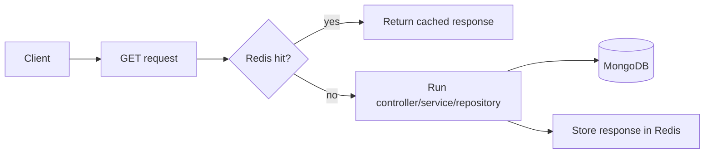

# Redis Cache

## Why Redis is here

Redis is used as an **optional server-side cache** for repeated GET responses.
It makes repeated reads cheaper without becoming required for the API to work.

## Cache flow

## Important behavior

- cache is mainly for repeated reads,
- writes invalidate related tags,
- user-aware scope helps avoid cross-user leakage,
- if Redis is unavailable, the app keeps going.

## Related pages

- [Request Flow](../theory/request-flow.md)
- [MongoDB & Mongoose](./mongodb-mongoose.md)
- [Prometheus](./prometheus.md)
