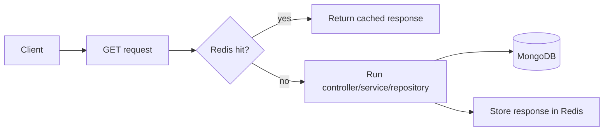
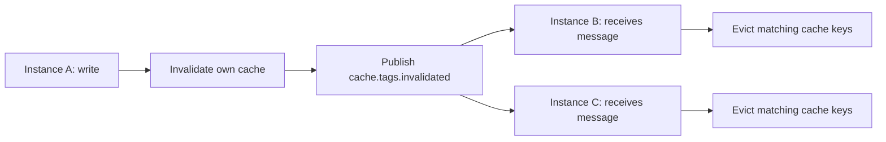

# Redis Cache

## Why Redis is here

[Redis](https://redis.io/docs/latest/) is used as an **optional server-side cache** for repeated GET responses.
It makes repeated reads cheaper without becoming required for the API to work.

The repo uses the official [`redis`](https://github.com/redis/node-redis) Node client; cache helpers live in `src/utils/cache.ts`.

## Cache flow

## Important behavior

- cache is mainly for repeated reads,
- writes invalidate related tags,
- user-aware scope helps avoid cross-user leakage,
- if Redis is unavailable, the app keeps going.

## Multi-instance cache invalidation (pub/sub)

When the same app runs in multiple processes or containers, each instance has its own connection to Redis but makes local invalidation decisions independently.

If instance A writes a product and clears its local cache, instance B still serves the old cached value — unless it is told to invalidate too.

Redis pub/sub solves this:

**Redis as a cache store** keeps response data for fast reads.  
**Redis as a pub/sub bus** synchronises which keys to evict across all instances.

The publisher (`broadcastCacheInvalidation`) and subscriber (`subscribeCacheInvalidation`) both live in `src/utils/cache.ts`.

- The subscriber is started automatically on app boot (after Redis connects) and stopped during graceful shutdown.
- The publisher is called automatically by the `invalidateCache` middleware after every successful write.
- Both are no-ops when Redis is unavailable — the app keeps going.

## Useful links

- [Redis data types](https://redis.io/docs/latest/develop/data-types/)
- [Redis TTL / expiration](https://redis.io/docs/latest/develop/use/keyspace/#key-expiration)
- [Redis pub/sub](https://redis.io/docs/latest/develop/interact/pubsub/)
- [node-redis client guide](https://github.com/redis/node-redis#usage)
- [Cache-aside pattern (Microsoft)](https://learn.microsoft.com/azure/architecture/patterns/cache-aside)

## Related pages

- [Request Flow](../theory/request-flow.md)
- [MongoDB & Mongoose](./mongodb-mongoose.md)
- [Prometheus](./prometheus.md)
- [OpenTelemetry](./opentelemetry.md) — Redis spans show every command
