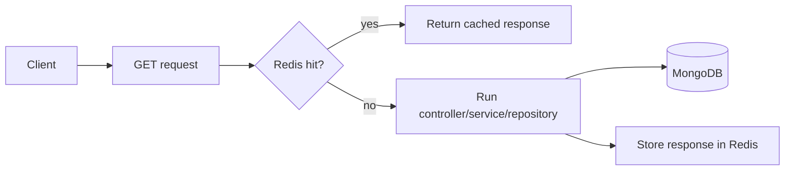
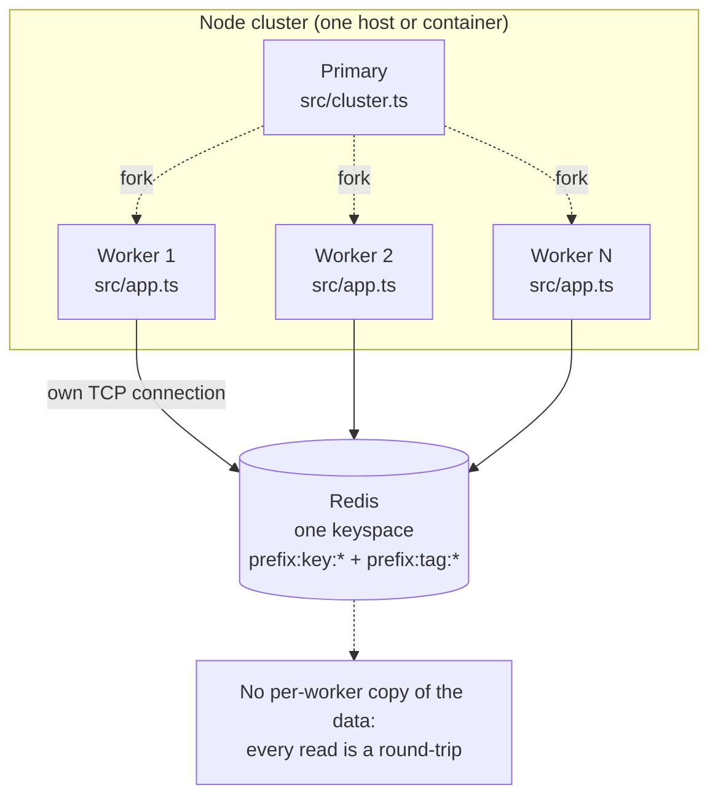
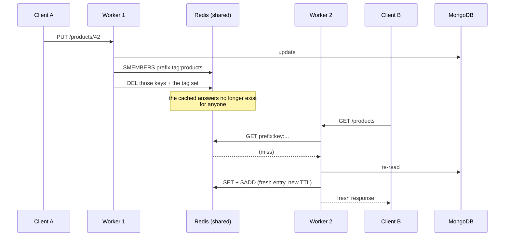
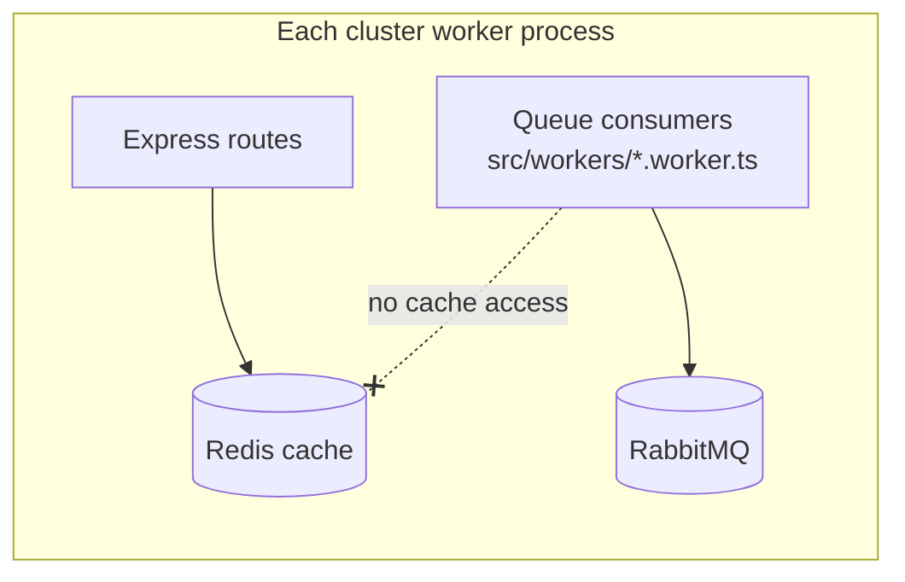

# Redis Cache

## Why Redis is here

[Redis](https://redis.io/docs/latest/) is used as an **optional server-side cache** for repeated GET responses.
It makes repeated reads cheaper without becoming required for the API to work.

The repo uses the official [`redis`](https://github.com/redis/node-redis) Node client; cache helpers live in `src/core/adapters/cache.ts`.

## Cache flow

```mermaid
flowchart LR
    Client --> GET[GET request]
    GET --> Redis{Redis hit?}
    Redis -->|yes| Cached[Return cached response]
    Redis -->|no| API[Run controller/service/repository]
    API --> Mongo[(MongoDB)]
    API --> Save[Store response in Redis]
```

## Important behavior

- cache is mainly for repeated reads,
- writes invalidate related tags,
- user-aware scope helps avoid cross-user leakage,
- if Redis is unavailable, the app keeps going.

## Writes that bypass the API

This is **cache-aside**: reads fill the cache, and whoever writes the data is responsible for
invalidating it. `invalidateCache` (in `src/middlewares/cache.ts`) does that for every write the
API handles.

Nothing does it for writes that never reach Express — `npm run db:seed`, `migrate-mongo`, a
`mongosh` session, a GUI. Those change Mongo while Redis keeps serving the answer it computed
beforehand, which is how a freshly-seeded database can still render as an empty product list.

Two mitigations, because neither is sufficient alone:

|                                | What it does                                                                                                                                                                | Limit                                                             |
| ------------------------------ | --------------------------------------------------------------------------------------------------------------------------------------------------------------------------- | ----------------------------------------------------------------- |
| `npm run db:cache:clear`       | Deletes every key under `NODE_REDIS_CACHE_PREFIX` (`SCAN` + `DEL`, never `FLUSHALL`, so a shared Redis is safe). `db:seed` calls it automatically when it created something | Opt-in — only covers writers that remember                        |
| `NODE_REDIS_CACHE_DEV_TTL_MAX` | Clamps every route's TTL when `NODE_ENV !== 'production'`, default `30`s                                                                                                    | Dev only, and it shortens the stale window rather than closing it |

The TTL cap is the one that matters for writers nobody anticipated: it bounds _every_ out-of-band
write to seconds instead of the route's declared hour. Set it to `0` to opt out and use the
declared TTLs everywhere. Production is never clamped, because there the API is the only writer.

`clearCache()` never throws, but it does report whether it got through: it resolves
`{ deleted, reachable }`, where `reachable: false` means caching is switched on and Redis could
not be reached, so stale entries survived. Its two callers then differ on purpose — `db:seed`
ignores the flag and keeps seeding (an unreachable Redis must not block a seed), while
`db:cache:clear` exits `1`, since a recovery tool that announces `0 keys removed` and exits `0`
having done nothing is indistinguishable from a genuinely empty cache.

The complete answer is to have the database announce its own changes — MongoDB change streams,
or CDC via Debezium — so any write invalidates regardless of origin. Change streams require a
replica set, which this compose file does not run.

## Redis and the workers

With `NODE_ENABLE_CLUSTERING=1` the primary forks one worker per CPU core, and each worker runs
the whole Express app — see [Clustering](../theory/clustering.md). Workers are separate OS
processes: they share no memory, no variables, no in-process cache. What they do share is Redis.

```mermaid
flowchart TD
    subgraph proc["Node cluster (one host or container)"]
        P["Primary<br/>src/cluster.ts"]
        W1["Worker 1<br/>src/app.ts"]
        W2["Worker 2<br/>src/app.ts"]
        WN["Worker N<br/>src/app.ts"]
        P -. fork .-> W1
        P -. fork .-> W2
        P -. fork .-> WN
    end
    W1 -->|own TCP connection| R
    W2 --> R
    WN --> R
    R[("Redis<br/>one keyspace<br/>prefix:key:* + prefix:tag:*")]
    R -.-> Note["No per-worker copy of the data:<br/>every read is a round-trip"]
```

Each worker opens **its own connection** (`getClient()` in `src/core/adapters/cache.ts`, one lazy
client per process), but every connection addresses the **same keyspace** — same
`NODE_REDIS_URL`, same `NODE_REDIS_CACHE_PREFIX`. A worker never keeps a local copy of a cached
response, so there is no such thing as "worker 2's cache" to fall out of date. There is one cache,
and four processes reading it.

The same holds beyond one host: replicas in separate containers, pods or machines behave
identically as long as they point at the same Redis with the same prefix. "Worker" below means
any of them.

### Why there is no cross-instance broadcast

That shared keyspace is what makes invalidation a solved problem rather than a coordination one.
A write handled by worker 1 deletes the keys; worker 2 finds them gone on its very next read,
without being told anything:

```mermaid
sequenceDiagram
    participant C1 as Client A
    participant W1 as Worker 1
    participant R as Redis (shared)
    participant W2 as Worker 2
    participant C2 as Client B
    participant M as MongoDB
    C1->>W1: PUT /products/42
    W1->>M: update
    W1->>R: SMEMBERS prefix:tag:products
    W1->>R: DEL those keys + the tag set
    Note over R: the cached answers no longer exist<br/>for anyone
    C2->>W2: GET /products
    W2->>R: GET prefix:key:...
    R-->>W2: (miss)
    W2->>M: re-read
    W2->>R: SET + SADD (fresh entry, new TTL)
    W2-->>C2: fresh response
```

Worker 2 is correct **before any message could have been sent**. A pub/sub broadcast on top of
this would tell worker 2 to delete keys worker 1 already deleted — three extra round-trips per
write per worker, a second Redis connection per process, and a shutdown ordering constraint, all
to change no state. One was implemented here and has been removed; the AsyncAPI channel
`cache.tags.invalidated` went with it (see `CHANGELOG.md`).

The one design that would need the broadcast is a **process-local L1 cache** — an in-memory map
in each worker, in front of Redis, saving the network hop on every hit. Then worker 2 really
would hold a stale copy only it can see, and only a message could reach it. That tier does not
exist in `cache.ts`; if it is ever added, the pub/sub comes back in the same commit, tested
against the in-memory eviction it actually serves.

Two consequences worth keeping in mind:

- **A missed invalidation is bounded by the TTL, and nothing else.** That was already true — the
  broadcast never contributed to correctness — which is why the TTL cap above is load-bearing.
- **Whatever a worker keeps in its own memory is invisible to the other workers.** Rate-limit
  counters, session state, dedup sets: if it must be shared, it goes in Redis or Mongo.

### Queue workers

`src/workers/` (email, PDF) is a different meaning of the word: those are RabbitMQ consumers, and
`registerWorkers()` runs them **inside every cluster worker**, so N processes consume from the
same queues. They do not touch the cache at all.

```mermaid
flowchart LR
    subgraph W["Each cluster worker process"]
        E["Express routes"] --> Cache[("Redis cache")]
        Q["Queue consumers<br/>src/workers/*.worker.ts"] --> Rabbit[("RabbitMQ")]
    end
    Q -. no cache access .-x Cache
```

That is fine for the two shipped workers — sending mail and rendering a PDF change no cached
resource. A worker that _writes to Mongo_, though, is one of the
[writes that bypass the API](#writes-that-bypass-the-api) described above: it never passes through
the `invalidateCache` middleware, so it must call `invalidateCacheTags` itself.

## Works with

- **[OpenTelemetry](./opentelemetry.md)** — every Redis command (`GET` for cache reads, `SET` for writes, `DEL` for tag invalidations) is automatically wrapped as a child span. In Grafana → Tempo a cache hit looks like a short Redis span with no following Mongoose span — the span tree makes the cache benefit immediately visible. A cache miss shows Redis then Mongoose back to back. → [What is instrumented out of the box](./opentelemetry.md#what-is-instrumented-out-of-the-box)

## External references

- [Redis pub/sub](https://redis.io/docs/latest/develop/interact/pubsub/) — the mechanism this page deliberately does _not_ use, and the one to reach for if an L1 tier is ever added

## Related pages

- [Clustering & Graceful Shutdown](../theory/clustering.md) — where the workers sharing this cache come from
- [Request Flow](../theory/request-flow.md)
- [MongoDB & Mongoose](./mongodb-mongoose.md)
- [Prometheus](./prometheus.md)
- [OpenTelemetry](./opentelemetry.md) — Redis spans show every command
