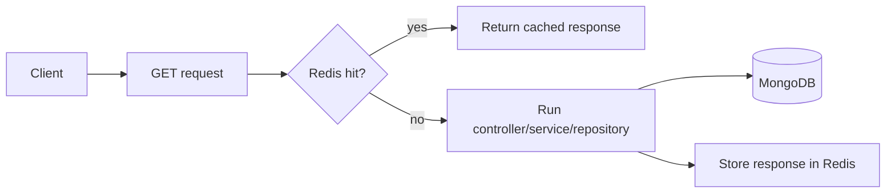
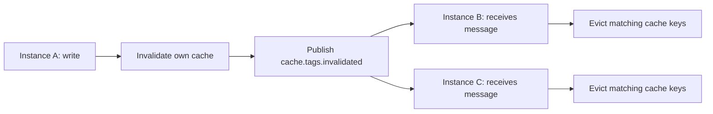

# Redis Cache

## Why Redis is here

[Redis](https://redis.io/docs/latest/) is used as an **optional server-side cache** for repeated GET responses.
It makes repeated reads cheaper without becoming required for the API to work.

The repo uses the official [`redis`](https://github.com/redis/node-redis) Node client; cache helpers live in `src/core/adapters/cache.ts`.

## Cache flow

```mermaid
flowchart LR
    Client --> GET[GET request]
    GET --> Redis{Redis hit?}
    Redis -->|yes| Cached[Return cached response]
    Redis -->|no| API[Run controller/service/repository]
    API --> Mongo[(MongoDB)]
    API --> Save[Store response in Redis]
```

## Important behavior

- cache is mainly for repeated reads,
- writes invalidate related tags,
- user-aware scope helps avoid cross-user leakage,
- if Redis is unavailable, the app keeps going.

## Writes that bypass the API

This is **cache-aside**: reads fill the cache, and whoever writes the data is responsible for
invalidating it. `invalidateCache` (in `src/middlewares/cache.ts`) does that for every write the
API handles.

Nothing does it for writes that never reach Express — `npm run db:seed`, `migrate-mongo`, a
`mongosh` session, a GUI. Those change Mongo while Redis keeps serving the answer it computed
beforehand, which is how a freshly-seeded database can still render as an empty product list.

Two mitigations, because neither is sufficient alone:

|                                | What it does                                                                                                                                                                | Limit                                                             |
| ------------------------------ | --------------------------------------------------------------------------------------------------------------------------------------------------------------------------- | ----------------------------------------------------------------- |
| `npm run db:cache:clear`       | Deletes every key under `NODE_REDIS_CACHE_PREFIX` (`SCAN` + `DEL`, never `FLUSHALL`, so a shared Redis is safe). `db:seed` calls it automatically when it created something | Opt-in — only covers writers that remember                        |
| `NODE_REDIS_CACHE_DEV_TTL_MAX` | Clamps every route's TTL when `NODE_ENV !== 'production'`, default `30`s                                                                                                    | Dev only, and it shortens the stale window rather than closing it |

The TTL cap is the one that matters for writers nobody anticipated: it bounds _every_ out-of-band
write to seconds instead of the route's declared hour. Set it to `0` to opt out and use the
declared TTLs everywhere. Production is never clamped, because there the API is the only writer.

`clearCache()` never throws, but it does report whether it got through: it resolves
`{ deleted, reachable }`, where `reachable: false` means caching is switched on and Redis could
not be reached, so stale entries survived. Its two callers then differ on purpose — `db:seed`
ignores the flag and keeps seeding (an unreachable Redis must not block a seed), while
`db:cache:clear` exits `1`, since a recovery tool that announces `0 keys removed` and exits `0`
having done nothing is indistinguishable from a genuinely empty cache.

The complete answer is to have the database announce its own changes — MongoDB change streams,
or CDC via Debezium — so any write invalidates regardless of origin. Change streams require a
replica set, which this compose file does not run.

## Multi-instance cache invalidation (pub/sub)

When the same app runs in multiple processes or containers, each instance has its own connection to Redis but makes local invalidation decisions independently.

If instance A writes a product and clears its local cache, instance B still serves the old cached value — unless it is told to invalidate too.

Redis pub/sub solves this:

```mermaid
flowchart LR
    A[Instance A: write] --> Local[Invalidate own cache]
    Local --> Pub[Publish cache.tags.invalidated]
    Pub --> B[Instance B: receives message]
    Pub --> C[Instance C: receives message]
    B --> EvictB[Evict matching cache keys]
    C --> EvictC[Evict matching cache keys]
```

**Redis as a cache store** keeps response data for fast reads.  
**Redis as a pub/sub bus** synchronises which keys to evict across all instances.

The publisher (`broadcastCacheInvalidation`) and subscriber (`subscribeCacheInvalidation`) both live in `src/core/adapters/cache.ts`.

- The subscriber is started automatically on app boot (after Redis connects) and stopped during graceful shutdown.
- The publisher is called automatically by the `invalidateCache` middleware after every successful write.
- Both are no-ops when Redis is unavailable — the app keeps going.

## Works with

- **[OpenTelemetry](./opentelemetry.md)** — every Redis command (`GET` for cache reads, `SET` for writes, `DEL` for tag invalidations) is automatically wrapped as a child span. In Grafana → Tempo a cache hit looks like a short Redis span with no following Mongoose span — the span tree makes the cache benefit immediately visible. A cache miss shows Redis then Mongoose back to back. → [What is instrumented out of the box](./opentelemetry.md#what-is-instrumented-out-of-the-box)

## External references

- [Redis pub/sub](https://redis.io/docs/latest/develop/interact/pubsub/) — the mechanism behind multi-instance cache invalidation described above

## Related pages

- [Request Flow](../theory/request-flow.md)
- [MongoDB & Mongoose](./mongodb-mongoose.md)
- [Prometheus](./prometheus.md)
- [OpenTelemetry](./opentelemetry.md) — Redis spans show every command
