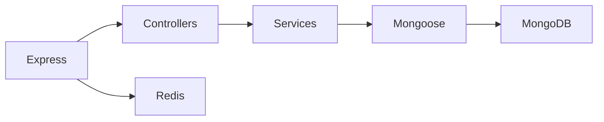
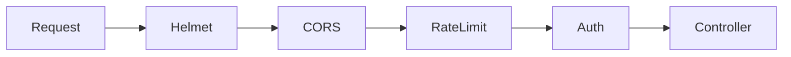

# Runtime & Security

## Core runtime

| Tool     | Why it is here                         | Repo example                                 |
| -------- | -------------------------------------- | -------------------------------------------- |
| Express  | simple REST transport layer            | routes + middlewares + controllers           |
| MongoDB  | document database                      | default persistence engine for this variant  |
| Mongoose | schema + model layer on top of MongoDB | models and repositories                      |
| Redis    | optional response cache                | repeated GET requests and cache invalidation |
| Zod      | input shaping and validation           | service-level validation patterns            |
| Multer   | multipart/file upload handling         | upload-friendly endpoints                    |
| i18next  | translation dictionary support         | user-facing messages/locales                 |

## Runtime visual

## Security stack

| Tool                            | Job                                         |
| ------------------------------- | ------------------------------------------- |
| Helmet                          | safe default HTTP headers                   |
| cors                            | origin allowlist and browser access control |
| express-rate-limit              | simple abuse protection at the edge         |
| jsonwebtoken                    | access/refresh token flows                  |
| cookie-parser                   | read cookies safely in Express              |
| express-session + connect-mongo | server-side session storage when needed     |
| csrf-sync                       | CSRF protection for cookie/session flows    |
| bcrypt                          | password hashing                            |

## Security visual

## How to think about these tools

- Edge concerns should stay near routes and middlewares.
- Persistence concerns should stay near repositories and models.
- Validation should stay close to service intent.
- Optional tools like Redis should improve speed, not become hard requirements.

## Related pages

- [Theory / Request Flow](../theory/request-flow.md) shows where these tools sit in one request.
- [Observability & Quality](./observability-and-quality.md) covers signals and developer tooling.
- [API / REST Style](../api/rest-style.md) explains the contract shape these tools support.
