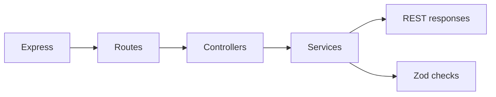

# Runtime

## Main runtime tools

| Tool | Why it is here | Repo role |
| --- | --- | --- |
| Express | REST transport layer | routes + middleware pipeline |
| Zod | validation and coercion | service and schema helpers |
| Multer | multipart/file uploads | upload-aware endpoints |
| i18next | translations/messages | shared locale-backed text |

## Runtime visual

## How to think about runtime here

- Express owns HTTP plumbing.
- Controllers stay thin.
- Services do the meaningful work.
- Validation should stay close to business intent.

## Related pages

- [Layers](../theory/layers.md)
- [Security](./security.md)
- [REST Style](../api/rest-style.md)
