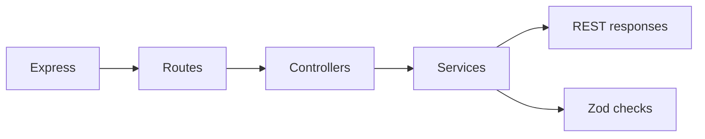

# Runtime

## Main runtime tools

| Tool                                                 | Why it is here          | Repo role                                                         |
| ---------------------------------------------------- | ----------------------- | ----------------------------------------------------------------- |
| [Node.js](https://nodejs.org/en/docs) (≥ 22)         | JavaScript runtime      | language platform; see also [Clustering](../theory/clustering.md) |
| [Express 5](https://expressjs.com/)                  | REST transport layer    | routes + middleware pipeline in `src/app.ts`                      |
| [Zod](https://zod.dev/)                              | validation and coercion | service and schema helpers                                        |
| [Multer](https://github.com/expressjs/multer#readme) | multipart/file uploads  | upload-aware endpoints via `src/utils/multer.ts`                  |
| [i18next](https://www.i18next.com/)                  | translations/messages   | shared locale-backed text from `src/locales/`                     |
| [dotenv](https://github.com/motdotla/dotenv#readme)  | env loading             | reads `.env` into `process.env` at boot                           |
| [TypeScript](https://www.typescriptlang.org/docs/)   | static types            | source language                                                   |
| [tsx](https://github.com/privatenumber/tsx#readme)   | dev runner              | runs TS without a build step in `dev`/`start` scripts             |

## Runtime visual

## How to think about runtime here

- Express owns HTTP plumbing.
- Controllers stay thin.
- Services do the meaningful work.
- Validation should stay close to business intent.

## Useful links

- [Express 5 migration guide](https://expressjs.com/en/guide/migrating-5.html)
- [Express middleware reference](https://expressjs.com/en/resources/middleware.html)
- [Zod schema basics](https://zod.dev/?id=basic-usage)
- [Multer storage engines](https://github.com/expressjs/multer#storage)
- [i18next getting started](https://www.i18next.com/overview/getting-started)
- [Node.js cluster module](https://nodejs.org/api/cluster.html) — used in `src/cluster.ts`

## Related pages

- [Layers](../theory/layers.md)
- [Clustering & graceful shutdown](../theory/clustering.md)
- [Security](./security.md)
- [REST Style](../api/rest-style.md)
- [Email & PDF rendering](./email-and-rendering.md)
- [WebSockets](./websockets.md)
