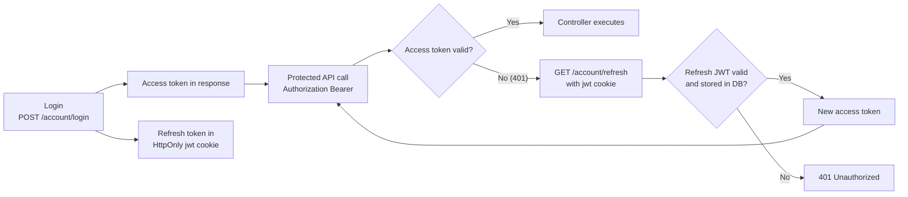

# Security

## Main security tools

| Tool                                                               | Why it is here                              |
| ------------------------------------------------------------------ | ------------------------------------------- |
| [Helmet](https://helmetjs.github.io/)                              | safe default HTTP headers                   |
| [cors](https://github.com/expressjs/cors#readme)                   | origin allowlist and browser access control |
| [express-rate-limit](https://express-rate-limit.mintlify.app/)     | basic abuse protection at the edge          |
| [jsonwebtoken](https://github.com/auth0/node-jsonwebtoken#readme)  | access and refresh token flows              |
| [cookie-parser](https://github.com/expressjs/cookie-parser#readme) | cookie access in Express                    |
| [bcrypt](https://github.com/kelektiv/node.bcrypt.js#readme)        | password hashing                            |

## Auth architecture (current backend pattern)

This backend uses a **split-token model**:

- **Access token**: short-lived JWT returned by `POST /account/login` and sent on API calls in the `Authorization` header with the Bearer scheme.
- **Refresh token**: longer-lived JWT stored in the HTTP-only `jwt` cookie and used only to mint a new access token (`GET /account/refresh`).

This keeps normal authenticated requests explicit (client-attached Bearer token), while keeping the refresh token out of JavaScript access (HTTP-only cookie).

## Where token verification happens

- **Access token verification**: `getAuth` middleware reads the Bearer token from `Authorization` and verifies JWT signature/expiry with `verifyAccessToken`.
- **Refresh token verification**: `createAccessToken` calls `verifyRefreshToken`, which checks both:
    1. JWT signature/expiry with the refresh secret.
    2. token presence in the server-side token store (`users.tokens`) to reject revoked/unknown refresh tokens.

If access-token verification fails, protected routes return `401`. The client can then call refresh and retry with the new access token.

## Security properties provided

- **JWT signing (HS256 + secret)**: prevents token tampering and enforces expiry validation.
- **Bearer transport**: token is not auto-attached by browsers; requests must include it explicitly.
- **Refresh cookie flags** (`httpOnly`, `sameSite=lax`, `secure` in production):
    - `httpOnly` blocks JavaScript reads of the refresh token.
    - `sameSite=lax` reduces cross-site cookie sending in common CSRF scenarios.
    - `secure` (production) limits cookie transport to HTTPS.
- **Server-side refresh-token check**: refresh is accepted only if the signed token is still present in DB, enabling revocation/logout-all behavior.

## Login → auth → refresh request flow

1. User logs in (`POST /account/login`).
2. Server returns a short-lived access token and sets `jwt` refresh cookie.
3. Client calls protected APIs with the Bearer token in `Authorization`.
4. If access token is expired/invalid, API responds `401 Unauthorized`.
5. Client calls `GET /account/refresh`; browser sends `jwt` cookie automatically.
6. Server validates refresh token signature **and** DB presence, then returns a new access token.
7. Client retries protected request with the new access token.

## Strategy

Security concerns should happen **before** business logic reaches deep layers.
That is why auth, headers, origin checks, and rate limiting stay near routes and middlewares.

## External references

- [OWASP REST Security Cheat Sheet](https://cheatsheetseries.owasp.org/cheatsheets/REST_Security_Cheat_Sheet.html)
- [OWASP JWT Cheat Sheet](https://cheatsheetseries.owasp.org/cheatsheets/JSON_Web_Token_for_Java_Cheat_Sheet.html)

## Related pages

- [Request Flow](../theory/request-flow.md)
- [Winston & Audit Logs](./winston.md)
- [API overview](../api/#rest-patterns-used-here)
