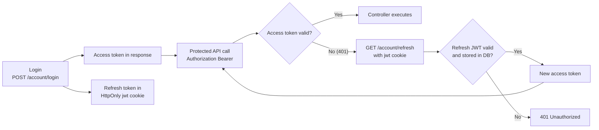

# Security

## Main security tools

| Tool                                                               | Why it is here                              |
| ------------------------------------------------------------------ | ------------------------------------------- |
| [Helmet](https://helmetjs.github.io/)                              | safe default HTTP headers                   |
| [cors](https://github.com/expressjs/cors#readme)                   | origin allowlist and browser access control |
| [express-rate-limit](https://express-rate-limit.mintlify.app/)     | basic abuse protection at the edge          |
| [jsonwebtoken](https://github.com/auth0/node-jsonwebtoken#readme)  | access and refresh token flows              |
| [cookie-parser](https://github.com/expressjs/cookie-parser#readme) | cookie access in Express                    |
| [bcrypt](https://github.com/kelektiv/node.bcrypt.js#readme)        | password hashing                            |

## Auth architecture (current backend pattern)

This backend uses a **split-token model**:

- **Access token**: short-lived JWT returned by `POST /account/login` and sent on API calls in the `Authorization` header with the Bearer scheme.
- **Refresh token**: longer-lived JWT stored in the HTTP-only `jwt` cookie and used only to mint a new access token (`GET /account/refresh`).

This keeps normal authenticated requests explicit (client-attached Bearer token), while keeping the refresh token out of JavaScript access (HTTP-only cookie).

## Where token verification happens

- **Access token verification**: `getAuth` middleware reads the Bearer token from `Authorization` and verifies JWT signature/expiry with `verifyAccessToken`.
- **Refresh token verification**: `createAccessToken` calls `verifyRefreshToken`, which checks both:
    1. JWT signature/expiry with the refresh secret.
    2. token presence in the server-side token store (`users.tokens`) to reject revoked/unknown refresh tokens.

If access-token verification fails, protected routes return `401`. The client can then call refresh and retry with the new access token.

## Security properties provided

- **JWT signing (HS256 + secret)**: prevents token tampering and enforces expiry validation.
- **Bearer transport**: token is not auto-attached by browsers; requests must include it explicitly.
- **Refresh cookie flags** (`httpOnly`, `sameSite=lax`, `secure` in production):
    - `httpOnly` blocks JavaScript reads of the refresh token.
    - `sameSite=lax` reduces cross-site cookie sending in common CSRF scenarios.
    - `secure` (production) limits cookie transport to HTTPS.
- **Server-side refresh-token check**: refresh is accepted only if the signed token is still present in DB, enabling revocation/logout-all behavior.

## Login → auth → refresh request flow

1. User logs in (`POST /account/login`).
2. Server returns a short-lived access token and sets `jwt` refresh cookie.
3. Client calls protected APIs with the Bearer token in `Authorization`.
4. If access token is expired/invalid, API responds `401 Unauthorized`.
5. Client calls `GET /account/refresh`; browser sends `jwt` cookie automatically.
6. Server validates refresh token signature **and** DB presence, then returns a new access token.
7. Client retries protected request with the new access token.

```mermaid
flowchart LR
    A[Login\nPOST /account/login] --> B[Access token in response]
    A --> C[Refresh token in\nHttpOnly jwt cookie]
    B --> D[Protected API call\nAuthorization Bearer]
    D --> E{Access token valid?}
    E -- Yes --> F[Controller executes]
    E -- No (401) --> G[GET /account/refresh\nwith jwt cookie]
    G --> H{Refresh JWT valid\nand stored in DB?}
    H -- Yes --> I[New access token]
    I --> D
    H -- No --> J[401 Unauthorized]
```

## The two rate-limit budgets

**The global limiter is sized for browsing.** A single-page app spends 5–15 requests rendering one
page, and a full pass of the frontend's live e2e suite issues ~150, peaking at 52 in a minute
(measured, not estimated). The default is therefore 100 requests per **minute** — the conventional
shape for a public API.

Per minute rather than per quarter-hour, for two reasons. Spread over a long window the same number
becomes a session quota an ordinary browsing session trips, and a limit a legitimate user reaches is
worse than none: the 429 lands on them and reads as the app being broken, while an attacker simply
rotates IPs. A short window also recovers — exhausting a 15-minute budget in the first two minutes
locks the user out for the remaining thirteen.

**Credential endpoints get their own, much smaller budget.** Applied to `POST /account/login`, the
global generosity is a hundred password guesses a minute from one address. Worse, a shared bucket
means an attacker's guesses and a real user's page views spend the same allowance, so raising the
global limit for legitimate traffic silently raises the guessing rate too. The separate limiter is
mounted per route, so browsing never consumes it and a locked-out guesser can still read the
catalogue.

`skipSuccessfulRequests` is on: a user who signs in correctly has spent nothing, so a shared address
(an office, a school, CGNAT) does not lock its own users out for succeeding. Only failures count,
which is exactly the signal worth limiting.

The test suites raise the budget tenfold — see `tests/support/setup.ts`.

## Why the metrics endpoint has its own credential

`/observability/metrics` cannot use the admin JWT the other observability routes use: it is scraped
by Prometheus, which has no way to log in, refresh a token or hold a session. What Prometheus does
support is a static bearer credential in its `scrape_configs`, so that is the credential here.

Left open, the endpoint is free reconnaissance: request volumes, error rates, latency percentiles,
in-flight counts, login success/failure counters, process uptime and heap. None of it is user data;
all of it is a map of how the service behaves and when it is weakest.

::: warning Deny by default
An unauthenticated metrics endpoint is not a state to arrive at by forgetting a variable, so an
unset `NODE_METRICS_TOKEN` denies rather than opens. The shipped `.env-example` and compose config
both set it, so the stack works out of the box — change it, like any other secret, before it faces
anything.
:::

The comparison is `timingSafeEqual`, not `===`: a byte-by-byte comparison that returns early leaks
the token's prefix to anyone willing to measure, and the whole token to anyone patient.

## Why search text is escaped before it reaches `$regex`

`$regex` with unescaped input is a remote denial of service, not a correctness nit. MongoDB
evaluates the pattern **server-side against every candidate document**, and a catastrophic
backtracking pattern costs seconds of CPU per document from a handful of characters — `(a+)+$`
against a 31-character subject takes ~45s in one engine. `POST /products/search` and
`GET /products?text=` are public, so that is an unauthenticated request pinning a core.

It is also simply what a search box means. Unescaped, `.` matches every character, `^` anchors, and
a lone `(` is a syntax error the driver raises as a 500 — so a user searching for `1.5` or
`50% (off)` gets wrong results or an error rather than the products they wanted.

Literal matching gives up regex search as a feature. Nothing in this API offered it: these helpers
back "type words into a box", and a query language for anonymous callers is not a thing to expose
by accident.

One detail is load-bearing: a term that vanishes under stripping returns **`undefined`**, not an
empty pattern. `$regex: ''` matches every document, so it would silently turn a filter into
"everything" — the exact inversion of what the caller asked for.

## `trust proxy`, and the two ways to get it wrong

Everything that identifies a caller by address — the rate limiter's bucket key, the audit log's
`ip` — reads `request.ip`. Behind a proxy that is the **proxy's** address unless Express is told
otherwise, and both failure modes are silent:

| Setting                                      | What breaks                                                                                                                                                                        |
| -------------------------------------------- | ---------------------------------------------------------------------------------------------------------------------------------------------------------------------------------- |
| **Unset** (Express's default) behind a proxy | Every request looks like one client. The per-IP limiter becomes a single shared bucket, so one busy caller 429s everyone else, and the audit log records the proxy as every actor. |
| **`true`** (trust everything)                | `X-Forwarded-For` is client-supplied. A caller sets it to a random value per request and never hits the limit at all — strictly worse than unset for anything security-related.    |

The correct value is the **number of proxies you actually run**, so Express counts back from the
right-hand end of `X-Forwarded-For` — the part a client cannot forge. `NODE_TRUST_PROXY_HOPS`
carries it, and `0` (the default) means "no proxy, use the socket address", which is right for local
development and for the compose stack, where the API is published directly.

## 401 or 403, and why the guards agree

The distinction is the client's next move, not a shade of politeness:

- **401** — "authenticate and try again". The frontend redirects to login and returns the visitor
  to where they were aiming.
- **403** — "you are known and still refused". Logging in again would only loop.

Every guard follows it: no credentials at all is 401 even on an admin-only route, and a verified
caller who is not an admin is 403. The same rule decides what the auth resolver does with a token
whose user no longer exists — it resolves `undefined` rather than rejecting, so a deleted admin
gets 403 rather than being told to log in to an account that cannot.

## Why the SSE endpoints authenticate by cookie

`EventSource` — the only way a browser consumes SSE — **cannot set request headers**. That is a
limitation of the browser API, not an oversight, so `isAuth`, which reads `Authorization: Bearer`,
can never be satisfied by an SSE connection.

What `EventSource` does send, given `withCredentials: true`, is cookies, and this app already
issues an `HttpOnly` refresh cookie at login. So `isAdminViaCookie` verifies that cookie exactly as
`GET /account/refresh` does — signature **and** presence on the user document — so a revoked or
logged-out token is rejected, not merely an expired one.

::: danger Not a query-string token
The obvious alternative is `?token=…`. URLs land in access logs, proxy logs, browser history and
`Referer` headers, and a refresh token in any of those is a full account takeover.
:::

## Strategy

Security concerns should happen **before** business logic reaches deep layers.
That is why auth, headers, origin checks, and rate limiting stay near routes and middlewares.

## External references

- [OWASP REST Security Cheat Sheet](https://cheatsheetseries.owasp.org/cheatsheets/REST_Security_Cheat_Sheet.html)
- [OWASP JWT Cheat Sheet](https://cheatsheetseries.owasp.org/cheatsheets/JSON_Web_Token_for_Java_Cheat_Sheet.html)

## Related pages

- [Request Flow](../theory/request-flow.md)
- [Winston & Audit Logs](./winston.md)
- [API overview](../api/#rest-patterns-used-here)
