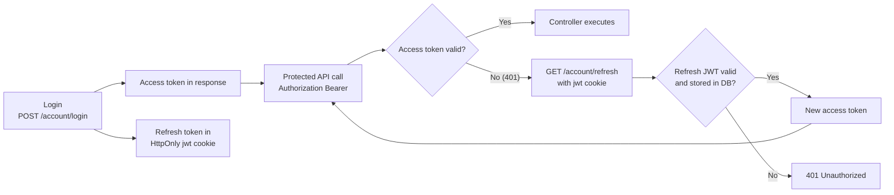
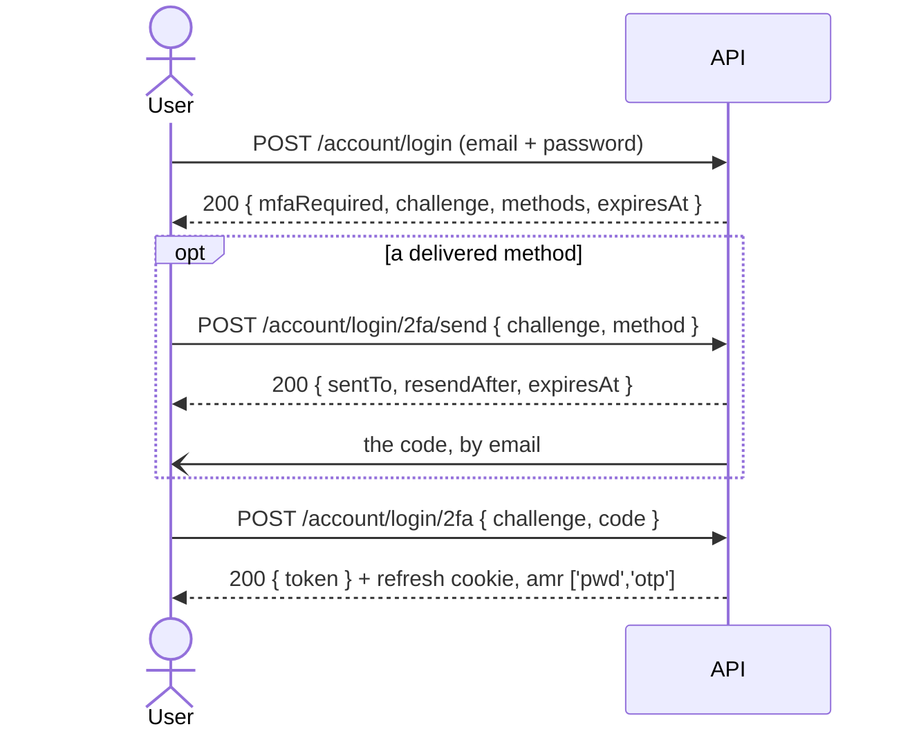

# Security

## Main security tools

| Tool                                                               | Why it is here                              |
| ------------------------------------------------------------------ | ------------------------------------------- |
| [Helmet](https://helmetjs.github.io/)                              | safe default HTTP headers                   |
| [cors](https://github.com/expressjs/cors#readme)                   | origin allowlist and browser access control |
| [express-rate-limit](https://express-rate-limit.mintlify.app/)     | basic abuse protection at the edge          |
| [jsonwebtoken](https://github.com/auth0/node-jsonwebtoken#readme)  | access and refresh token flows              |
| [cookie-parser](https://github.com/expressjs/cookie-parser#readme) | cookie access in Express                    |
| [bcrypt](https://github.com/kelektiv/node.bcrypt.js#readme)        | password hashing                            |

## Auth architecture (current backend pattern)

This backend uses a **split-token model**:

- **Access token**: short-lived JWT returned by `POST /account/login` and sent on API calls in the `Authorization` header with the Bearer scheme.
- **Refresh token**: longer-lived JWT stored in the HTTP-only `jwt` cookie and used only to mint a new access token (`GET /account/refresh`).

This keeps normal authenticated requests explicit (client-attached Bearer token), while keeping the refresh token out of JavaScript access (HTTP-only cookie).

## Where token verification happens

- **Access token verification**: `getAuth` middleware reads the Bearer token from `Authorization` and verifies JWT signature/expiry with `verifyAccessToken`.
- **Refresh token verification**: `createAccessToken` calls `verifyRefreshToken`, which checks both:
    1. JWT signature/expiry with the refresh secret.
    2. token presence in the server-side token store (`users.tokens`) to reject revoked/unknown refresh tokens.

If access-token verification fails, protected routes return `401`. The client can then call refresh and retry with the new access token.

## Security properties provided

- **JWT signing (HS256 + secret)**: prevents token tampering and enforces expiry validation.
- **Bearer transport**: token is not auto-attached by browsers; requests must include it explicitly.
- **Refresh cookie flags** (`httpOnly`, `sameSite=lax`, `secure` in production):
    - `httpOnly` blocks JavaScript reads of the refresh token.
    - `sameSite=lax` reduces cross-site cookie sending in common CSRF scenarios.
    - `secure` (production) limits cookie transport to HTTPS.
- **Server-side refresh-token check**: refresh is accepted only if the signed token is still present in DB, enabling revocation/logout-all behavior.
- **Single-use token entropy**: every value stored in `users.tokens[]` — refresh sessions, password reset, email verification, delete confirmation — carries at least 128 bits, from `randomBytes(16)` or a signed JWT. Storage is a plain sha256 digest, never the raw value, so a database dump yields nothing usable. Deliberately **not** bcrypt: there is no low-entropy secret to stretch, and a KDF would tax the refresh path every authenticated client hits on a timer.
- **Single-use tokens are spent atomically**: a token is consumed by one `$pull` update, never by load-then-`save()`. The operation is idempotent — pulling an already-spent token matches nothing and reports `modifiedCount: 0` — and that count is the _only_ thing that distinguishes the winner when the same reset link is followed twice at once. Both callers pass the earlier "does this token exist" read; exactly one sees a non-zero count and proceeds.

## Login → auth → refresh request flow

1. User logs in (`POST /account/login`).
2. Server returns a short-lived access token and sets `jwt` refresh cookie.
3. Client calls protected APIs with the Bearer token in `Authorization`.
4. If access token is expired/invalid, API responds `401 Unauthorized`.
5. Client calls `GET /account/refresh`; browser sends `jwt` cookie automatically.
6. Server validates refresh token signature **and** DB presence, then returns a new access token.
7. Client retries protected request with the new access token.

```mermaid
flowchart LR
    A[Login\nPOST /account/login] --> B[Access token in response]
    A --> C[Refresh token in\nHttpOnly jwt cookie]
    B --> D[Protected API call\nAuthorization Bearer]
    D --> E{Access token valid?}
    E -- Yes --> F[Controller executes]
    E -- No (401) --> G[GET /account/refresh\nwith jwt cookie]
    G --> H{Refresh JWT valid\nand stored in DB?}
    H -- Yes --> I[New access token]
    I --> D
    H -- No --> J[401 Unauthorized]
```

## Two-factor authentication

An optional second factor on top of the login flow above. An account may arm **several**, and the
set of them is a registry rather than a branch: `src/modules/account/two-factor/methods/` holds one
handler per channel, and everything above it — services, controllers, contract — deals in a
`method` string.

Two methods ship: `totp`, an authenticator app, and `email`, a six-digit code mailed to the
account's verified address. A future `sms` is a third handler and no other change.

### The challenge is a claim check, not a code

The single most misread part of the flow. `POST /account/login` cannot mint a session yet but must
not hold the half-finished login in memory, so it hands the browser a signed note naming the
attempt. The **code** is the separate secret, and where it comes from is what a method decides.

```mermaid
sequenceDiagram
    actor U as User
    participant A as API
    U->>A: POST /account/login (email + password)
    A-->>U: 200 { mfaRequired, challenge, methods, expiresAt }
    opt a delivered method
        U->>A: POST /account/login/2fa/send { challenge, method }
        A-->>U: 200 { sentTo, resendAfter, expiresAt }
        A-)U: the code, by email
    end
    U->>A: POST /account/login/2fa { challenge, code }
    A-->>U: 200 { token } + refresh cookie, amr ['pwd','otp']
```

The challenge is a single-use, revocable, hashed-at-rest token — the same `tokens[]` mechanism
`password-reset` and account-deletion confirmation use (`users/model.ts#tokenAdd`), not a JWT — so
there is no shared secret to keep straight from an access token: it simply fails ordinary token
verification. `POST /account/login/2fa` spends it the moment a right code arrives
(`spendLiveToken`), so a second presentation of an already-answered challenge is refused outright,
not merely re-checked. It lives 5 minutes for a device-only account and **10** for one with a
delivered method armed, because a mailed code has an SMTP queue and an app switch to survive.

### Storage is asymmetric, per method

| what             | form                                                               | why                                                                                                                            |
| ---------------- | ------------------------------------------------------------------ | ------------------------------------------------------------------------------------------------------------------------------ |
| a device secret  | AES-256-GCM, key from `NODE_TOTP_ENCRYPTION_KEY`, version-prefixed | must be recoverable to recompute a code against; the prefix lets a future key rotation decrypt old rows with their own key     |
| a delivered code | HMAC-SHA256 under the same key                                     | six digits is a space of one million — a bare digest falls to anyone holding a database dump, an HMAC does not without the key |
| backup codes     | sha256                                                             | one-time and high-entropy, so there is no low-entropy secret to stretch                                                        |

### The controls, and which attack each one answers

- **Enrollment is two steps, per method.** `POST /account/2fa/methods/{method}/setup` arms nothing;
  only `.../confirm`, given a code the caller demonstrably received, sets `enrolledAt`.
- **Backup codes are minted once**, by whichever method an account arms first — they recover the
  account, not the method. Losing the last factor discards them.
- **Email requires a verified address.** 2FA by mail is only ever as strong as the mailbox behind
  it, and an address nobody has proved control of is not a second factor at all.
- **Replay** — a device code's RFC 6238 time step is stored, so the identical code cannot verify
  twice; a delivered code is deleted the moment it is spent.
- **Guessing** — `NODE_MFA_CHALLENGE_MAX` bounds attempts against ONE live challenge. On top of
  that, a delivered code carries its own attempt ceiling, because the code outlives any single
  challenge: a caller who simply logs in again would otherwise get a fresh budget to keep guessing
  the same six digits with.
- **Mail-bombing** — `NODE_MFA_SEND_MAX` bounds deliveries per challenge, and a per-code cooldown
  paces the resend button. Both, because they bound different things: the limiter caps the total,
  the cooldown paces one account's own retries.
- **Disabling requires proving a factor** — fresh critical auth plus a valid code or backup code —
  so a stolen-but-fresh session cannot strip 2FA off an account on its own. Removing one method
  and removing all of them are held to the same bar.
- **Recovery is admin-assisted, not self-service.** A lost device and lost backup codes reduce to
  the `/users` admin surface, deliberately: a mailbox-based reset would make 2FA only as strong as
  the inbox it defends against.

### What is NOT covered

`GET /account/oauth/{provider}/callback` mints a session without consulting `twoFactorEnabledAt`.
An account with a linked provider therefore has an unchallenged way in, and 2FA on this deployment
is a control on the password path only.

## The rate-limit budgets

**The global limiter is sized for browsing.** A single-page app spends 5–15 requests rendering one
page, and a full pass of the frontend's live e2e suite issues ~150, peaking at 52 in a minute
(measured, not estimated). The default is therefore 100 requests per **minute** — the conventional
shape for a public API.

Per minute rather than per quarter-hour, for two reasons. Spread over a long window the same number
becomes a session quota an ordinary browsing session trips, and a limit a legitimate user reaches is
worse than none: the 429 lands on them and reads as the app being broken, while an attacker simply
rotates IPs. A short window also recovers — exhausting a 15-minute budget in the first two minutes
locks the user out for the remaining thirteen.

**Credential endpoints get their own, much smaller budget.** Applied to `POST /account/login`, the
global generosity is a hundred password guesses a minute from one address. Worse, a shared bucket
means an attacker's guesses and a real user's page views spend the same allowance, so raising the
global limit for legitimate traffic silently raises the guessing rate too. The separate limiter is
mounted per route, so browsing never consumes it and a locked-out guesser can still read the
catalogue.

`skipSuccessfulRequests` is on: a user who signs in correctly has spent nothing, so a shared address
(an office, a school, CGNAT) does not lock its own users out for succeeding. Only failures count,
which is exactly the signal worth limiting.

The test suites raise the budget tenfold — see `tests/support/setup.ts`.

**A third budget, the same shape as neither.** `submissionLimiter` guards `feedback`'s
`POST /contact` — the one public write that causes an outbound email — and it inverts the rule
above: `skipSuccessfulRequests` is deliberately **off**. A credential attempt is abusive when it
FAILS (a wrong guess); a contact-form submission is abusive when it SUCCEEDS (a bot posts a
well-formed body, gets a `201`, and an operator gets an email). Mounting `credentialLimiters` on
`/contact` would therefore change nothing at all — it would count zero of the requests that matter.
`submissionLimiter` spends its budget on every request, success or failure, keyed on the caller's
address like the global limiter, at a much smaller default (`NODE_SUBMISSION_RATE_LIMIT_MAX=5`) —
a person files a contact request once.

**A fourth budget, same shape as the third.** `uploadLimiter` guards every route that accepts an
image (`upload.single('imageUpload')`, across `products`, `users` and `account`). The cost here
isn't a spam email, it's CPU: each upload feeds the `worker.image.digest` pipeline —
decode/strip-metadata/resize/re-encode via `sharp` — which runs inline when no broker is
configured, and one at a time per worker (`prefetch: 1`) when one is. Like `submissionLimiter`,
`skipSuccessfulRequests` is off: a well-formed upload is the expensive case, not a rejected one.
Default `NODE_UPLOAD_RATE_LIMIT_MAX=20` — generous enough for someone editing several product
images in a row, well under the global brake.

**The last two are keyed on a credential, not an address.** `mfaChallengeLimiter`
(`POST /account/login/2fa`) and `mfaSendLimiter` (`POST /account/login/2fa/send`) both bucket on a
sha256 of the challenge token rather than the caller's IP. That is the only key that bounds guesses
against one login: an IP or account key lets a distributed attacker rotate addresses, while the
challenge is the thing being attacked. Both windows are 600s, the longer of the two challenge
tiers, so a window can never end before the challenge it bounds.

They are two budgets and not one because they bound different costs — `NODE_MFA_CHALLENGE_MAX`
caps GUESSES, `NODE_MFA_SEND_MAX` caps outbound mail — and sharing them would let a caller who
typed three wrong codes lose the ability to be sent a right one.

Neither is the whole story, because a delivered code lives on the user document and outlives the
challenge it was sent for. Its own attempt ceiling is what closes that, and a ceiling only counts
if a miss is WRITTEN: every path that checks a code — the login challenge, the enrollment confirm,
and both removal routes — persists the spent attempt before answering, or the ceiling silently
becomes no ceiling at all.

## Why the metrics endpoint has its own credential

`/observability/metrics` cannot use the admin JWT the other observability routes use: it is scraped
by Prometheus, which has no way to log in, refresh a token or hold a session. What Prometheus does
support is a static bearer credential in its `scrape_configs`, so that is the credential here.

Left open, the endpoint is free reconnaissance: request volumes, error rates, latency percentiles,
in-flight counts, login success/failure counters, process uptime and heap. None of it is user data;
all of it is a map of how the service behaves and when it is weakest.

::: warning Deny by default
An unauthenticated metrics endpoint is not a state to arrive at by forgetting a variable, so an
unset `NODE_METRICS_TOKEN` denies rather than opens. The shipped `.env-example` and compose config
both set it, so the stack works out of the box — change it, like any other secret, before it faces
anything.
:::

The comparison is `timingSafeEqual`, not `===`: a byte-by-byte comparison that returns early leaks
the token's prefix to anyone willing to measure, and the whole token to anyone patient.

## Why search text is escaped before it reaches `$regex`

`$regex` with unescaped input is a remote denial of service, not a correctness nit. MongoDB
evaluates the pattern **server-side against every candidate document**, and a catastrophic
backtracking pattern costs seconds of CPU per document from a handful of characters — `(a+)+$`
against a 31-character subject takes ~45s in one engine. `POST /products/search` and
`GET /products?text=` are public, so that is an unauthenticated request pinning a core.

It is also simply what a search box means. Unescaped, `.` matches every character, `^` anchors, and
a lone `(` is a syntax error the driver raises as a 500 — so a user searching for `1.5` or
`50% (off)` gets wrong results or an error rather than the products they wanted.

Literal matching gives up regex search as a feature. Nothing in this API offered it: these helpers
back "type words into a box", and a query language for anonymous callers is not a thing to expose
by accident.

One detail is load-bearing: a term that vanishes under stripping returns **`undefined`**, not an
empty pattern. `$regex: ''` matches every document, so it would silently turn a filter into
"everything" — the exact inversion of what the caller asked for.

## `trust proxy`, and the two ways to get it wrong

Everything that identifies a caller by address — the rate limiter's bucket key, the audit log's
`ip` — reads `request.ip`. Behind a proxy that is the **proxy's** address unless Express is told
otherwise, and both failure modes are silent:

| Setting                                      | What breaks                                                                                                                                                                        |
| -------------------------------------------- | ---------------------------------------------------------------------------------------------------------------------------------------------------------------------------------- |
| **Unset** (Express's default) behind a proxy | Every request looks like one client. The per-IP limiter becomes a single shared bucket, so one busy caller 429s everyone else, and the audit log records the proxy as every actor. |
| **`true`** (trust everything)                | `X-Forwarded-For` is client-supplied. A caller sets it to a random value per request and never hits the limit at all — strictly worse than unset for anything security-related.    |

The correct value is the **number of proxies you actually run**, so Express counts back from the
right-hand end of `X-Forwarded-For` — the part a client cannot forge. `NODE_TRUST_PROXY_HOPS`
carries it, and `0` (the default) means "no proxy, use the socket address", which is right for local
development and for the compose stack, where the API is published directly.

## 401 or 403, and why the guards agree

The distinction is the client's next move, not a shade of politeness:

- **401** — "authenticate and try again". The frontend redirects to login and returns the visitor
  to where they were aiming.
- **403** — "you are known and still refused". Logging in again would only loop.

Every guard follows it: no credentials at all is 401 even on an admin-only route, and a verified
caller who is not an admin is 403. The same rule decides what the auth resolver does with a token
whose user no longer exists — it resolves `undefined` rather than rejecting, so a deleted admin
gets 403 rather than being told to log in to an account that cannot.

## Why the SSE endpoints authenticate by cookie

`EventSource` — the only way a browser consumes SSE — **cannot set request headers**. That is a
limitation of the browser API, not an oversight, so `isAuth`, which reads `Authorization: Bearer`,
can never be satisfied by an SSE connection.

What `EventSource` does send, given `withCredentials: true`, is cookies, and this app already
issues an `HttpOnly` refresh cookie at login. So `isAdminViaCookie` verifies that cookie exactly as
`GET /account/refresh` does — signature **and** presence on the user document — so a revoked or
logged-out token is rejected, not merely an expired one.

::: danger Not a query-string token
The obvious alternative is `?token=…`. URLs land in access logs, proxy logs, browser history and
`Referer` headers, and a refresh token in any of those is a full account takeover.
:::

## Strategy

Security concerns should happen **before** business logic reaches deep layers.
That is why auth, headers, origin checks, and rate limiting stay near routes and middlewares.

## External references

- [OWASP REST Security Cheat Sheet](https://cheatsheetseries.owasp.org/cheatsheets/REST_Security_Cheat_Sheet.html)
- [OWASP JWT Cheat Sheet](https://cheatsheetseries.owasp.org/cheatsheets/JSON_Web_Token_for_Java_Cheat_Sheet.html)

## Related pages

- [Request Flow](../theory/request-flow.md)
- [Winston & Audit Logs](./winston.md)
- [API overview](../api/#rest-patterns-used-here)
- [Data Protection](../theory/data-protection.md) — what personal data this stores, under what
  lawful basis, and the subject-request and breach runbooks
