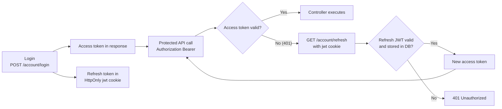
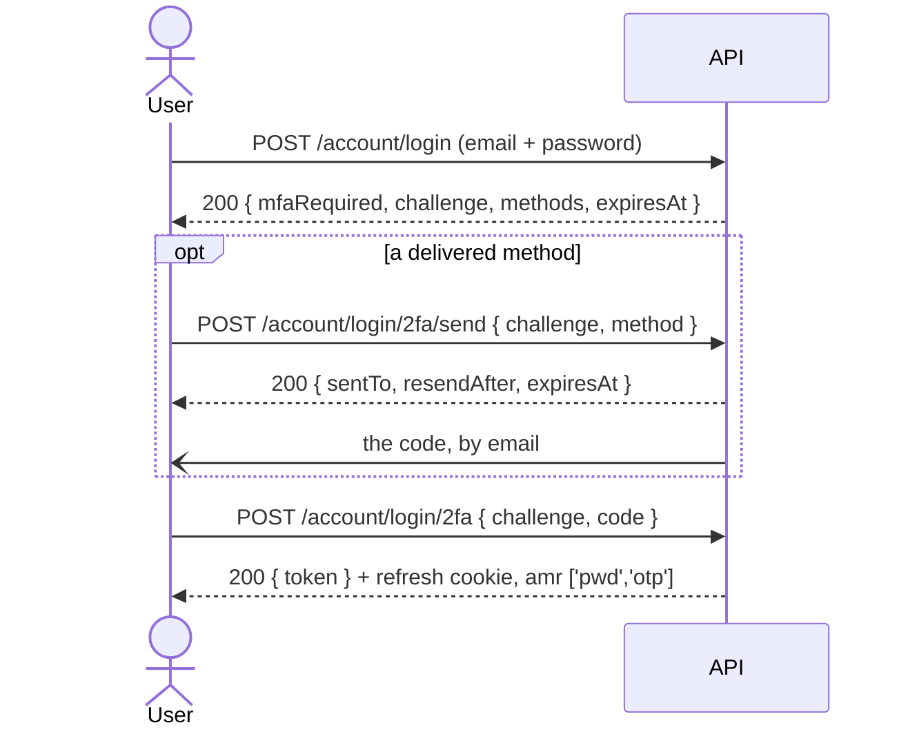
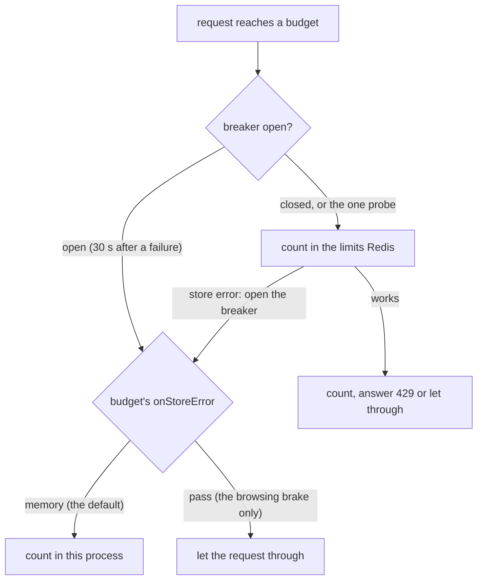
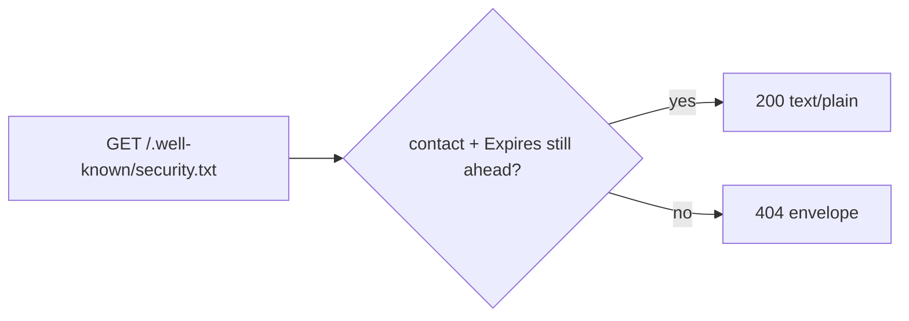

# Security

## Main security tools

| Tool                                                               | Why it is here                              |
| ------------------------------------------------------------------ | ------------------------------------------- |
| [Helmet](https://helmetjs.github.io/)                              | safe default HTTP headers                   |
| [cors](https://github.com/expressjs/cors#readme)                   | origin allowlist and browser access control |
| [express-rate-limit](https://express-rate-limit.mintlify.app/)     | basic abuse protection at the edge          |
| [jsonwebtoken](https://github.com/auth0/node-jsonwebtoken#readme)  | access and refresh token flows              |
| [cookie-parser](https://github.com/expressjs/cookie-parser#readme) | cookie access in Express                    |
| [bcrypt](https://github.com/kelektiv/node.bcrypt.js#readme)        | password hashing                            |

## Auth architecture (current backend pattern)

This backend uses a **split-token model**:

- **Access token**: short-lived JWT returned by `POST /account/login` and sent on API calls in the `Authorization` header with the Bearer scheme.
- **Refresh token**: longer-lived JWT stored in the HTTP-only `jwt` cookie and used only to mint a new access token (`GET /account/refresh`).

This keeps normal authenticated requests explicit (client-attached Bearer token), while keeping the refresh token out of JavaScript access (HTTP-only cookie).

## Where token verification happens

- **Access token verification**: `getAuth` middleware reads the Bearer token from `Authorization` and verifies JWT signature/expiry with `verifyAccessToken`.
- **Refresh token verification**: `createAccessToken` calls `verifyRefreshToken`, which checks both:
    1. JWT signature/expiry with the refresh secret.
    2. token presence in the server-side token store (`users.tokens`) to reject revoked/unknown refresh tokens.

If access-token verification fails, protected routes return `401`. The client can then call refresh and retry with the new access token.

**A database outage while resolving a token is not "invalid credentials".** `getAuth` tells the
two apart (`kernel/middlewares/authorizations.ts`, `infrastructure/http/errors.ts#isInfrastructureError`):
a Mongo/Redis connection failure is forwarded to the global error handler, which answers `503` with
`Retry-After`; everything else (a bad signature, an expired token, a user who no longer exists)
proceeds anonymous. RFC 9110 §15.5.2 vs §15.6.4 — telling a
client its credentials are wrong when the server is the one that is broken is a lie the client acts
on, logging out a session that was never invalid.

## Signing-key rotation

`NODE_TOKEN_ACCESS` and `NODE_TOKEN_REFRESH` are each an ordered, comma-separated **ring** of
secrets, newest first — `account/session/config.ts`'s `getAccessTokenRing`/`getRefreshTokenRing`.
`account/session/jwt.ts` signs every new token with `ring[0]` and stamps a `kid` header
(`account/session/key-ring.ts#keyId`, a truncated SHA-256 of the secret itself, never its index —
reordering the ring on rotation must not silently repoint an old `kid` at a different key).
Verifying looks the claimed `kid` up in the ring and checks the signature against that one member;
a `kid` naming no current member rejects as an ordinary bad token (401), not a 500 — it is a
session signed by a key this deployment has since retired, which is exactly "log in again". A ring
of one — no comma — behaves precisely as an unrotated deployment always has.

**To rotate:** prepend the new secret (`new-secret,old-secret`), deploy, wait out the longest
refresh window in play (`NODE_TOKEN_REFRESH_TIME_LONG` — a year by default — or force
`logout-all` for every account instead of waiting), then drop the old secret and deploy again.
Skipping the wait window logs out every session still signed with the entry you remove.

## Database credential and key rotation

Three separate secrets, three separate rotation procedures — none of them automated, all of them
either a `mongosh` command or an env-var edit plus a deploy.

**`mongo_app_password` / `mongo_root_password`** (files under `clients/<name>/secrets/`).
`docker/mongo-init.js` only ever runs against an empty data directory, so editing the file alone
does nothing to an existing volume — change the password inside Mongo itself, then update the file
to match:

```bash
docker compose --env-file "clients/<name>/.env" -f docker-compose.production.yml \
  exec database mongosh -u "$MONGO_ROOT_USER" -p --authenticationDatabase admin --eval '
    db.getSiblingDB("<MONGO_DB>").updateUser("<MONGO_APP_USER>", { pwd: "<new password>" })
  '
```

Then write the new value into the secret file and recreate the services that mount it — the running
`app`/`cron` containers hold the old password in memory until they restart. Rotate
`mongo_root_password` the same way against the `admin` database, with
`db.getSiblingDB("admin").updateUser("<MONGO_ROOT_USER>", ...)`.

**`NODE_TOTP_ENCRYPTION_KEY` / `NODE_WEBHOOK_SECRET_ENCRYPTION_KEY` / `NODE_PII_ENCRYPTION_KEY`.**
Each is a **ring**, the same shape as the JWT secrets above but with an explicit version rather
than a derived `kid`:
`v2:<new-secret>,v1:<old-secret>` — newest first, `parseVersionedKeyRing` in
`@infrastructure/security/versioned-secret`. A bare value with no `v1:` prefix is still accepted
(a single-key deployment needs no format change), and `versioned-secret.ts` stamps every ciphertext
it writes with the ring entry that wrote it, so a decrypt looks up the STORED version rather than
assuming `ring[0]`.

**To rotate:**

1. Prepend the new secret, keep the old one: `NODE_TOTP_ENCRYPTION_KEY=v2:<new>,v1:<old>`. Deploy —
   every new TOTP enrollment and every delivered-code HMAC now uses `v2`; every row still stamped
   `v1` keeps decrypting against the entry that wrote it.
2. Re-encrypt existing rows onto the new key, at whatever pace fits — lazily, the next time a row
   is written for an unrelated reason, or a one-off `scripts/ops/` script (see
   [Data](../reference/data.md#data-a-one-off-script-under-scripts-ops)) that reads every `v1`-stamped
   secret, decrypts and re-encrypts it. Until that finishes, both entries must stay in the ring.
3. Once nothing decrypts against `v1` any more, drop it from the ring and deploy again. A row still
   stamped with a dropped version fails loudly (`Unknown TOTP key version: v1`) rather than reading
   as garbage — confirm the migration actually reached every row before this step, not after.

A delivered code (`account/two-factor/delivered-codes.ts`) is the one exception: it is never
persisted across a rotation (`DELIVERED_CODE_TTL_MS` is ten minutes), so it always signs and
verifies against `ring[0]` — a rotation mid-flight invalidates a code in transit, the same trade the
JWT rotation above makes for a session mid-refresh.

**Optional, not built:** a startup probe warning when a key's recorded version looks old enough to
need attention. Needs a "rotated since X" timestamp somewhere first, which nothing here writes
today — a follow-on, not part of this runbook.

## Pseudonymised identifiers

One primitive, `pseudonymise(purpose, value)` (`src/infrastructure/security/pseudonymise.ts`), keys every hash of an identifier or a secret that must be comparable but not readable.

| Purpose       | Used for                                | Why not a bare hash                                                                                           |
| ------------- | --------------------------------------- | ------------------------------------------------------------------------------------------------------------- |
| `idempotency` | the request fingerprint stored for 24 h | `POST /signup` bodies carry the plaintext password; a bare SHA-256 lets a Mongo dump be guessed at hash speed |
| `rate-limit`  | the submitted-email budget key in Redis | a Redis snapshot must not hand over the user list                                                             |
| `log`         | personal fields in log lines            | see [Winston](./winston.md#personal-data)                                                                     |

- **Scheme:** HMAC-SHA256 under a subkey HKDF-derived (RFC 5869) from `NODE_PSEUDONYM_KEY`, one subkey per purpose, so a digest made for one purpose cannot be replayed as another's.
- **Standard:** EDPB Guidelines 01/2025 ¶88-89 and ¶117-118, ENISA pseudonymisation techniques (2019) §7.3, NIST SP 800-57 §5.2.
- **Rotation:** a single value, no ring. Changing it costs, once: identity rate-limit budgets reset (at most one window), log digests stop correlating across the change, and a retry with the same `Idempotency-Key` across the change answers `422` for at most 24 h.

## Machine-to-machine credentials

A JWT proves a PERSON signed in; a partner integration or a webhook consumer calling back into the
API has no person behind it, and handing it a person's password would put every request in the
audit trail under that person's name while carrying their whole reach. `api-keys` is the answer: a
revocable, opaque credential a person MINTS, scoped to a subset of their own permissions.

**Format and dispatch.** `sk_<8-char prefix>_<32 bytes>`, both halves `base64url`. `getAuth`
(`kernel/middlewares/authorizations.ts`) branches on the `sk_` prefix before attempting any JWT
verification — a JWT is always base64url of `{"alg"` and so always begins `eyJ`, so the two
prefixes can never collide. `kernel/authentication.ts`'s `CredentialResolver` port is what
`api-keys` fills, the same "module fills a kernel port" shape `AuthResolver` already establishes;
unlike `AuthResolver`, an unregistered `CredentialResolver` is not an error — a build with no
`api-keys` module simply resolves nothing for an `sk_...` token, the same as a token nobody can
verify.

**Storage is a sha256 digest, not encryption.** A credential is verified, never re-signed with, so
there is no plaintext to recover later — `hashToken` (`@modules/users`), the same one-way primitive
refresh/reset tokens use: `randomBytes(32)` has no search space for bcrypt/argon2 to make expensive,
so the ~100ms they would cost on every authenticated request buys nothing. Comparison is
constant-time (`constantTimeEqual`, `infrastructure/security/constant-time.ts` — the same helper
`isMetricsScraper` uses, see below), never `===`.

**A key holds a subset of the minter's permissions, floored TWICE.** Once at MINT time
(`api-keys/services/api-keys.ts`), against what the requesting caller holds right then; again on
EVERY SUBSEQUENT USE (`api-keys/module.ts`'s `CredentialResolver`), by re-deriving the minter's
CURRENT permissions and intersecting them against the key's stored snapshot. The second floor is
the one that matters after the fact: demoting or deleting the person who minted a key shrinks or
kills every key they ever minted, without the credential document itself ever being touched — the
same defensive shape as `kernel/permissions.ts`'s own caller flooring (never trust a cached
permission list; re-derive from the authoritative source on every check).

**Tenant-scoped only.** A credential can never satisfy a `platform.` key — `requirePermission`
refuses one outright, distinctly from a missing permission, since this repo's deployment model is a
silo (one organisation per stack) and every real use case is shop-level.

**Which routes a credential may reach, and how that is kept honest.** Two identity guards, and a
route mounts exactly one:

| Guard                | Admits                              | For                                                                                                                                                                      |
| -------------------- | ----------------------------------- | ------------------------------------------------------------------------------------------------------------------------------------------------------------------------ |
| `isAuth`             | a human session only                | routes whose subject is the CALLER — cart, wishlist, addresses, `account/*`, and `orders`, whose customer views narrow their reads through `callerScope(authContext)`    |
| `isAuthOrCredential` | a session OR an `sk_...` credential | routes whose subject is the TENANT'S DATA — `users`, `inventory`, `audit-logs`, `webhooks`, `feedback`'s operator half, and the write halves of `products` and `locales` |

This is a split rather than one widened guard because a credential resolves to `request.caller`
with NO `authContext`, and roughly a hundred reads across the modules assume one is present — many
written `request.authContext!.id`, an assertion sound only while `isAuth` admits nothing else.
Widening `isAuth` would turn each of those into a `TypeError` and a 500 on exactly the routes where
a machine credential makes least sense. With the split, a route whose author forgets to think about
credentials gets `isAuth` and answers 401 — the direction an auth mistake should fail in.

Mount `isAuthOrCredential` only where both hold, and both are checkable rather than a matter of
taste: every guard on the route is a tenant-scoped `<family>.any.<action>` key, and no controller
it reaches reads `request.authContext`.
Both halves are asserted, both by `tests/cross-cutting/authenticated-controllers.test.ts`: it
reads Express's own resolved chain per route, refusing an `authContext!` read behind anything but
`isAuth` and a non-`.any.` `requirePermission` key behind `isAuthOrCredential`. A controller that
starts reading `authContext`, or a write that starts checking a `.self.` key, behind the
credential guard fails the suite rather than production.
`tests/cross-cutting/api-key-authentication.test.ts` covers the other mount rule instead — that no
module mounts BOTH identity guards — driving a real credential over the real chain.

**A key's read permissions count.** `products` reads narrow through `callerScope(request.caller)`,
which a session and a key both set, so a key holding `products.any.read` sees drafts and soft-deleted
rows exactly as a session with it does, and the response cache bypass follows from the same filter
(`hasAnonymousReadScope`). A resolved credential never holds fewer keys than a stranger: the public
baseline is unioned in (`api-keys/services/resolver.ts`), so a key minted for something else still
reads the published catalogue instead of an empty one.

Two exclusions are decisions, not consequences, and each says so at its mount:

- **`api-keys` itself.** It reads no `authContext` and would qualify mechanically. A credential
  that can mint credentials is one that never has to be rotated, so minting stays a human act.
- **`orders`.** Its `orders.any.*` routes would qualify, but the same router carries the
  customer's own `/:id`, `/:id/cancel` and `/:id/invoice`. Opening it up means splitting the
  router first.

Never pair `isAuthOrCredential` with `requireFreshAuth`: step-up reads `authContext`, and a
credential can never answer a re-authentication challenge, so the pairing hands a partner
integration a 401 it can never clear. No route mounts both, and that is the rule rather than a
coincidence.

**Lifecycle.** The plaintext is shown exactly once, in `POST /api-keys`'s response. Revoke
(`DELETE /api-keys/{id}`) is a soft state change — `revokedAt`, not a delete — so a revoked key's
audit history stays readable; revoking twice is a no-op, not a 404. An optional `expiresAt` refuses
the credential past that instant with no revoke needed. `lastUsedAt` is stamped on every successful
resolve, fire-and-forget, so a partner integration that stopped calling can be found and cleaned up.

## Security properties provided

- **JWT signing (HS256 + secret, key ring)**: prevents token tampering and enforces expiry
  validation; the ring above is what makes rotating the secret not a mass logout.
- **Bearer transport**: token is not auto-attached by browsers; requests must include it explicitly.
- **Refresh cookie flags** (`httpOnly`, `sameSite=lax`, `secure` in production):
    - `httpOnly` blocks JavaScript reads of the refresh token.
    - `sameSite=lax` reduces cross-site cookie sending in common CSRF scenarios.
    - `secure` (production) limits cookie transport to HTTPS.
- **Server-side refresh-token check**: refresh is accepted only if the signed token is still present in DB, enabling revocation/logout-all behavior.
- **Single-use token entropy**: every value stored in `users.tokens[]` — refresh sessions, password reset, email verification, delete confirmation — carries at least 128 bits, from `randomBytes(16)` or a signed JWT. Storage is a plain sha256 digest, never the raw value, so a database dump yields nothing usable. Deliberately **not** bcrypt: there is no low-entropy secret to stretch, and a KDF would tax the refresh path every authenticated client hits on a timer.
- **Single-use tokens are spent atomically**: a token is consumed by one `$pull` update, never by load-then-`save()`. The operation is idempotent — pulling an already-spent token matches nothing and reports `modifiedCount: 0` — and that count is the _only_ thing that distinguishes the winner when the same reset link is followed twice at once. Both callers pass the earlier "does this token exist" read; exactly one sees a non-zero count and proceeds.

## Login → auth → refresh request flow

1. User logs in (`POST /account/login`).
2. Server returns a short-lived access token and sets `jwt` refresh cookie.
3. Client calls protected APIs with the Bearer token in `Authorization`.
4. If access token is expired/invalid, API responds `401 Unauthorized`.
5. Client calls `GET /account/refresh`; browser sends `jwt` cookie automatically.
6. Server validates refresh token signature **and** DB presence, then returns a new access token.
7. Client retries protected request with the new access token.


```mermaid
flowchart LR
    A[Login\nPOST /account/login] --> B[Access token in response]
    A --> C[Refresh token in\nHttpOnly jwt cookie]
    B --> D[Protected API call\nAuthorization Bearer]
    D --> E{Access token valid?}
    E -- Yes --> F[Controller executes]
    E -- No (401) --> G[GET /account/refresh\nwith jwt cookie]
    G --> H{Refresh JWT valid\nand stored in DB?}
    H -- Yes --> I[New access token]
    I --> D
    H -- No --> J[401 Unauthorized]
```

## Two-factor authentication

The attacker's side of the second factor. The registry's shape, the enrollment state machine and
what a user document carries are on
[Two-factor authentication](../modules/account-two-factor.md).

An optional second factor on top of the login flow above. An account may arm **several**, and the
set of them is a registry rather than a branch: `src/modules/account/two-factor/methods/` holds one
handler per channel, and everything above it — services, controllers, contract — deals in a
`method` string.

Two methods ship: `totp`, an authenticator app, and `email`, a six-digit code mailed to the
account's verified address. A future `sms` is a third handler and no other change.

### The challenge is a claim check, not a code

The single most misread part of the flow. `POST /account/login` cannot mint a session yet but must
not hold the half-finished login in memory, so it hands the browser a signed note naming the
attempt. The **code** is the separate secret, and where it comes from is what a method decides.


```mermaid
sequenceDiagram
    actor U as User
    participant A as API
    U->>A: POST /account/login (email + password)
    A-->>U: 200 { mfaRequired, challenge, methods, expiresAt }
    opt a delivered method
        U->>A: POST /account/login/2fa/send { challenge, method }
        A-->>U: 200 { sentTo, resendAfter, expiresAt }
        A-)U: the code, by email
    end
    U->>A: POST /account/login/2fa { challenge, code }
    A-->>U: 200 { token } + refresh cookie, amr ['pwd','otp']
```

The challenge is a single-use, revocable, hashed-at-rest token — the same `tokens[]` mechanism
`password-reset` and account-deletion confirmation use (`users/model.ts#tokenAdd`), not a JWT — so
there is no shared secret to keep straight from an access token: it simply fails ordinary token
verification. `POST /account/login/2fa` spends it the moment a right code arrives
(`spendLiveToken`), so a second presentation of an already-answered challenge is refused outright,
not merely re-checked. It lives 5 minutes for a device-only account and **10** for one with a
delivered method armed, because a mailed code has an SMTP queue and an app switch to survive.

### Storage is asymmetric, per method

| what             | form                                                               | why                                                                                                                            |
| ---------------- | ------------------------------------------------------------------ | ------------------------------------------------------------------------------------------------------------------------------ |
| a device secret  | AES-256-GCM, key from `NODE_TOTP_ENCRYPTION_KEY`, version-prefixed | must be recoverable to recompute a code against; the prefix lets a future key rotation decrypt old rows with their own key     |
| a delivered code | HMAC-SHA256 under an HKDF subkey of the same key                   | six digits is a space of one million — a bare digest falls to anyone holding a database dump, an HMAC does not without the key |
| backup codes     | scrypt, one salt per account                                       | 40 bits per code needs stretching — NIST 800-63B's "look-up secret" rule below 112 bits                                        |

### The controls, and which attack each one answers

- **Enrollment is two steps, per method.** `POST /account/2fa/methods/{method}/setup` arms nothing;
  only `.../confirm`, given a code the caller demonstrably received, sets `enrolledAt`.
- **Backup codes are minted once**, by whichever method an account arms first — they recover the
  account, not the method. Losing the last factor discards them.
- **Email requires a verified address.** 2FA by mail is only ever as strong as the mailbox behind
  it, and an address nobody has proved control of is not a second factor at all.
- **Replay** — a device code's RFC 6238 time step is stored, so the identical code cannot verify
  twice; a delivered code is deleted the moment it is spent.
- **Guessing** — `NODE_MFA_CHALLENGE_MAX` bounds attempts against ONE live challenge. On top of
  that, a delivered code carries its own attempt ceiling, because the code outlives any single
  challenge: a caller who simply logs in again would otherwise get a fresh budget to keep guessing
  the same six digits with.
- **Mail-bombing** — `NODE_MFA_SEND_MAX` bounds deliveries per challenge, and a per-code cooldown
  paces the resend button. Both, because they bound different things: the limiter caps the total,
  the cooldown paces one account's own retries.
- **Disabling requires proving a factor** — fresh critical auth plus a valid code or backup code —
  so a stolen-but-fresh session cannot strip 2FA off an account on its own. Removing one method
  and removing all of them are held to the same bar.
- **There is no app path to recover a lost factor.** No self-service reset (a mailbox-based one
  would make 2FA only as strong as the inbox it defends against), and no staff reset either: a
  credential is its owner's alone, so no `/users` route can clear a second factor. A lost device
  and lost backup codes are fixed by a technician, by hand, in the database.

### OAuth and the second factor

`GET /account/oauth/{provider}/callback` checks `twoFactorEnabledAt` the way `postLogin` does: an
account with an armed factor gets the login challenge instead of a session, so 2FA guards every
way in, not the password path alone. See [OAuth](../modules/account-oauth.md) for that path's own
defences.

## The rate-limit budgets

**The global limiter is sized for browsing.** A single-page app spends 5–15 requests rendering one
page, and a full pass of the frontend's live e2e suite issues ~150, peaking at 52 in a minute
(measured, not estimated). The default is therefore 100 requests per **minute** — the conventional
shape for a public API.

Per minute rather than per quarter-hour, for two reasons. Spread over a long window the same number
becomes a session quota an ordinary browsing session trips, and a limit a legitimate user reaches is
worse than none: the 429 lands on them and reads as the app being broken, while an attacker simply
rotates IPs. A short window also recovers — exhausting a 15-minute budget in the first two minutes
locks the user out for the remaining thirteen.

**Credential endpoints get their own, much smaller budget.** Applied to `POST /account/login`, the
global generosity is a hundred password guesses a minute from one address. Worse, a shared bucket
means an attacker's guesses and a real user's page views spend the same allowance, so raising the
global limit for legitimate traffic silently raises the guessing rate too. The separate limiter is
mounted per route, so browsing never consumes it and a locked-out guesser can still read the
catalogue.

`skipSuccessfulRequests` is on: a user who signs in correctly has spent nothing, so a shared address
(an office, a school, CGNAT) does not lock its own users out for succeeding. Only failures count,
which is exactly the signal worth limiting.

The test suites raise the budget tenfold — see `tests/support/setup.ts`.

**A third budget, the same shape as neither.** `submissionLimiter` guards `feedback`'s
`POST /contact` — the one public write that causes an outbound email — and it inverts the rule
above: `skipSuccessfulRequests` is deliberately **off**. A credential attempt is abusive when it
FAILS (a wrong guess); a contact-form submission is abusive when it SUCCEEDS (a bot posts a
well-formed body, gets a `201`, and an operator gets an email). Mounting `credentialLimiters` on
`/contact` would therefore change nothing at all — it would count zero of the requests that matter.
`submissionLimiter` spends its budget on every request, success or failure, keyed on the caller's
address like the global limiter, at a much smaller default (`NODE_SUBMISSION_RATE_LIMIT_MAX=5`) —
a person files a contact request once.

**A fourth budget, same shape as the third.** `uploadLimiter` guards every route that accepts an
image (`upload.single('imageUpload')`, across `products`, `users` and `account`). The cost here
isn't a spam email, it's CPU: each upload feeds the `worker.image.digest` pipeline —
decode/strip-metadata/resize/re-encode via `sharp` — which runs inline when no broker is
configured, and one at a time per worker (`prefetch: 1`) when one is. Like `submissionLimiter`,
`skipSuccessfulRequests` is off: a well-formed upload is the expensive case, not a rejected one.
Default `NODE_UPLOAD_RATE_LIMIT_MAX=20` — generous enough for someone editing several product
images in a row, well under the global brake.

**A fifth, on the one unauthenticated WRITE.** `webhookLimiter` guards `POST /payments/webhook`.
The signature check is the actual defence — an unsigned flood costs one HMAC each, then a `400` —
so this budget is not bounding an attack, it is closing the gap that every other route already had
a stated ceiling and this one didn't. Shaped like `submissionLimiter`: `skipSuccessfulRequests` off,
keyed on the caller's address, since a genuine delivery is the traffic being bounded here too.
Default `NODE_PAYMENT_WEBHOOK_RATE_LIMIT_MAX=60` — sized for a burst of real deliveries (several
events per order, a sale driving many orders at once), not the one-per-order steady state.

**The last two are keyed on a credential, not an address.** `mfaChallengeLimiter`
(`POST /account/login/2fa`) and `mfaSendLimiter` (`POST /account/login/2fa/send`) both bucket on a
sha256 of the challenge token rather than the caller's IP. That is the only key that bounds guesses
against one login: an IP or account key lets a distributed attacker rotate addresses, while the
challenge is the thing being attacked. Both windows are 600s, the longer of the two challenge
tiers, so a window can never end before the challenge it bounds.

A request naming no `challenge` at all — a forged or malformed body — has nothing to hash, so it
falls back to the caller's address BLOCK instead of one shared bucket: a shared bucket would let
any two such callers exhaust the same budget, which bounds neither of them against a live
challenge.

They are two budgets and not one because they bound different costs — `NODE_MFA_CHALLENGE_MAX`
caps GUESSES, `NODE_MFA_SEND_MAX` caps outbound mail — and sharing them would let a caller who
typed three wrong codes lose the ability to be sent a right one.

Neither is the whole story, because a delivered code lives on the user document and outlives the
challenge it was sent for. Its own attempt ceiling is what closes that, and a ceiling only counts
if a miss is WRITTEN: every path that checks a code — the login challenge, the enrollment confirm,
and both removal routes — persists the spent attempt before answering, or the ceiling silently
becomes no ceiling at all.

**A sixth, also keyed on a credential.** `apiKeyLimiter` bounds a request authenticated via
[an api-key](#machine-to-machine-credentials), keyed on the credential itself rather than the
caller's address — a partner behind one NAT is one caller, and ten partners behind one CDN are ten,
which an address-keyed budget can't tell apart. Run from inside `getAuth`'s credential branch
rather than mounted on any one route, so every route reached through `getAuth` gets it for free; it
layers on top of, not in place of, the address-keyed global brake, which keeps bounding every
request including credentialed ones. Default `NODE_API_KEY_RATE_LIMIT_MAX=120`.

Every budget above, as declared data (`RateLimitBudget` on the owning module's manifest, or
`INFRASTRUCTURE_RATE_LIMITS` for the three above with none) — generated by
`npm run docs:rate-limits`, checked by `tests/cross-cutting/rate-limit-budgets.test.ts`:

<!-- rate-limit-budgets:start -->

| Budget                                  | Owner            | Env var                                | Default | Window                      | Keyed by                                                                                                                                      | Audited | Redis down |
| --------------------------------------- | ---------------- | -------------------------------------- | ------- | --------------------------- | --------------------------------------------------------------------------------------------------------------------------------------------- | ------- | ---------- |
| Credential guesses — per account        | `account`        | `NODE_AUTH_RATE_LIMIT_MAX`             | 10      | `NODE_RATE_LIMIT_WINDOW_MS` | the authenticated account when there is one, else the submitted email (normalised and pseudonymised; falls back to address block when absent) | yes     | memory     |
| Credential guesses — per address        | `account`        | `NODE_AUTH_RATE_LIMIT_ADDRESS_MAX`     | 30      | `NODE_RATE_LIMIT_WINDOW_MS` | address                                                                                                                                       | yes     | memory     |
| Credential guesses — per address block  | `account`        | `NODE_AUTH_RATE_LIMIT_BLOCK_MAX`       | 100     | `NODE_RATE_LIMIT_WINDOW_MS` | address block (IPv4 /24, IPv6 /64)                                                                                                            | yes     | memory     |
| Password-strength checks                | `account`        | `NODE_PASSWORD_CHECK_RATE_LIMIT_MAX`   | 20      | `NODE_RATE_LIMIT_WINDOW_MS` | address                                                                                                                                       | yes     | memory     |
| Signups — per email                     | `account`        | `NODE_SIGNUP_RATE_LIMIT_MAX`           | 5       | `NODE_RATE_LIMIT_WINDOW_MS` | the submitted email, normalised and pseudonymised (falls back to address block when absent)                                                   | yes     | memory     |
| Signups — per address                   | `account`        | `NODE_SIGNUP_RATE_LIMIT_ADDRESS_MAX`   | 15      | `NODE_RATE_LIMIT_WINDOW_MS` | address                                                                                                                                       | yes     | memory     |
| Signups — per address block             | `account`        | `NODE_SIGNUP_RATE_LIMIT_BLOCK_MAX`     | 40      | `NODE_RATE_LIMIT_WINDOW_MS` | address block (IPv4 /24, IPv6 /64)                                                                                                            | yes     | memory     |
| Password resets — per email             | `account`        | `NODE_RESET_RATE_LIMIT_MAX`            | 5       | `NODE_RATE_LIMIT_WINDOW_MS` | the submitted email, normalised and pseudonymised (falls back to address block when absent)                                                   | yes     | memory     |
| Password resets — per address           | `account`        | `NODE_RESET_RATE_LIMIT_ADDRESS_MAX`    | 15      | `NODE_RATE_LIMIT_WINDOW_MS` | address                                                                                                                                       | yes     | memory     |
| Password resets — per address block     | `account`        | `NODE_RESET_RATE_LIMIT_BLOCK_MAX`      | 40      | `NODE_RATE_LIMIT_WINDOW_MS` | address block (IPv4 /24, IPv6 /64)                                                                                                            | yes     | memory     |
| MFA challenge guesses                   | `account`        | `NODE_MFA_CHALLENGE_MAX`               | 5       | 600000ms                    | the challenge string, hashed (falls back to address block when absent)                                                                        | yes     | memory     |
| MFA code deliveries                     | `account`        | `NODE_MFA_SEND_MAX`                    | 3       | 600000ms                    | the challenge string, hashed (falls back to address block when absent)                                                                        | yes     | memory     |
| MFA code deliveries — per account       | `account`        | `NODE_MFA_ACCOUNT_SEND_MAX`            | 5       | 3600000ms                   | the authenticated account                                                                                                                     | yes     | memory     |
| Two-factor code guesses — per account   | `account`        | `NODE_MFA_ACCOUNT_GUESS_MAX`           | 5       | 3600000ms                   | the authenticated account                                                                                                                     | yes     | memory     |
| Example creation                        | `example`        | `NODE_EXAMPLE_RATE_LIMIT_MAX`          | 30      | `NODE_RATE_LIMIT_WINDOW_MS` | the authenticated account                                                                                                                     | yes     | memory     |
| Contact submissions — per address       | `feedback`       | `NODE_SUBMISSION_RATE_LIMIT_MAX`       | 5       | `NODE_RATE_LIMIT_WINDOW_MS` | address                                                                                                                                       | yes     | memory     |
| Contact submissions — per email         | `feedback`       | `NODE_SUBMISSION_RATE_LIMIT_EMAIL_MAX` | 5       | `NODE_RATE_LIMIT_WINDOW_MS` | the submitted email, normalised and pseudonymised (falls back to address block when absent)                                                   | yes     | memory     |
| Contact submissions — per address block | `feedback`       | `NODE_SUBMISSION_RATE_LIMIT_BLOCK_MAX` | 20      | `NODE_RATE_LIMIT_WINDOW_MS` | address block (IPv4 /24, IPv6 /64)                                                                                                            | yes     | memory     |
| Invoice / credit-note renders           | `invoicing`      | `NODE_INVOICING_RATE_LIMIT_MAX`        | 20      | `NODE_RATE_LIMIT_WINDOW_MS` | the authenticated account                                                                                                                     | yes     | memory     |
| Payment webhook deliveries              | `payments`       | `NODE_PAYMENT_WEBHOOK_RATE_LIMIT_MAX`  | 60      | `NODE_RATE_LIMIT_WINDOW_MS` | address                                                                                                                                       | yes     | memory     |
| Payment confirm attempts                | `payments`       | `NODE_PAYMENT_CONFIRM_RATE_LIMIT_MAX`  | 5       | 3600000ms                   | the authenticated account                                                                                                                     | yes     | memory     |
| Payment confirm declines                | `payments`       | `NODE_PAYMENT_DECLINE_RATE_LIMIT_MAX`  | 3       | 3600000ms                   | the authenticated account                                                                                                                     | yes     | memory     |
| Returns and withdrawals opened          | `returns`        | `NODE_RETURNS_RATE_LIMIT_MAX`          | 20      | `NODE_RATE_LIMIT_WINDOW_MS` | the authenticated account                                                                                                                     | yes     | memory     |
| Browsing (global)                       | `infrastructure` | `NODE_RATE_LIMIT_MAX`                  | 100     | `NODE_RATE_LIMIT_WINDOW_MS` | address                                                                                                                                       | no      | pass       |
| Api-key requests                        | `infrastructure` | `NODE_API_KEY_RATE_LIMIT_MAX`          | 120     | `NODE_RATE_LIMIT_WINDOW_MS` | the api-key credential                                                                                                                        | yes     | memory     |
| Image uploads                           | `infrastructure` | `NODE_UPLOAD_RATE_LIMIT_MAX`           | 20      | `NODE_RATE_LIMIT_WINDOW_MS` | address                                                                                                                                       | yes     | memory     |

<!-- rate-limit-budgets:end -->

### When the limits Redis is down

Counters live on the `limits` Redis ([two instances](redis-cache.md#two-redis-instances)). A security
control fails **secure** (OWASP A10:2025), so a store error must not switch a budget off, and it must
not lock every customer out either:


```mermaid
flowchart TD
    R["request reaches a budget"] --> B{"breaker open?"}
    B -- "closed, or the one probe" --> Redis["count in the limits Redis"]
    B -- "open (30 s after a failure)" --> Policy
    Redis -- "works" --> Done["count, answer 429 or let through"]
    Redis -- "store error: open the breaker" --> Policy{"budget's onStoreError"}
    Policy -- "memory (the default)" --> Mem["count in this process"]
    Policy -- "pass (the browsing brake only)" --> Pass["let the request through"]
```

- **`memory` is the default**, so a new budget fails secure without anyone asking. The limit holds
  per worker rather than per deployment for the length of the outage. Login's challenge gate and
  the payment decline gate read the same fallback, so they keep working.
- **`pass` is a decision**, listed in `tests/cross-cutting/rate-limit-budgets.test.ts`: only the
  global browsing brake, which guards no credential.
- **The breaker** (`store-breaker.ts`) is one per process. Without it an outage adds the 1 s connect
  timeout to every request on every budget. After 30 s one request probes Redis; the rest keep
  using the fallback until it answers.
- **Signal:** one `error` log line per outage, and `rate_limit_store_fallback_total{namespace}`
  counts every operation served without Redis. An alert on it belongs to the monitoring stack.

### Identity- and block-keyed budgets — signup, password reset, the contact form

A residential-proxy pool costs about $20 for millions of addresses, and a single IPv6 customer is
allocated 18 quintillion of them. A budget keyed on one address bounds almost nothing against
either — which mattered nowhere more than the three routes above whose abuse is a well-formed
request repeated, not a failed one.

**`signupLimiters` and `resetRequestLimiters` replace `credentialLimiters` on their routes**, not
add to it. `credentialLimiters`' `skipSuccessfulRequests` spends nothing on a successful signup
(a Sybil account) or a successful reset request (`postResetRequest` always answers 200, to avoid
revealing whether an account exists) — exactly the requests these routes exist to bound. Both are
shaped like `submissionLimiter` instead: every request spends the budget, success or failure.

**Every one of these budgets is now three, not one**: identity (the submitted email, normalised
and hashed like `identityOf`), single address, and address BLOCK — an IPv4 /24, an IPv6 /64.
`contactLimiters` adds the same two dimensions on top of the pre-existing `submissionLimiter`. The
block dimension also extends `credentialLimiters` itself, so login gets the same third bucket.
A dual-stack listener reports an IPv4 caller as `::ffff:a.b.c.d`, so the key is built by unmapping
FIRST (`ipKeyGenerator`) and masking the IPv4 result to its /24 after; masking before would leave
every mapped caller in a bucket of one.

Three independent buckets, not one key built from all three fields: varying any single one of
identity, address or block gets a caller a fresh budget on the other two dimensions, but never on
all three at once — which is the property that makes a proxy pool, or a pool of freshly-registered
mailboxes, cost something rather than nothing.

## Why the metrics endpoint has its own credential

`/observability/metrics` cannot use the bearer token the other observability routes check
`platform.observability.any.read` on: it is scraped by Prometheus, which has no way to log in, refresh
a token or hold a session. What Prometheus does
support is a static bearer credential in its `scrape_configs`, so that is the credential here.

Left open, the endpoint is free reconnaissance: request volumes, error rates, latency percentiles,
in-flight counts, login success/failure counters, process uptime and heap. None of it is user data;
all of it is a map of how the service behaves and when it is weakest.

::: warning Deny by default
An unauthenticated metrics endpoint is not a state to arrive at by forgetting a variable, so an
unset `NODE_METRICS_TOKEN` denies rather than opens. The shipped `.env-example` and compose config
both set it, so the stack works out of the box — change it, like any other secret, before it faces
anything.
:::

The comparison is `timingSafeEqual`, not `===`: a byte-by-byte comparison that returns early leaks
the token's prefix to anyone willing to measure, and the whole token to anyone patient.

## Why search text is escaped before it reaches `$regex`

`$regex` with unescaped input is a remote denial of service, not a correctness nit. MongoDB
evaluates the pattern **server-side against every candidate document**, and a catastrophic
backtracking pattern costs seconds of CPU per document from a handful of characters — `(a+)+$`
against a 31-character subject takes ~45s in one engine. `POST /products/search` and
`GET /products?text=` are public, so that is an unauthenticated request pinning a core.

It is also simply what a search box means. Unescaped, `.` matches every character, `^` anchors, and
a lone `(` is a syntax error the driver raises as a 500 — so a user searching for `1.5` or
`50% (off)` gets wrong results or an error rather than the products they wanted.

Literal matching gives up regex search as a feature. Nothing in this API offered it: these helpers
back "type words into a box", and a query language for anonymous callers is not a thing to expose
by accident.

One detail is load-bearing: a term that vanishes under stripping returns **`undefined`**, not an
empty pattern. `$regex: ''` matches every document, so it would silently turn a filter into
"everything" — the exact inversion of what the caller asked for.

## One environment switch

`NODE_ENV` has two settings that matter: **development or test** (a developer's machine, CI) and
**everything else**. Everything else is strict, an unset value and `staging` included. One helper
says which, `isRelaxedEnvironment()` in `infrastructure/runtime/config.ts`, and every switch
below reads it. The failure it closes: a safety switch that turned on only for the exact word
`production` stayed off for a server that forgot to set it.

| Switch                                | Strict (a deployment)        | Relaxed (development/test)        |
| ------------------------------------- | ---------------------------- | --------------------------------- |
| Session and OAuth cookies             | `Secure`                     | not `Secure`, so local HTTP works |
| `scenario:apply` (the seeder)         | refuses to run               | runs                              |
| Presence rules marked production-only | checked                      | skipped                           |
| Stripe `sk_test_` key                 | refused at boot              | accepted                          |
| Stack traces in logs                  | left out                     | kept                              |
| Log level, console format             | `info`, JSON                 | `debug`, pretty on a terminal     |
| Cache `max-age`, `autoIndex`          | as declared, `autoIndex` off | clamped, Mongoose's default       |

A staging server therefore cannot seed demo data or use a Stripe test key. That is intended: a
switch that must differ gets its own explicit variable, never a relaxed `NODE_ENV`. Standards:
[OWASP secure by default](https://devguide.owasp.org/en/04-design/02-web-app-checklist/01-secure-by-default/),
[Node.js: run with `NODE_ENV=production`](https://nodejs.org/en/learn/getting-started/nodejs-the-difference-between-development-and-production),
[Twelve-Factor config](https://12factor.net/config).

## `trust proxy`, and the two ways to get it wrong

Everything that identifies a caller by address — the rate limiter's bucket key, the audit log's
`ip` — reads `request.ip`. Behind a proxy that is the **proxy's** address unless Express is told
otherwise, and both failure modes are silent:

| Setting                                      | What breaks                                                                                                                                                                        |
| -------------------------------------------- | ---------------------------------------------------------------------------------------------------------------------------------------------------------------------------------- |
| **Unset** (Express's default) behind a proxy | Every request looks like one client. The per-IP limiter becomes a single shared bucket, so one busy caller 429s everyone else, and the audit log records the proxy as every actor. |
| **`true`** (trust everything)                | `X-Forwarded-For` is client-supplied. A caller sets it to a random value per request and never hits the limit at all — strictly worse than unset for anything security-related.    |

The correct value is the **number of proxies you actually run**, so Express counts back from the
right-hand end of `X-Forwarded-For` — the part a client cannot forge. `NODE_TRUST_PROXY_HOPS`
carries it, and `0` (the default) means "no proxy, use the socket address", which is right for local
development and for the compose stack, where the API is published directly. The Traefik overlay sets
it to `1`.

`0` is handed to Express as `false`, and that is what lets express-rate-limit spot the one mistake
worth a warning: an `X-Forwarded-For` arriving while no proxy is counted. The library checks **once
per limiter**, on the first request that reaches it (the orchestrator probes are skipped before the
check), and logs through the app logger as `rate-limit: express-rate-limit reports a
misconfiguration`.

## 401 or 403, and why the guards agree

The distinction is the client's next move, not a shade of politeness:

- **401** — "authenticate and try again". The frontend redirects to login and returns the visitor
  to where they were aiming.
- **403** — "you are known and still refused". Logging in again would only loop.

Every guard follows it: no credentials at all is 401 even on the most tightly keyed route, and a
verified caller who does not hold the key is 403. The same rule decides what the auth resolver
does with a token whose user no longer exists — it resolves `undefined` rather than rejecting, so
a deleted account gets 403 rather than being told to log in to an account that cannot.

An [api-key](#machine-to-machine-credentials) follows the same rule from a third direction: it IS
a credential, so a route it holds no permission for is 403 like any other refusal — including a
`platform.` route, which it is refused outright rather than merely never granted, since a
tenant-scoped credential can never reach one by construction.

## Why the SSE endpoints authenticate by cookie

`EventSource` — the only way a browser consumes SSE — **cannot set request headers**. That is a
limitation of the browser API, not an oversight, so `isAuth`, which reads `Authorization: Bearer`,
can never be satisfied by an SSE connection.

What `EventSource` does send, given `withCredentials: true`, is cookies, and this app already
issues an `HttpOnly` refresh cookie at login. So `requirePermissionViaCookie` takes the same
permission key every other guard takes and verifies that cookie exactly as `GET /account/refresh`
does — signature **and** presence on the user document — so a revoked or
logged-out token is rejected, not merely an expired one.

::: danger Not a query-string token
The obvious alternative is `?token=…`. URLs land in access logs, proxy logs, browser history and
`Referer` headers, and a refresh token in any of those is a full account takeover.
:::

## Reporting a vulnerability

Three layers, each reaching a different finder:

| Layer                                  | Reaches                              | Where                                                       |
| -------------------------------------- | ------------------------------------ | ----------------------------------------------------------- |
| GitHub private vulnerability reporting | someone browsing the repo            | repo Settings → Security (a maintainer toggle, outside git) |
| A security policy file                 | the repo's Security tab              | repo root                                                   |
| `/.well-known/security.txt` (RFC 9116) | someone probing a running deployment | `src/app/system-routes.ts`                                  |

Layer 3 is an Express route, not a static file: `express.static` runs with `dotfiles: 'ignore'`,
which 404s every `.well-known` path, and that option is a defence worth keeping.

It is **off by default**, so a fork never publishes the author's contact:

| Variable                   | Meaning                                                 |
| -------------------------- | ------------------------------------------------------- |
| `NODE_SECURITY_CONTACT`    | required to publish; a GitHub advisory URL or `mailto:` |
| `NODE_SECURITY_EXPIRES`    | required to publish; ISO 8601 date                      |
| `NODE_SECURITY_POLICY_URL` | optional `Policy:` link                                 |

`Expires` is a renewal duty. It is a fixed date on purpose: a rolling one always looks fresh and
so says nothing. Once it passes the route answers 404 (RFC 9116 §2.5.5: an expired file must not be
trusted), judged on every request rather than at boot. Not published: PGP `Encryption:` and
signatures.


```mermaid
flowchart LR
    R[GET /.well-known/security.txt] --> C{contact + Expires still ahead?}
    C -- yes --> T[200 text/plain]
    C -- no --> N[404 envelope]
```

## Strategy

Security concerns should happen **before** business logic reaches deep layers.
That is why auth, headers, origin checks, and rate limiting stay near routes and middlewares.

## External references

- [OWASP REST Security Cheat Sheet](https://cheatsheetseries.owasp.org/cheatsheets/REST_Security_Cheat_Sheet.html)
- [OWASP JWT Cheat Sheet](https://cheatsheetseries.owasp.org/cheatsheets/JSON_Web_Token_for_Java_Cheat_Sheet.html)

## Related pages

- [Request Flow](../theory/request-flow.md)
- [api-keys](../modules/api-keys.md) — machine-to-machine credentials, in full
- [Sessions](../modules/account-sessions.md) — the token mechanics, and the freshness claims
- [Two-factor authentication](../modules/account-two-factor.md) — the registry and its state machine
- [OAuth](../modules/account-oauth.md) — the provider port and the CSRF handshake
- [Winston & Audit Logs](./winston.md)
- [API overview](../api/#rest-patterns-used-here)
- [Data Protection](../theory/data-protection.md) — what personal data this stores, under what
  lawful basis, and the subject-request and breach runbooks
