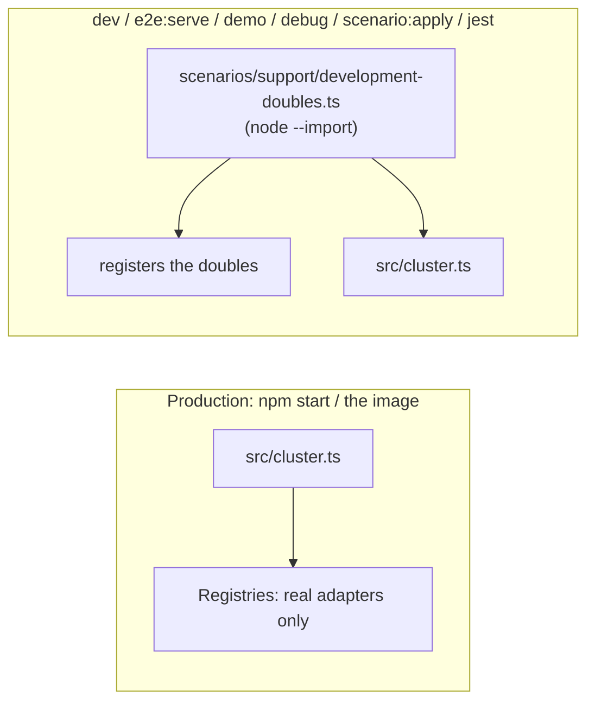

# Test doubles

**No fake, no stub, no demo code in production.** Not refused: absent.

A double lies about a real effect — the `fake` payment provider says "paid", the mail `log` says
"sent". Those live outside `src/`, in `scenarios/support/doubles/`, which the production image does
not copy. A process that wants them loads one preload first.

## What is a double, and what is not

| Setting                 | Production                | Dev, demo, jest                           |
| ----------------------- | ------------------------- | ----------------------------------------- |
| `NODE_PAYMENT_PROVIDER` | no provider — card is off | `fake`, unless the environment names one  |
| `NODE_MAIL_TRANSPORT`   | `smtp` only               | `log` (renders, drops), `outbox` (memory) |
| OAuth `fake`            | not registered            | registered by the dev preload             |
| analytics `none`        | stays: it is "off"        | same                                      |
| antibot `none`          | stays: it is "off"        | same                                      |

**"Off" is not a double.** It asks nothing and claims nothing, so it stays.

**A feature with no real adapter simply does not work** in production. Today there is no real
payment adapter, so production offers no card payment: `GET /payments/methods` lists no `card`,
checkout refuses it with `409 CART_PAYMENT_METHOD_NOT_AVAILABLE`, and `POST /payments/webhook`
answers 404. A deployment with a bank transfer configured still checks out, by transfer.

## The door: one preload

| Who runs it                       | How                                                                        |
| --------------------------------- | -------------------------------------------------------------------------- |
| `dev`, `dev:docker*`, `e2e:serve` | `tsx … --import ./scenarios/support/development-doubles.ts src/cluster.ts` |
| `demo`, `debug`                   | the same flag in front of `scenarios/run-server.ts` / `src/cluster.ts`     |
| `scenario:apply`, `db:bootstrap`  | `scenarios/apply.ts` imports the preload at its top                        |
| the cluster test suite            | `tests/cluster/support/cluster.ts` spawns `tsx --import …`                 |
| the dev `cron` container          | `NODE_OPTIONS=--require tsx/cjs --require …` in `docker-compose.yml`       |
| jest                              | `tests/support/setup.ts` calls `registerDoubles()`                         |

`cluster.fork()` hands `execArgv` to every worker, so a worker gets the doubles too.

The preload does three things, in order: reads `.env`, gives `NODE_PAYMENT_PROVIDER`,
`NODE_MAIL_TRANSPORT` and `NODE_PSEUDONYM_KEY` a development default **when unset**, and registers
the doubles.

## Why the registration is light

The preload and `setup.ts` both run **before** the application. A double that imported the
payments module there would load mongoose and express before OpenTelemetry patches them, and load
a module before a test's `jest.mock` is hoisted. So `scenarios/support/doubles/register.ts` loads
only the registries, and each double loads what it needs on its first call.

The registries live on `globalThis` under a `Symbol.for` key (`createSharedProviderRegistry` in
`src/infrastructure/runtime/provider-registry.ts`): 23 test files use `resetModules` or
`isolateModules`, and a module-local map would come back empty after one.

## Add a double

1. Put the file in `scenarios/support/doubles/`. A double that belongs to a `group: shop` module
   goes in a folder named for it (`payments/`), with a `register.ts` exporting one function.
2. Register it from `scenarios/support/doubles/register.ts`.
3. Test it under `tests/unit/scenarios/`.

`npm run demo:remove` deletes a removed module's doubles folder and its two lines in `register.ts`.

See: [Payments provider port](../modules/payments-provider-port.md) ·
[Email & rendering](./email-and-rendering.md#which-transport-and-who-decides) ·
[Demo profile](./demo-profile.md)
