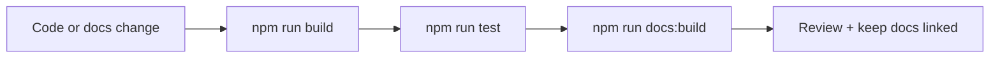

# Testing & Docs

## Quality tools

| Tool                               | Why it is here                          |
| ---------------------------------- | --------------------------------------- |
| Jest                               | unit and integration tests              |
| ESLint                             | code consistency and correctness checks |
| Prettier                           | predictable formatting                  |
| VitePress                          | documentation site                      |
| Mermaid + vitepress-plugin-mermaid | ADHD-friendly visual diagrams           |

## Maintenance flow

## Documentation rule of thumb

- keep docs grouped by concept,
- prefer visual maps when they help,
- avoid a page for every tiny request/response,
- keep code comments brief and move long explanation here.

## Related pages

- [Theory](../theory/)
- [API](../api/)
- Root file `AI_README.md` for agent-focused repo context
