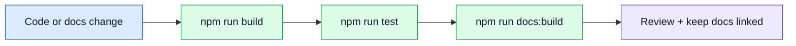

# Testing & Docs

## Quality tools

| Tool                                                                                                                        | Why it is here                            |
| --------------------------------------------------------------------------------------------------------------------------- | ----------------------------------------- |
| [Jest](https://jestjs.io/) (+ [ts-jest](https://kulshekhar.github.io/ts-jest/))                                             | unit and integration tests                |
| [mongodb-memory-server](https://nodkz.github.io/mongodb-memory-server/)                                                     | in-memory MongoDB for tests               |
| [ESLint](https://eslint.org/)                                                                                               | code consistency and correctness checks   |
| [Prettier](https://prettier.io/)                                                                                            | predictable formatting                    |
| [VitePress](https://vitepress.dev/)                                                                                         | documentation site + offline local search |
| [Mermaid](https://mermaid.js.org/) + [vitepress-plugin-mermaid](https://emersonbottero.github.io/vitepress-plugin-mermaid/) | ADHD-friendly visual diagrams             |

## Maintenance flow

## Documentation rule of thumb

- keep docs grouped by concept,
- prefer visual maps when they help,
- use the local search bar first when you only need to jump to one concept,
- avoid a page for every tiny request/response,
- keep code comments brief and move long explanation here.

## External references

- [Jest matchers](https://jestjs.io/docs/expect) — assertion reference for writing new tests
- [Mermaid diagram syntax](https://mermaid.js.org/intro/syntax-reference.html) — needed when adding new diagrams to these docs

## Related pages

- [Theory](../theory/)
- [API](../api/)
- Root file `AI_README.md` for agent-focused repo context
