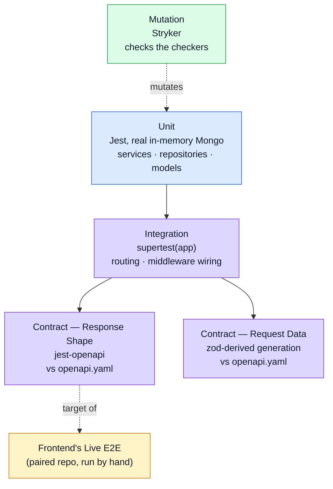
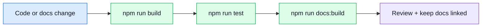

# Testing & Docs

This page is the map. Each layer has its own detail page — code, tools, patterns, file map and a diagram — linked from the table below and from "Related pages" at the bottom of every one of them, so you can start anywhere and always find your way back here.

## The layers, end to end

```mermaid
%%{init: {'flowchart': {'nodeSpacing': 50, 'rankSpacing': 60}}}%%
flowchart TB
    Unit["Unit\nJest, real in-memory Mongo\nservices · repositories · models"]
    Integration["Integration\nsupertest(app)\nrouting · middleware wiring"]
    ContractResponse["Contract — Response Shape\njest-openapi\nvs openapi.yaml"]
    ContractRequest["Contract — Request Data\nzod-derived generation\nvs openapi.yaml"]
    Mutation["Mutation\nStryker\nchecks the checkers"]
    LiveFE["Frontend's Live E2E\n(paired repo, run by hand)"]

    Unit --> Integration
    Integration --> ContractResponse
    Integration --> ContractRequest
    Mutation -.mutates.-> Unit
    ContractResponse -.target of.-> LiveFE

    classDef fast fill:#dbeafe,stroke:#2563eb,color:#111827;
    classDef http fill:#ddd6fe,stroke:#7c3aed,color:#111827;
    classDef meta fill:#dcfce7,stroke:#16a34a,color:#111827;
    classDef ext fill:#fef3c7,stroke:#d97706,color:#111827;
    class Unit fast;
    class Integration,ContractResponse,ContractRequest http;
    class Mutation meta;
    class LiveFE ext;
```

| Layer                     | Question it answers                                                                                 | Tool(s)                           | Command                              | Detail page                                                 |
| ------------------------- | --------------------------------------------------------------------------------------------------- | --------------------------------- | ------------------------------------ | ----------------------------------------------------------- |
| Unit                      | Is this unit's logic right?                                                                         | Jest, real in-memory Mongo        | `npm run test:unit`                  | [Unit Testing](./unit-testing.md)                           |
| Integration               | Are the units actually wired together?                                                              | Jest + supertest                  | `npm run test:integration`           | [Integration Testing](./integration-testing.md)             |
| Contract — Response Shape | Does the wire response match `openapi.yaml`, exactly?                                               | jest-openapi                      | `npm run test:contract`              | [Contract Testing](./contract-testing.md)                   |
| Contract — Request Data   | Does the API accept every payload the contract declares legal, and reject what it declares illegal? | A zod-v4 AST walker + seeded PRNG | `npm run test:contract` (same suite) | [Contract-Derived Request Data](./contract-request-data.md) |
| Mutation                  | Do the tests notice when the source is wrong?                                                       | Stryker + jest-runner             | `npm run test:mutation`              | [Mutation Testing](./mutation-testing.md)                   |

Each layer answers a question no other layer answers — a layer that duplicates another's question is cost without coverage:

- **Unit** is fast, isolated, and hits a real in-memory Mongo — but never crosses HTTP, so a correctly-implemented service behind a misconfigured route would still look green here.
- **Integration** drives the real `src/app.ts` over real HTTP, but only checks that the right thing ran (status codes, auth gates) — not that the response body matches what's promised.
- **Contract — Response Shape** is the only layer that sees over-serialization: `openapi.yaml` declares `additionalProperties: false` on every object schema, so a field appearing on a response without being declared fails _here_, specifically — the class of bug that produced a `password`/`tokens` leak, a `_id`/`__v` exposure, and a fully populated `product` object on every cart line. The generated Zod schemas don't cover this; they validate request bodies, never responses.
- **Contract — Request Data** is the mirror gap: does the validator actually enforce what the spec promises, and does it accept everything the spec allows? Different mechanism (generation from the schema, not comparison against it), different bug class (validator drift, not over-serialization).
- **Mutation** doesn't test the app at all — it tests the _tests_, and only for the unit layer.

## What each layer can and cannot catch

| Failure                                                                | Caught by                                                   |
| ---------------------------------------------------------------------- | ----------------------------------------------------------- |
| Business-logic error in a service/repository/model                     | [Unit Testing](./unit-testing.md)                           |
| Wrong middleware mounted, or a route unreachable                       | [Integration Testing](./integration-testing.md)             |
| A response leaks an undeclared field, or omits a declared one          | [Contract Testing](./contract-testing.md)                   |
| A validator rejects a payload its own contract declares legal          | [Contract-Derived Request Data](./contract-request-data.md) |
| A validator accepts a payload its own contract declares illegal        | [Contract-Derived Request Data](./contract-request-data.md) |
| A test that asserts nothing                                            | [Mutation Testing](./mutation-testing.md)                   |
| This API's contract silently drifting from the paired frontend's mocks | the frontend's live E2E profile, run by hand — see below    |

## Being the target of the frontend's live E2E profile

`db:seed:reset:host` (see [Package Scripts](./package-scripts.md)) isn't only a local convenience — it's also what the paired `boilerplate-vue-frontend` repo's `npm run test:e2e:live` shells out to between specs, via `cy.resetState()`. That profile runs the frontend's Cypress suite against this backend instead of its MSW mocks, and layers three things this repo's own contract tests can't provide on their own: a preflight that fails fast when this API isn't up or isn't seeded, response validation on every request the frontend makes, and a parity spec that fails when this repo's `db/seeds/index.ts` drifts from the frontend's hand-mirrored mock seed.

It is run by hand, not from this repo's CI — the two repos are independently versioned and there is no single pipeline that owns both. Boot sequence and rationale live in the frontend repo: `boilerplate-vue-frontend/docs/tools/live-e2e.md`. The practical implication for changes here: editing `db/seeds/index.ts` or `openapi.yaml` without telling the frontend team is exactly the drift that profile exists to catch, but only the next time someone runs it.

## Quality tools

| Tool                                                                                                                        | Why it is here                                                                                                                                           |
| --------------------------------------------------------------------------------------------------------------------------- | -------------------------------------------------------------------------------------------------------------------------------------------------------- |
| [Jest](https://jestjs.io/) (+ [ts-jest](https://kulshekhar.github.io/ts-jest/))                                             | Runner for unit, integration and both contract layers                                                                                                    |
| [mongodb-memory-server](https://nodkz.github.io/mongodb-memory-server/)                                                     | In-memory MongoDB — used by unit tests directly and by both contract layers via `setupTestDb()`                                                          |
| [supertest](https://github.com/ladjs/supertest)                                                                             | Drives `src/app.ts` over real HTTP without binding a port                                                                                                |
| [jest-openapi](https://github.com/openapi-library/OpenAPIValidators)                                                        | Validates real responses against `openapi.yaml`                                                                                                          |
| A hand-rolled zod-v4 AST walker (`tests/helpers/contract-data.ts`)                                                          | Generates request payloads _from_ `openapi.yaml`-derived schemas — see [Contract-Derived Request Data](./contract-request-data.md) for why not a library |
| [Stryker](https://stryker-mutator.io/)                                                                                      | Mutation testing — checks the tests work                                                                                                                 |
| [ESLint](https://eslint.org/)                                                                                               | Code consistency and correctness checks                                                                                                                  |
| [Prettier](https://prettier.io/)                                                                                            | Predictable formatting                                                                                                                                   |
| [VitePress](https://vitepress.dev/)                                                                                         | Documentation site + offline local search                                                                                                                |
| [Mermaid](https://mermaid.js.org/) + [vitepress-plugin-mermaid](https://emersonbottero.github.io/vitepress-plugin-mermaid/) | ADHD-friendly visual diagrams                                                                                                                            |

## Maintenance flow

```mermaid
%%{init: {'flowchart': {'nodeSpacing': 45, 'rankSpacing': 60}}}%%
flowchart LR
    Change[Code or docs change] --> Build[npm run build]
    Build --> Test[npm run test]
    Test --> Docs[npm run docs:build]
    Docs --> Review[Review + keep docs linked]

    classDef work fill:#dbeafe,stroke:#2563eb,color:#111827;
    classDef checks fill:#dcfce7,stroke:#16a34a,color:#111827;
    classDef finish fill:#ede9fe,stroke:#7c3aed,color:#111827;
    class Change work;
    class Build,Test,Docs checks;
    class Review finish;
```

`npm run test` runs `test:unit`, `test:integration` and `test:contract` — the three layers fast and deterministic enough to gate a PR. Mutation testing runs separately, nightly; see its own page for why.

## Documentation rule of thumb

- keep docs grouped by concept,
- prefer visual maps when they help,
- use the local search bar first when you only need to jump to one concept,
- avoid a page for every tiny request/response,
- keep code comments brief and move long explanation here.

## External references

- [Jest matchers](https://jestjs.io/docs/expect) — assertion reference for writing new tests
- [Mermaid diagram syntax](https://mermaid.js.org/intro/syntax-reference.html) — needed when adding new diagrams to these docs

## Related pages

- [Unit Testing](./unit-testing.md)
- [Integration Testing](./integration-testing.md)
- [Contract Testing](./contract-testing.md)
- [Contract-Derived Request Data](./contract-request-data.md)
- [Mutation Testing](./mutation-testing.md)
- [Theory](../theory/)
- [API](../api/)
- Root file `AI_README.md` for agent-focused repo context
