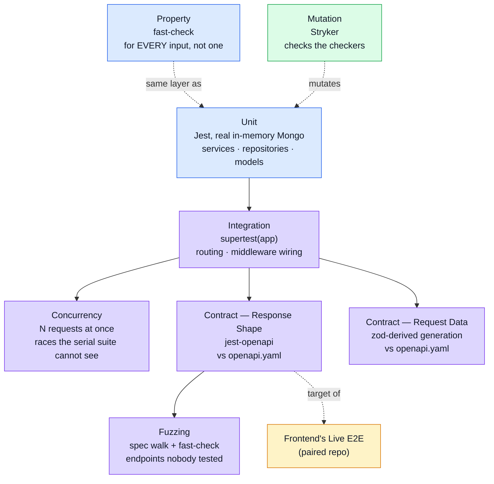
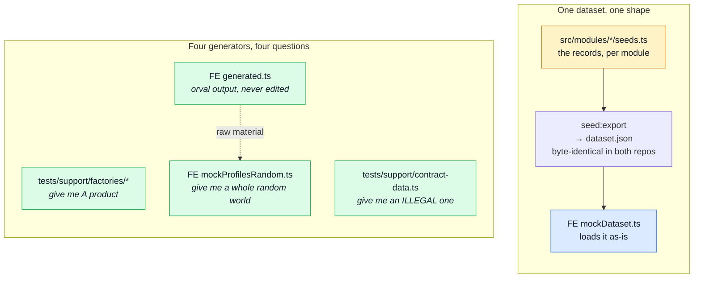
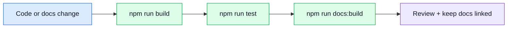

# Testing & Docs

This page is the map. Each layer has its own detail page — code, tools, patterns, file map and a diagram — linked from the table below and from "Related pages" at the bottom of every one of them, so you can start anywhere and always find your way back here.

## The layers, end to end

```mermaid
%%{init: {'flowchart': {'nodeSpacing': 50, 'rankSpacing': 60}}}%%
flowchart TB
    Unit["Unit\nJest, real in-memory Mongo\nservices · repositories · models"]
    Property["Property\nfast-check\nfor EVERY input, not one"]
    Integration["Integration\nsupertest(app)\nrouting · middleware wiring"]
    Concurrency["Concurrency\nN requests at once\nraces the serial suite cannot see"]
    ContractResponse["Contract — Response Shape\njest-openapi\nvs openapi.yaml"]
    ContractRequest["Contract — Request Data\nzod-derived generation\nvs openapi.yaml"]
    Fuzz["Fuzzing\nspec walk + fast-check\nendpoints nobody tested"]
    Mutation["Mutation\nStryker\nchecks the checkers"]
    LiveFE["Frontend's Live E2E\n(paired repo)"]

    Unit --> Integration
    Property -.same layer as.-> Unit
    Integration --> Concurrency
    Integration --> ContractResponse
    Integration --> ContractRequest
    ContractResponse --> Fuzz
    Mutation -.mutates.-> Unit
    ContractResponse -.target of.-> LiveFE

    classDef fast fill:#dbeafe,stroke:#2563eb,color:#111827;
    classDef http fill:#ddd6fe,stroke:#7c3aed,color:#111827;
    classDef meta fill:#dcfce7,stroke:#16a34a,color:#111827;
    classDef ext fill:#fef3c7,stroke:#d97706,color:#111827;
    class Unit,Property fast;
    class Integration,Concurrency,ContractResponse,ContractRequest,Fuzz http;
    class Mutation meta;
    class LiveFE ext;
```

| Layer                     | Question it answers                                                                                 | Tool(s)                           | Command                              | Detail page                                                 |
| ------------------------- | --------------------------------------------------------------------------------------------------- | --------------------------------- | ------------------------------------ | ----------------------------------------------------------- |
| Unit                      | Is this unit's logic right?                                                                         | Jest, real in-memory Mongo        | `npm run test:unit`                  | [Unit Testing](./unit-testing.md)                           |
| Integration               | Are the units actually wired together?                                                              | Jest + supertest                  | `npm run test:integration`           | [Integration Testing](./integration-testing.md)             |
| Contract — Response Shape | Does the wire response match `openapi.yaml`, exactly?                                               | jest-openapi                      | `npm run test:contract`              | [Contract Testing](./contract-testing.md)                   |
| Contract — Request Data   | Does the API accept every payload the contract declares legal, and reject what it declares illegal? | A zod-v4 AST walker + seeded PRNG | `npm run test:contract` (same suite) | [Contract-Derived Request Data](./contract-request-data.md) |
| Property                  | Does the rule hold for _every_ input, not just the ones someone thought of?                         | fast-check                        | `npm run test:unit` (same suite)     | [Property Testing](./property-testing.md)                   |
| Concurrency               | Does it still hold when N requests arrive at once?                                                  | supertest + `Promise.allSettled`  | `npm run test:integration` (same)    | [Concurrency Testing](./concurrency-testing.md)             |
| Fuzzing                   | Does any spec-valid request produce a 5xx or an undocumented response — on ANY endpoint?            | spec walk + fast-check            | `npm run test:fuzz`                  | [Spec-Driven Fuzzing](./fuzz-testing.md)                    |
| Mutation                  | Do the tests notice when the source is wrong?                                                       | Stryker + jest-runner             | `npm run test:mutation`              | [Mutation Testing](./mutation-testing.md)                   |

Each layer answers a question no other layer answers — a layer that duplicates another's question is cost without coverage:

- **Unit** is fast, isolated, and hits a real in-memory Mongo — but never crosses HTTP, so a correctly-implemented service behind a misconfigured route would still look green here.
- **Integration** drives the real `src/app.ts` over real HTTP, but only checks that the right thing ran (status codes, auth gates) — not that the response body matches what's promised.
- **Contract — Response Shape** is the only layer that sees over-serialization: `openapi.yaml` declares `additionalProperties: false` on every object schema, so a field appearing on a response without being declared fails _here_, specifically — the class of bug that leaks `password`/`tokens`, exposes `_id`/`__v`, or lets a populated `product` object ride along on a cart line. The generated Zod schemas don't cover this; they validate request bodies, never responses.
- **Contract — Request Data** is the mirror gap: does the validator actually enforce what the spec promises, and does it accept everything the spec allows? Different mechanism (generation from the schema, not comparison against it), different bug class (validator drift, not over-serialization).
- **Mutation** doesn't test the app at all — it tests the _tests_, and only for the unit layer.

## Where test data comes from

Seven things across the two repos can hand you an entity, and it is reasonable to wonder whether that is six too many. It is not: each answers a question the others cannot, and the one dataset both repos genuinely share — the demo data — lives in a single file copied byte-identically between them, and `check:spec-identity` answers whether they have drifted.

| Source                                     | Repo                  | What it is for                                                                                                                                                                                                                                                                                                                                                                 |
| ------------------------------------------ | --------------------- | ------------------------------------------------------------------------------------------------------------------------------------------------------------------------------------------------------------------------------------------------------------------------------------------------------------------------------------------------------------------------------ |
| `db/seeds/dataset.json`                    | both (byte-identical) | **The demo dataset, as the API answers it.** Every seeded row, serialized — schema defaults, derived order totals and all. The one dataset a human sees when they open either app. Written by `npm run seed:export` here and copied to the frontend, which loads it directly. `npm run check:spec-identity` compares the two copies and the `spec-identity` CI job gates on it |
| `src/modules/<name>/seeds.ts`              | BE                    | **The records themselves** — the demo catalogue, the two accounts, the order book. One per module, declared as `seeds` in the manifest and consumed by `db:seed`; the export reads them back out through `seedExport`                                                                                                                                                          |
| `tests/support/mocks/mockDataset.ts`       | FE                    | **Loads the published dataset**, applying the only two divergences that repo needs: `imageUrl` dropped (it ships no image files) and timestamps restamped to now. No mapper — that is the point                                                                                                                                                                                |
| `src/modules/<name>/factory.ts`            | BE                    | **Arbitrary throwaway entities** — "give me _a_ product, I do not care which, and let me override one field". The opposite need to a fixed demo dataset. `make*` builds a payload; `src/modules/<name>/tests/factory.ts` beside it adds `create*`, which persists so the model's hooks run. The same builder the demo records use, which is why the two cannot drift           |
| `tests/support/contract-data.ts`           | BE                    | **Payloads derived from the zod schemas**, valid and — uniquely — invalid, each violating exactly one declared constraint. The only source that can produce something the API is supposed to _reject_, which is what makes it a contract test rather than a fixture                                                                                                            |
| `tests/mocks/shared/mockProfilesRandom.ts` | FE                    | **A whole random dataset**, faker-seeded and reproducible, for the question "does the app survive _any_ contract-valid data". Pins the two login identities and force-patches the role-scoping branches, so randomisation cannot quietly stop testing them                                                                                                                     |
| `tests/mocks/generated.ts`                 | FE                    | **Orval output** — one faker factory per operation, regenerated by `npm run gen:api`, never edited. Raw material for the random profile above, not consumed directly by handlers                                                                                                                                                                                               |

Reading it as a shape: **one** hand-maintained dataset, **one** mapper over it — the API's own serializers, run once by `seed:export` — and **four** generators that exist because "the demo data" and "some data" and "deliberately illegal data" are three different questions. There used to be two mappers, one per runtime, over a shared file of facts. That is the drift this layout removed.

```mermaid
%%{init: {'flowchart': {'nodeSpacing': 45, 'rankSpacing': 55}}}%%
flowchart TB
    subgraph one["One dataset, one shape"]
        direction TB
        Seed["src/modules/*/seeds.ts<br/>the records, per module"]
        Seed --> Export["seed:export<br/>→ dataset.json<br/>byte-identical in both repos"]
        Export --> FEMap["FE mockDataset.ts<br/>loads it as-is"]
    end

    subgraph four["Four generators, four questions"]
        direction TB
        Factories["tests/support/factories/*<br/><i>give me A product</i>"]
        ContractData["tests/support/contract-data.ts<br/><i>give me an ILLEGAL one</i>"]
        Random["FE mockProfilesRandom.ts<br/><i>give me a whole random world</i>"]
        Generated["FE generated.ts<br/><i>orval output, never edited</i>"]
    end

    Generated -.raw material.-> Random

    classDef source fill:#fef3c7,stroke:#d97706,color:#111827;
    classDef mapper fill:#dbeafe,stroke:#2563eb,color:#111827;
    classDef gen fill:#dcfce7,stroke:#16a34a,color:#111827;
    class Seed source;
    class BEMap,FEMap mapper;
    class Factories,ContractData,Random,Generated gen;
```

### The four questions, and why none absorbs another

- **"Give me _the_ demo data."** → `dataset.json`, edited through the `seeds.ts` of the module that owns the records and republished with `npm run seed:export`. Fixed, shared, and the one a human sees on screen. `cy.loginAs('user')` types its credentials into a real form, so it cannot be randomised or generated.
- **"Give me _a_ product, I do not care which."** → the module's `factory.ts`. The opposite need: fresh, isolated, overridable per test, and never the demo data — 25 test files would interfere with each other if they shared rows. It is the same builder the demo records go through, so "a product" and "the demo product" cannot disagree about what a product is.
- **"Give me one the API must _reject_."** → `contract-data.ts`. Derived from the zod schemas so each payload violates exactly one declared constraint. Nothing else here can produce something deliberately illegal, which is the difference between a contract test and a fixture.
- **"Give me a whole world I have never seen."** → `mockProfilesRandom.ts` (frontend). Seeded and reproducible, for "does the app survive _any_ contract-valid data" rather than "is this value right".

Merging any two would mean one of those questions stops being asked. The merge that _was_ worth doing — the demo dataset, previously written out by hand on both sides — is the one already done.

## What each layer can and cannot catch

| Failure                                                                | Caught by                                                   |
| ---------------------------------------------------------------------- | ----------------------------------------------------------- |
| Business-logic error in a service/repository/model                     | [Unit Testing](./unit-testing.md)                           |
| Wrong middleware mounted, or a route unreachable                       | [Integration Testing](./integration-testing.md)             |
| A response leaks an undeclared field, or omits a declared one          | [Contract Testing](./contract-testing.md)                   |
| A validator rejects a payload its own contract declares legal          | [Contract-Derived Request Data](./contract-request-data.md) |
| A validator accepts a payload its own contract declares illegal        | [Contract-Derived Request Data](./contract-request-data.md) |
| A rule that holds for the tested inputs but not for all of them        | [Property Testing](./property-testing.md)                   |
| A race: two requests interleaving into a state neither would produce   | [Concurrency Testing](./concurrency-testing.md)             |
| A 5xx or undocumented response on an endpoint nobody wrote a test for  | [Spec-Driven Fuzzing](./fuzz-testing.md)                    |
| A test that asserts nothing                                            | [Mutation Testing](./mutation-testing.md)                   |
| This API's contract silently drifting from the paired frontend's mocks | the frontend's live E2E profile, run by hand — see below    |

## Being the target of the frontend's live E2E profile

`npm run host -- db:seed:reset` (see [Package Scripts](./package-scripts.md)) isn't only a local convenience — it's also what the paired `boilerplate-vue-frontend` repo's `npm run test:e2e:live` shells out to between specs, via `cy.resetState()`. That profile runs the frontend's Cypress suite against this backend instead of its MSW mocks, and layers three things this repo's own contract tests can't provide on their own: a preflight that fails fast when this API isn't up or isn't seeded, response validation on every request the frontend makes, and a parity spec that fails when this repo's `db/seeds/index.ts` drifts from the frontend's hand-mirrored mock seed.

It is run by hand, not from this repo's CI — the two repos are independently versioned and there is no single pipeline that owns both. Boot sequence and rationale live in the frontend repo: `boilerplate-vue-frontend/docs/tools/live-e2e.md`. The practical implication for changes here: editing `db/seeds/index.ts` or `openapi.yaml` without telling the frontend team is exactly the drift that profile exists to catch, but only the next time someone runs it.

## Test timings

Measured 2026-08-14 on a 16-core / 30 GB machine. They are here so a number that doubles is visible
as a regression rather than as "tests feel slow lately" — treat them as an order of magnitude, not a
promise. The paired frontend keeps the same table; its numbers are an order of magnitude larger,
because Cypress drives a real browser and this suite does not.

| Command                      | Time     | What it runs                                                               |
| ---------------------------- | -------- | -------------------------------------------------------------------------- |
| `npm run test:unit`          | **~23s** | 98 suites, 1425 tests                                                      |
| `npm run test:cross-cutting` | ~3s      | 12 suites, 102 tests — the sweeps                                          |
| `npm run test:integration`   | ~14s     | 8 suites, 66 tests, `--runInBand`                                          |
| `npm run test:contract`      | ~49s     | 14 suites, 222 tests, `--runInBand`                                        |
| `npm test`                   | **~90s** | all four, in that order                                                    |
| `npm run test:mutation`      | hours    | 6042 mutants; nightly in CI, see [Mutation Testing](./mutation-testing.md) |

The whole suite under the mutation run's swc transform is **~10s** for the same 1527 tests that take
~26s under ts-jest — the difference is type-checking, which `npm run ts-check` does once for the
whole project anyway. See `jest.config.mutation.js`.

**`--runInBand` on two of the four is worth re-examining.** It serialises test FILES, and the
justification recorded in [Concurrency Testing](./concurrency-testing.md) — that parallel workers
would share one in-memory Mongo — no longer describes the setup: `tests/support/global-setup.ts`
starts one server and `database.ts` gives each file its own DATABASE on it, so files are already
isolated from one another. Worth measuring before changing, not assuming.

## Quality tools

| Tool                                                                                                                        | Why it is here                                                                                                                                           |
| --------------------------------------------------------------------------------------------------------------------------- | -------------------------------------------------------------------------------------------------------------------------------------------------------- |
| [Jest](https://jestjs.io/) (+ [ts-jest](https://kulshekhar.github.io/ts-jest/))                                             | Runner for unit, integration and both contract layers                                                                                                    |
| [mongodb-memory-server](https://nodkz.github.io/mongodb-memory-server/)                                                     | In-memory MongoDB — used by unit tests directly and by both contract layers via `setupTestDb()`                                                          |
| [supertest](https://github.com/ladjs/supertest)                                                                             | Drives `src/app.ts` over real HTTP without binding a port                                                                                                |
| [jest-openapi](https://github.com/openapi-library/OpenAPIValidators)                                                        | Validates real responses against `openapi.yaml`                                                                                                          |
| A hand-rolled zod-v4 AST walker (`tests/support/contract-data.ts`)                                                          | Generates request payloads _from_ `openapi.yaml`-derived schemas — see [Contract-Derived Request Data](./contract-request-data.md) for why not a library |
| [Stryker](https://stryker-mutator.io/)                                                                                      | Mutation testing — checks the tests work                                                                                                                 |
| [ESLint](https://eslint.org/)                                                                                               | Code consistency and correctness checks                                                                                                                  |
| [Prettier](https://prettier.io/)                                                                                            | Predictable formatting                                                                                                                                   |
| [VitePress](https://vitepress.dev/)                                                                                         | Documentation site + offline local search                                                                                                                |
| [Mermaid](https://mermaid.js.org/) + [vitepress-plugin-mermaid](https://emersonbottero.github.io/vitepress-plugin-mermaid/) | ADHD-friendly visual diagrams                                                                                                                            |

## Maintenance flow

```mermaid
%%{init: {'flowchart': {'nodeSpacing': 45, 'rankSpacing': 60}}}%%
flowchart LR
    Change[Code or docs change] --> Build[npm run build]
    Build --> Test[npm run test]
    Test --> Docs[npm run docs:build]
    Docs --> Review[Review + keep docs linked]

    classDef work fill:#dbeafe,stroke:#2563eb,color:#111827;
    classDef checks fill:#dcfce7,stroke:#16a34a,color:#111827;
    classDef finish fill:#ede9fe,stroke:#7c3aed,color:#111827;
    class Change work;
    class Build,Test,Docs checks;
    class Review finish;
```

`npm run test` runs `test:unit`, `test:integration` and `test:contract` — the three layers fast and deterministic enough to gate a PR. Mutation testing runs separately, nightly; see its own page for why.

## Documentation rule of thumb

- keep docs grouped by concept,
- prefer visual maps when they help,
- use the local search bar first when you only need to jump to one concept,
- avoid a page for every tiny request/response,
- keep code comments brief and move long explanation here.

## External references

- [Jest matchers](https://jestjs.io/docs/expect) — assertion reference for writing new tests
- [Mermaid diagram syntax](https://mermaid.js.org/intro/syntax-reference.html) — needed when adding new diagrams to these docs

## Gate or hunter

Worth naming explicitly, because it decides where a suite runs and how a failure is read.

A **gate** answers a yes/no question fast enough to block a merge. Unit, integration, concurrency and contract are gates: they run on every push, and a failure means "do not merge this".

A **hunter** goes looking for problems nobody has asked about. Mutation and fuzzing are hunters: they are slow, they run nightly, and a failure is usually a **finding to read** rather than a merge to stop. A hunter wired as a gate gets switched off the first week it is inconvenient — which is why both live in their own workflow files where they cannot become PR gates by accident.

The corollary is that a green pull request is not a claim the hunters agree. That is what the nightlies are for.

## Deliberately not done

Four layers were considered for this repository and left out. They are recorded here rather than
dropped silently, because "absent" and "rejected for a reason" look identical in a codebase, and the
next person to notice the gap deserves the argument rather than a rediscovery.

Each entry says what the thing **is**, why it is not here, and what would change that answer.

### Scale and performance testing

**What it is.** Everything above asks "is the answer correct?". This family asks "is the answer
_fast enough_, and does it stay correct under volume?" — behaviour as a function of load and time
rather than of input. It is usually three distinct activities that get lumped under one name:

| Kind                 | Question                                                                                | Typical tool            |
| -------------------- | --------------------------------------------------------------------------------------- | ----------------------- |
| **Load**             | With N concurrent users, do latency and error rates stay inside budget?                 | k6, artillery           |
| **Soak / endurance** | Under sustained traffic for hours, does memory or a connection pool grow without bound? | the same, run long      |
| **Micro-benchmark**  | Is this function still O(n log n) rather than O(n²) after the refactor?                 | tinybench, benchmark.js |

A related, cheaper cousin is **query-shape assertion**: not "how fast is this", but "does this
endpoint still use an index, and does it still issue one query rather than N+1?".

**Why it is not here.** A budget is only meaningful against a workload, and this repository's
workload is a demo shop with a few dozen seeded rows. A p95 measured against that says nothing about
a fork's catalogue of two hundred thousand products, so any number committed here would be inherited
as authoritative while being meaningless — worse than no number.

The environment is the second problem. Load results are a property of the machine, the database
sizing and the network as much as of the code. Run on a shared CI runner, a load test largely
measures the runner, and the resulting flakiness is the kind that gets a job disabled.

**What would change it.** In a fork, once real traffic shapes exist: load tests against a
production-like environment, on a schedule, with budgets derived from that project's own SLOs — not
from this one's.

The part that WOULD transfer even here is the cheap structural subset, because it is deterministic
and needs no load rig: assert that a query plan shows an index scan rather than a collection scan
(`explain()` → `IXSCAN`, not `COLLSCAN`), and assert the number of queries an endpoint issues, which
is how an N+1 is caught while it is one line old. That is a genuine gap and a reasonable next
addition; it is simply not "performance testing" in the sense above.

### Diff coverage as a separate gate

**What it is.** A CI gate that ignores the repository's overall coverage and asks only about the
lines this pull request touched — typically "changed lines must be ≥90% covered". It is the standard
answer to a codebase whose global number is too low to raise, since it stops the bleeding without
requiring history to be fixed.

**Why it is not here.** Two gates already cover the same ground from better angles: the **per-file**
coverage floors (see the `mutate` / `coverageThreshold` pairing) answer "is this code executed at
all", and the **per-file mutation ratchet** answers the harder question "did the tests get weaker".
A third gate over the same territory adds CI machinery and a second number to argue about, without
answering anything the first two miss.

**What would change it.** A large legacy area landing below the floors, where fixing history is not
realistic. Diff coverage is exactly the right tool for that situation — this repository is simply not
in it.

### Type-level tests

**What it is.** Assertions about _types_ rather than about runtime values — that a signature has not
silently widened to `any`, that a generic infers what it should, that an invalid call is rejected by
the compiler. Written with `expectTypeOf` (Vitest) or `tsd`, and checked by running the type checker
rather than a test runner.

**Why it is not here.** They earn their place when the types **are** the product, as in a published
library whose consumers see nothing else. This repository's public surface is `openapi.yaml`, and it
is already defended from three sides: the contract suite exercises it over real HTTP, the generated
zod schemas are derived from it rather than hand-written, and `check:spec-identity` proves the
frontend holds the same file byte for byte. A type-level test would be a fourth check on the
best-guarded thing here.

**What would change it.** Extracting anything from this repository into a standalone package. At
that point the exported types become the contract and this is the layer that guards them.

### Incremental mutation mode

**What it is.** Stryker can cache per-mutant results (`incremental: true`) and, on the next run,
re-test only the mutants a diff could plausibly have affected — turning a full run into a short one.

**Why it is not here.** The full nightly run fits in roughly 36 minutes, which is comfortably inside
the window it has. Against that, the cache invalidates far more broadly than intuition suggests — a
change to a widely-imported module re-tests most of its dependents — so the saving is unpredictable
rather than proportional to the diff. And a stale-but-trusted cache is a quiet failure: it reports
green for mutants nobody re-ran.

**What would change it.** The run outgrowing its window, or a decision to run mutation on pull
requests rather than nightly. Both make the trade worth re-examining; neither is true today.

## Related pages

- [Unit Testing](./unit-testing.md)
- [Integration Testing](./integration-testing.md)
- [Contract Testing](./contract-testing.md)
- [Contract-Derived Request Data](./contract-request-data.md)
- [Property Testing](./property-testing.md) — generation over enumeration, for pure functions
- [Concurrency Testing](./concurrency-testing.md) — the four races and the patterns behind them
- [Spec-Driven Fuzzing](./fuzz-testing.md) — the endpoints nobody wrote a test for
- [Mutation Testing](./mutation-testing.md)
- [Theory](../theory/)
- [API](../api/)
- Root file `AI_README.md` for agent-focused repo context
