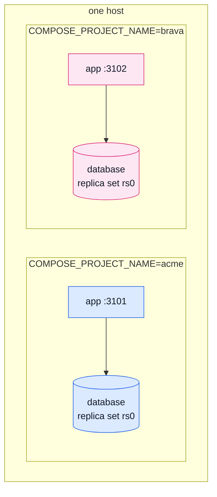

# Two Client Stacks

The silo decision — one client, one stack, one database — is a claim until it is demonstrated. This
page is the demonstration: two independent stacks built and run side by side on the same machine,
from the compose file exactly as shipped.



Every container, network and volume is namespaced by `COMPOSE_PROJECT_NAME` — the two stacks share
nothing, not even a Docker network, unless the [Traefik overlay](#many-clients-behind-one-proxy)
below is layered on to share the proxy.

::: warning Read this alongside the compose files
`docker-compose.production.yml` and `docker-compose.proxy.yml` explain each decision inline. This
page is the walkthrough and the two demonstrations; the compose files are the source of truth.
:::

## Bring up the first stack

```bash
mkdir -p clients/acme
cp .env-example clients/acme/.env   # then set real values
export COMPOSE_PROJECT_NAME=acme
docker compose --env-file "clients/acme/.env" -f docker-compose.production.yml up -d --build
```

One `up -d` brings up everything in the right order — `database`'s own entrypoint generates the
replica set's keyFile, `mongo-rs-init` initiates the set, `setup` runs `db:sync` and
`access:bootstrap` once that succeeds, then `app`/`cron` start.

**A fresh stack has an organisation but no owner** — every signup is a `customer`, on purpose (a
race to be first is a known vulnerability pattern). Sign up through the app once, then:

```bash
docker compose --env-file "clients/acme/.env" -f docker-compose.production.yml \
    exec app npm run access:grant -- you@example.com owner
```

Verified end to end on this exact sequence: signup, the verification email arriving (a local
Mailpit stood in for real SMTP), `access:grant`, login, and a real checkout — all against a stack
that started from nothing.

## Why the database is a replica set of one

**Corrected from an earlier draft**, which claimed a replica set gives "PITR and transactions" —
checked, and neither is quite right:

- **This app uses no transactions** — confirmed, no `startSession`/`withTransaction` anywhere in
  `src/`.
- **`mongodump --oplog` is not point-in-time recovery.** It gives one dump that is consistent
  ACROSS collections while writes keep arriving — real PITR needs continuous oplog capture
  ([Percona Backup for MongoDB](https://docs.percona.com/percona-backup-mongodb/index.html)).

What a replica set of one genuinely buys: MongoDB's own documented production topology, the only
thing `--oplog` or PBM ever build on top of, and a `mongodump` that cannot capture an order without
its payment mid-checkout. Converting a live standalone to a set later is a data-bearing migration;
starting as a set of one is a handful of compose lines.

**The mechanics, verified against this exact compose file:**

- `database` boots `mongod --replSet rs0 --keyFile ...` under a small entrypoint wrapper
  (`docker/mongo-entrypoint.sh`) that generates the keyFile into a named volume on first boot, with
  the ownership mongod actually needs (the image's `mongodb` user, uid 999) — a host-generated,
  bind-mounted keyFile keeps the host's own uid and mongod refuses to read it.
- The existing `docker/mongo-init.js` needed **no change** for this: the official image always
  boots a temporary, flag-stripped standalone to run `docker-entrypoint-initdb.d/*` and create the
  app user, sharing the same data directory the real, replSet-enabled mongod uses afterward.
- The one genuinely new piece is `rs.initiate()` — `docker/mongo-rs-init.sh`, a one-shot service
  that waits for the real mongod, initiates the set, and waits for PRIMARY before exiting.
  `setup` waits on it finishing before `db:sync`/`access:bootstrap` run.

**A dependency-chain lesson, found while building this:** an earlier version generated the keyFile
in its own one-shot service, a sibling `database` depended on. That broke every service depending
on `database` in turn — podman-compose 1.6/libpod refuses to start anything that transitively
requires an already-exited container. Folding the keyFile generation into `database`'s own
entrypoint instead of a separate service removed the dependency chain entirely, and is simpler
besides. Docker Compose itself (what a real host runs) does not have this restriction — it was
found and fixed here because this experiment ran on podman.

## The two demonstrations

**1. An order in `acme` is invisible to `brava`.** With `acme` running and an order placed:

```bash
export COMPOSE_PROJECT_NAME=brava
docker compose --env-file "clients/brava/.env" -f docker-compose.production.yml up -d
curl http://127.0.0.1:3102/products   # {"data":{"items":[],...}} — brava has never heard of acme
```

Verified directly against both databases, not just the API: `acme`'s `users`/`orders` collections
hold the signed-up owner and their order; `brava`'s hold nothing. Two stacks, two databases, zero
shared state.

**2. Deleting `brava` never touches `acme`.**

```bash
docker compose -p brava -f docker-compose.production.yml down -v
curl http://127.0.0.1:3101/products   # acme's product and order are still there
```

Every one of `brava`'s containers and named volumes is gone; `acme` never noticed. This is also the
GDPR-erasure story for a client relationship ending, demonstrated rather than asserted — silo means
"delete a client's data" is one `down -v`, not a query someone has to get right.

## Many clients behind one proxy

The base compose file stays proxy-agnostic — publish `127.0.0.1:${NODE_PORT}` and put any
TLS-terminating proxy in front, same as a single-stack deployment. `docker-compose.proxy.yml` is
the recipe for the case that specifically needs SHARED infrastructure: several client stacks on one
box, fronted by one proxy that discovers each stack automatically.

**Traefik v3**, not Caddy: adding client #11 is "start its stack" — Traefik's Docker provider reads
the new router straight off the container's own labels, nothing central to edit or restart. It is
also k3s's own default ingress controller, so if a fleet of Compose stacks ever outgrows Compose,
the proxy is one part of the stack that carries over unchanged.

```bash
docker network create proxy   # once, per host
export COMPOSE_PROJECT_NAME=acme
docker compose --env-file "clients/acme/.env" \
    -f docker-compose.production.yml -f docker-compose.proxy.yml up -d
```

**Verified structurally, not against a real certificate:** Traefik's Docker-provider discovery was
confirmed live — with `app`'s labels in place, Traefik's own log shows the router it built,
`acme@docker`, with the exact `Host(...)` rule the labels declare. Real ACME issuance needs a
public DNS record and ports 80/443 reachable from Let's Encrypt, neither of which a sandboxed build
environment can offer; on a real host with a real domain this is the same mechanism, just reachable
from the internet.

Two podman-compose 1.6 quirks worth knowing if you run this on podman rather than Docker (a real
Docker host hits neither):

- `ports: !reset []` (drops the loopback publish, since Traefik takes over routing) parses and
  works correctly.
- Referencing the base file's implicit default network by name (`networks: [default, proxy]`)
  needs that network declared explicitly at the top level of the overlay
  (`networks: { default: {} }`) — podman-compose otherwise reports `missing networks: default`.
  Both forms are legal Compose Specification; the second is only needed to work around this one
  tool.

## Where to go next

| You want to                                    | Read                                                             |
| ---------------------------------------------- | ---------------------------------------------------------------- |
| Understand the tenancy model this demonstrates | [Tenancy](../theory/tenancy.md)                                  |
| Back up what a stack holds                     | [Backups](./backups.md)                                          |
| Pick a host that can run this                  | [Hosting](./hosting.md)                                          |
| See every container in the base compose file   | [Docker & Podman](./docker-and-podman.md)                        |
| Run a single stack, start to finish            | [Getting Started — Production](../getting-started-production.md) |
