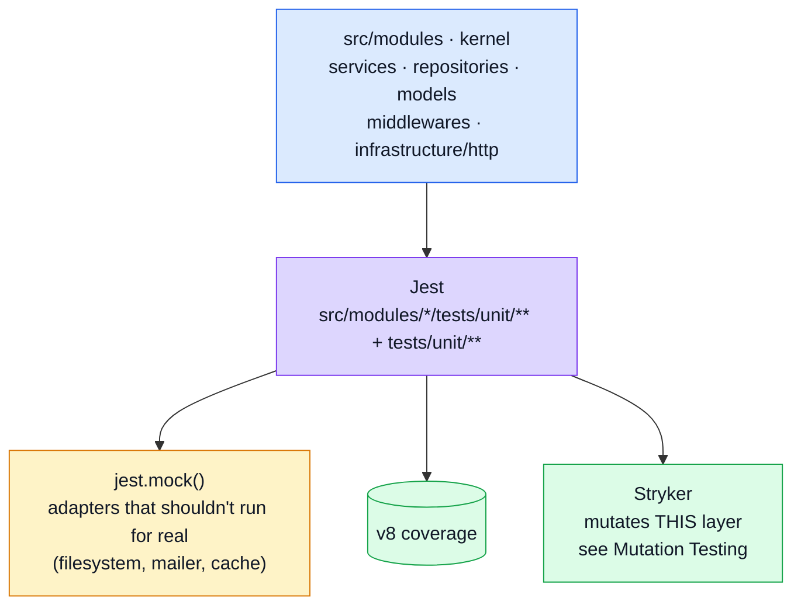

# Unit Testing

The layer that answers: **is this one piece of logic — a service, a repository, a model's validation rule, a middleware — correct on its own?** It's also the layer [Mutation Testing](./mutation-testing.md) mutates, so it's the one place a "test that asserts nothing" gets caught structurally rather than by review.

## Tools

| Tool                                                                          | Role                                                                                                                                                         |
| ----------------------------------------------------------------------------- | ------------------------------------------------------------------------------------------------------------------------------------------------------------ |
| [Jest](https://jestjs.io/) + [ts-jest](https://kulshekhar.github.io/ts-jest/) | Test runner and TypeScript transform                                                                                                                         |
| `jest.mock()`                                                                 | Used selectively — for adapters that shouldn't touch the outside world (filesystem, mailer, cache) or where a dependency's own behaviour is tested elsewhere |

## Where it sits



Notably **not** here: HTTP, or a database, real or in-memory. No unit test sends a request through
Express routing/middleware, and none opens Mongo — both start one layer up, in
[Integration Testing](./integration-testing.md), which is what
`.dependency-cruiser.cjs`'s `unit-layer-stays-database-free` rule and `eslint.config.ts`'s
`no-restricted-imports` block for `tests/unit/**` enforce structurally rather than by review. The
dependency-cruiser rule is the transitive one — it catches a spec that reaches a database through a
helper, which a per-file lint rule and a text sweep both miss.

## Patterns

### Repository / model / service tests belong in Integration Testing, not here

A repository or service test that needs to prove real Mongoose behaviour — schema validation,
defaults, indexes — needs a real (in-memory) MongoDB to do it honestly, and Stryker reruns
`tests/unit` once per mutant: a database connection paid at unit scope is paid thousands of times
over. That trade is [Integration Testing](./integration-testing.md)'s, via `setupTestDb()`; this
layer stays plain functions in, values out.

### Middleware / adapter tests — `jest.mock()` at the module boundary

Where a dependency shouldn't run for real in a unit test (the filesystem, an SMTP client, the cache adapter), it's replaced at the import boundary:

```ts
jest.mock('@infrastructure/adapters/cache', () => ({
    getCacheValue: jest.fn(),
    setCacheValue: jest.fn(),
    invalidateCacheTags: jest.fn()
}));
```

Note what is NOT mocked there: the caching middleware's own TTL clamp and size limit run for real,
because they are the thing under test. Only the Redis round-trip is replaced.

Middleware tests build minimal hand-rolled Express `Request`/`Response` doubles (`jest.fn()` chains for `.set()`/`.status()`/`.json()`) rather than going through `supertest` — that's a deliberate boundary: real HTTP starts at [Contract Testing](./contract-testing.md).

### `tsconfig.jest.json` — why it isn't just `tsconfig.json`

Two deviations, both load-bearing:

- `module`/`moduleResolution: "node16"` — the app imports subpath exports (`@opentelemetry/semantic-conventions/incubating`), which only `node16` resolution understands. Without it, `src/app.ts` can't be imported by a test at all — which is exactly what [Integration Testing](./integration-testing.md) and [Contract Testing](./contract-testing.md) need to do.
- `isolatedModules` is deliberately **not** set, despite ts-jest's own warning asking for it. Setting it stops ts-jest downlevelling `await import(...)` to `require()`, and a dynamic import in `src/modules/products/tests/unit/service.test.ts` would fail under Jest's CJS VM. The warning is noise; fixing it would not be.

This second point is also why `@faker-js/faker` (ESM-only from v10) can't be imported directly anywhere in this suite — see [Contract-Derived Request Data](./contract-request-data.md) for where that was tried and what was used instead.

## File map

| Path                                                              | Contents                                                                                            |
| ----------------------------------------------------------------- | --------------------------------------------------------------------------------------------------- |
| `src/modules/<name>/tests/unit/**`                                | One domain: its service, repository, model, validation and factory                                  |
| `src/modules/<name>/tests/contract/**`                            | That domain's endpoints against `openapi.yaml`                                                      |
| `tests/cross-cutting/**`                                          | Properties asserted of EVERY module at once — sweeps, and the shared persistence and i18n substrate |
| `tests/unit/middlewares/**`                                       | Cache, request logging                                                                              |
| `tests/unit/infrastructure/**`                                    | Adapters (cache, logger, mailer, queue), HTTP helpers, observability                                |
| `tests/unit/kernel/**`                                            | The module registry and the domain event bus                                                        |
| `tests/unit/jobs/**`, `tests/unit/db/**`, `tests/unit/scripts/**` | Scheduled jobs, the migration/seed runner, the repo-hygiene scripts                                 |
| `tests/support/**`                                                | Harness and helpers — never collected as specs                                                      |
| `tests/support/factories/*`                                       | `makeX()`/`createX()` pairs per entity                                                              |
| `tests/support/setup-test-db.ts`, `tests/support/database.ts`     | The `mongodb-memory-server` lifecycle                                                               |
| `tests/support/setup.ts`                                          | Global Jest setup (rate-limit override, i18next init, system-mongod detection)                      |
| `tsconfig.jest.json`                                              | The Jest-specific TypeScript config, see above                                                      |
| `jest.config.js`                                                  | `testMatch`, path aliases, `setupFiles`                                                             |

## Commands

| Command                      | Effect                                    |
| ---------------------------- | ----------------------------------------- |
| `npm run test:unit`          | Full unit suite                           |
| `npm run test:unit:coverage` | Same, with the unit-layer coverage floors |
| `npx jest <path>`            | One file, for fast iteration              |

::: warning Coverage here is a proxy, not the verdict
Every test must pass — one failure is a red build, with no threshold on that. Coverage is a separate
and weaker number: it reports which lines a suite EXECUTED, and a line can be executed by a test
that asserts nothing about it.

**[Mutation testing](./mutation-testing.md) is the instrument that judges this suite's quality** —
it changes the code and checks a test goes red. An uncovered line cannot kill a mutant, so mutation
score subsumes coverage; coverage is kept because it runs in seconds.

A service reporting 37% on this run is not 63% broken and not 63% untested — it is covered by the
integration suite, which this run does not execute. See
[Tests → Three numbers](../reference/tests.md#three-numbers-and-they-are-not-the-same-question).
:::

## Related pages

- [Testing](./testing-and-docs.md) — suite overview
- [Integration Testing](./integration-testing.md) — the same `src/app.ts`, driven over real HTTP
- [Contract Testing](./contract-testing.md) — response shape vs `openapi.yaml`
- [Mutation Testing](./mutation-testing.md) — mutates this layer's source and checks these tests notice
