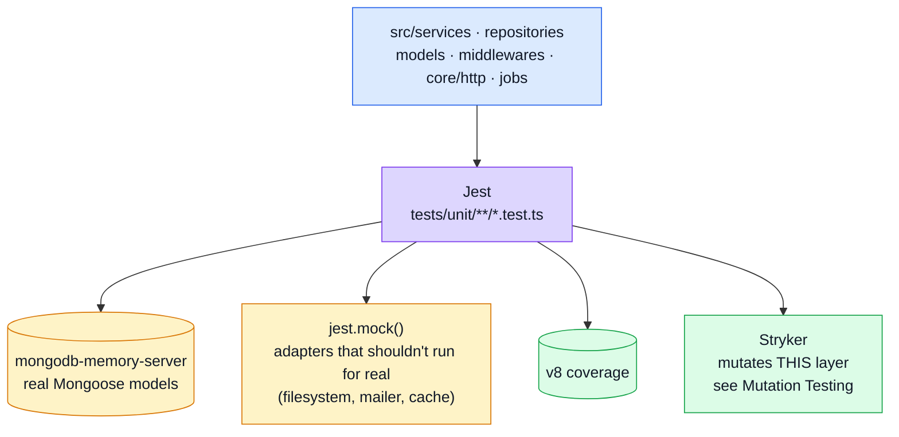

# Unit Testing

The layer that answers: **is this one piece of logic — a service, a repository, a model's validation rule, a middleware — correct on its own?** It's also the layer [Mutation Testing](./mutation-testing.md) mutates, so it's the one place a "test that asserts nothing" gets caught structurally rather than by review.

## Tools

| Tool                                                                          | Role                                                                                                                                                         |
| ----------------------------------------------------------------------------- | ------------------------------------------------------------------------------------------------------------------------------------------------------------ |
| [Jest](https://jestjs.io/) + [ts-jest](https://kulshekhar.github.io/ts-jest/) | Test runner and TypeScript transform                                                                                                                         |
| [mongodb-memory-server](https://nodkz.github.io/mongodb-memory-server/)       | A real, in-memory MongoDB — most "unit" tests here talk to real Mongoose models, not a mocked driver                                                         |
| `jest.mock()`                                                                 | Used selectively — for adapters that shouldn't touch the outside world (filesystem, mailer, cache) or where a dependency's own behaviour is tested elsewhere |

## Where it sits



Notably **not** here: HTTP. No test in `tests/unit/` sends a request through Express routing/middleware — that starts one layer up, in [Contract Testing](./contract-testing.md) and [Integration Testing](./integration-testing.md), both of which drive the real `src/app.ts` via `supertest`.

## Patterns

### Repository / model / service tests — real in-memory Mongo, no driver mock

Most of this suite talks to an actual (in-memory) MongoDB rather than a mocked Mongoose model. `tests/helpers/setup-test-db.ts` wires the lifecycle:

```ts
export const setupTestDb = () => {
    beforeAll(connect); // starts mongodb-memory-server, mongoose.connect()
    afterAll(disconnect); // drops the DB, closes the connection, stops the server
    beforeEach(clearAll); // empties every collection between tests
};
```

```ts
import { setupTestDb } from '../../helpers/setup-test-db';
import { makeProduct, createProduct } from '../../helpers/factories/products';

setupTestDb();

describe('productRepository.create', () => {
    it('inserts a new product and returns the Mongoose document', async () => {
        const product = await productRepository.create(makeProduct());
        expect(product._id).toBeDefined();
    });
});
```

The trade-off this buys: a repository/service test here genuinely exercises Mongoose schema validation, defaults and indexes — the things a stubbed driver would silently let through. `tests/helpers/factories/{users,products,orders}.ts` supply `makeX()` (plain payload) / `createX()` (persisted document) pairs so most tests only override the one or two fields the scenario cares about.

### Middleware / adapter tests — `jest.mock()` at the module boundary

Where a dependency shouldn't run for real in a unit test (the filesystem, an SMTP client, the cache adapter), it's replaced at the import boundary:

```ts
jest.mock('@core/adapters/cache', () => ({
    getCacheValue: jest.fn(),
    setCacheValue: jest.fn(),
    // Identity by default — the TTL-clamping behaviour itself is tested against the
    // real implementation in core/adapters/cache.test.ts, not re-verified here.
    resolveCacheTtl: jest.fn((seconds: number) => seconds)
}));
```

Middleware tests build minimal hand-rolled Express `Request`/`Response` doubles (`jest.fn()` chains for `.set()`/`.status()`/`.json()`) rather than going through `supertest` — that's a deliberate boundary: real HTTP starts at [Contract Testing](./contract-testing.md).

### `tsconfig.jest.json` — why it isn't just `tsconfig.json`

Two deviations, both load-bearing:

- `module`/`moduleResolution: "node16"` — the app imports subpath exports (`@opentelemetry/semantic-conventions/incubating`), which only `node16` resolution understands. Without it, `src/app.ts` can't be imported by a test at all — which is exactly what [Integration Testing](./integration-testing.md) and [Contract Testing](./contract-testing.md) need to do.
- `isolatedModules` is deliberately **not** set, despite ts-jest's own warning asking for it. Setting it stops ts-jest downlevelling `await import(...)` to `require()`, and a dynamic import in `tests/unit/services/products.test.ts` would fail under Jest's CJS VM. The warning is noise; fixing it would not be.

This second point is also why `@faker-js/faker` (ESM-only from v10) can't be imported directly anywhere in this suite — see [Contract-Derived Request Data](./contract-request-data.md) for where that was tried and what was used instead.

## File map

| Path                                                          | Contents                                                                         |
| ------------------------------------------------------------- | -------------------------------------------------------------------------------- |
| `tests/unit/services/**`                                      | Business logic — validation, search/filter rules, role scoping                   |
| `tests/unit/repositories/**`                                  | Mongoose query wrappers                                                          |
| `tests/unit/models/**`                                        | Schema validation, serialization transforms (`_id` → `id`, credential stripping) |
| `tests/unit/middlewares/**`                                   | Cache, request logging                                                           |
| `tests/unit/core/**`                                          | Adapters (cache, logger, mailer, queue), HTTP helpers, observability             |
| `tests/unit/controllers/**`                                   | A handful of controllers tested directly rather than through HTTP                |
| `tests/unit/jobs/**`, `tests/unit/db/**`                      | Scheduled jobs, the migration/seed runner                                        |
| `tests/helpers/factories/*`                                   | `makeX()`/`createX()` pairs per entity                                           |
| `tests/helpers/setup-test-db.ts`, `tests/helpers/database.ts` | The `mongodb-memory-server` lifecycle                                            |
| `tests/helpers/setup.ts`                                      | Global Jest setup (rate-limit override, i18next init, system-mongod detection)   |
| `tsconfig.jest.json`                                          | The Jest-specific TypeScript config, see above                                   |
| `jest.config.js`                                              | `testMatch`, path aliases, `setupFiles`                                          |

## Commands

| Command                      | Effect                                 |
| ---------------------------- | -------------------------------------- |
| `npm run test:unit`          | Full unit suite                        |
| `npm run test:unit:coverage` | Same, with coverage                    |
| `npm run test:unit:target`   | One hardcoded file, for fast iteration |

## Related pages

- [Testing](./testing-and-docs.md) — suite overview
- [Integration Testing](./integration-testing.md) — the same `src/app.ts`, driven over real HTTP
- [Contract Testing](./contract-testing.md) — response shape vs `openapi.yaml`
- [Mutation Testing](./mutation-testing.md) — mutates this layer's source and checks these tests notice
