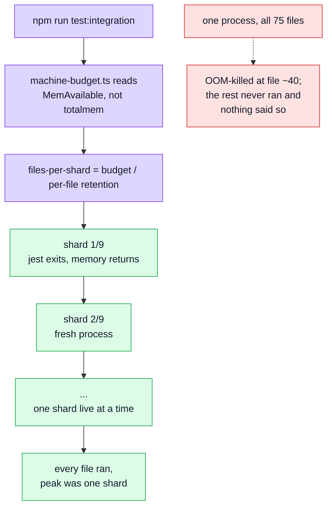

# Weak Machines

Every other page here assumes the suite fits. This one is about the machine where it doesn't — a
laptop with 14 GB and no swap, a small CI container, a dev box already running the docker stack.

The failure is quiet, which is what makes it worth a page. A jest worker that is OOM-killed
mid-file does not print "out of memory": the run reports the files that finished, exits non-zero
somewhere unrelated, and the missing assertions look like they passed. **A suite that is too big
for its machine reports green while measuring less than it claims.**

## Start here — the two mechanisms

Nothing here changes what a test asserts. Two separate knobs, for two separate resources:

| Mechanism       | Bounds       | Where it lives                                       | Costs you       |
| --------------- | ------------ | ---------------------------------------------------- | --------------- |
| **Sharding**    | memory       | `scripts/testing/run-suite.ts` + `machine-budget.ts` | wall-clock time |
| **Depth knobs** | time, memory | `tests/support/knobs.ts`, read from `.env`           | rigour          |

Sharding is free in the sense that matters — it runs exactly the same tests, just not all in one
process. Turning a depth knob down is not free: the suite asks fewer questions. Reach for the
first before the second.

## Why shards and not a bigger heap

Jest gives every test file a fresh module registry, but the **process** keeps what that registry
allocated — measured at roughly 70 MB per file. Over the integration layer's ~75 files that is
~5 GB of retention in one process, and the run dies long before the last file.

`--max-old-space-size` moves the ceiling; it does not stop the climb. A process that **exits**
every N files does, and `--shard` is jest's own way to say which N.



**`MemAvailable`, not `totalmem`.** The earlier heuristic multiplied total RAM by a core count; on
a 15 GB machine with 6.6 GB actually free it authorised eleven workers at ~905 MB each, and the OOM
killer took them mid-run while every test still reported passing. What is free now is the only
number that predicts whether the next worker survives.

**Sharding only starts where the machine runs out.** The per-shard size is the budget, capped by a
guard rail (`MAX_SHARD_PEAK_MB`, 8 GB) that exists only to stop a momentarily-idle machine sizing
one enormous shard it cannot sustain an hour later. The rail sits high on purpose: 8 GB is ~101
files per shard, more than any layer here holds, so a machine with real headroom runs the layer in
**one** shard, `--shard` is never passed, and the run is exactly what it always was.

| Machine                                 | files/shard | integration shards | sharding cost     |
| --------------------------------------- | ----------- | ------------------ | ----------------- |
| roomy box, several GB spare             | ~101        | **1**              | none              |
| this one, unpinned (6.6 GB free)        | ~50         | 2                  | one extra boot    |
| this one, `JEST_PROCESS_BUDGET_MB=2600` | ~21         | 4                  | three extra boots |

A constrained machine does not rely on the rail — it sets `JEST_PROCESS_BUDGET_MB` below it. 2600 is
the figure measured green here: 19 files in one in-band shard peaked at 2407 MB RSS and passed,
where all 75 in one process reached Node's heap ceiling and died at 448 s.

## Why in-band inside a shard

`integration`, `contract` and `fuzz` keep `--runInBand` within their shard. They share one
in-memory mongod and were written against one-file-at-a-time execution.

`--workerIdleMemoryLimit` set **below** a worker's steady-state baseline is worse than the problem
it solves: jest finds every worker over budget the moment it goes idle and restarts it after every
single file. The limit belongs above the baseline, as a backstop for a leak, not as a routine.

## The depth knobs

All four are read in `tests/support/knobs.ts` and promoted from `.env` by `jest.config.js` — an
allowlist, never a wholesale merge, so a live rate limit in `.env` can never reach a worker.
Nothing under `src/` reads them: **a knob changes what a suite asks, never what the code answers.**

| Knob                    | Default | Floor | Costs one                              |
| ----------------------- | ------- | ----- | -------------------------------------- |
| `TEST_PROPERTY_RUNS`    | 300     | 10    | function call — cheap, turn this first |
| `TEST_PROPERTY_RUNS_DB` | 40      | 5     | sequence of writes against Mongo       |
| `TEST_FUZZ_RUNS`        | 12      | 1     | HTTP request against a real database   |
| `TEST_RACE_SIZE`        | 10      | 2     | simultaneous in-flight request         |

Each has a floor because a vacuous suite is worse than a slow one: `numRuns: 0` and a race of one
both pass by construction. Nonsense reads as unset rather than as zero, so a typo gets the
documented default instead of silent green.

`TEST_RACE_SIZE` only goes **down** usefully. `tests/support/setup.ts` raises the auth limiters to
1000 under test, so there is no ceiling to hit on the way up — only more simultaneous requests and
DB writes for a machine that may not have the memory to spare.

## What does not fit, at any setting

Mutation testing. Sharding and depth knobs do not rescue it, and it is better to know that than to
leave a run going overnight.

Measured on a 14 GB / 16-core machine with no swap:

| Run                                  | Result                                                    |
| ------------------------------------ | --------------------------------------------------------- |
| Standard scope, full                 | 14,297 mutants at 2–3/min ≈ **42 h**                      |
| Deep scope, one line-packed shard    | 403 mutants at ~150 s each ≈ **15 h**                     |
| Deep scope, dry run                  | 12–15 min, and OOMs on a widely-imported `--mutate`       |
| Standard scope, 10 well-tested files | 626 mutants, **completes** — this is the shape that works |

Three things make mutation different in kind from the test layers:

- **The dry run is indivisible.** It executes the whole related-test closure in one process to
  build the per-test coverage map. It cannot be sharded, and it is where the deep scope OOMs.
- **Fewer files is not cheaper.** With `enableFindRelatedTests`, cost follows the _related-test
  closure_, not the file count. Five files under `src/infrastructure/runtime` pull in more of the
  suite than thirteen scattered ones, because everything imports them.
- **A killed run yields nothing.** Stryker writes its JSON at the end, so a `timeout` produces no
  partial report — unlike a killed jest shard, which at least tells you which files passed.

On a machine this size, scope mutation runs by **what completes**, not by what fits a line budget.
See [Mutation Testing](./mutation-testing.md) for the scoping itself, and
[Coverage & Confidence](./coverage-and-confidence.md) for what the resulting numbers are worth.

## Recipes

```bash
# Let the runner size itself — the default, and usually right.
npm run test:integration

# Pin it, when the runner's guess is wrong for this box.
JEST_SHARDS=12 npm run test:integration
JEST_WORKERS=1 npx jest path/to/one.test.ts

# Give a layer a night's rigour instead of a minute's.
TEST_PROPERTY_RUNS=5000 npm run test:unit

# Make the generative layers fit a very small machine.
TEST_FUZZ_RUNS=3 TEST_PROPERTY_RUNS_DB=10 npm run test:fuzz
```

`JEST_WORKERS` and `JEST_WORKER_MEMORY_MB` also work from `.env`, and a real environment variable
always beats the file — so a one-off run goes lower without editing anything.

## Related

- [Testing — Quick Start](./testing-quickstart.md) — what to run day to day
- [Integration Testing](./integration-testing.md) — the layer that needs this most
- [Property Testing](./property-testing.md) and [Fuzz Testing](./fuzz-testing.md) — what the depth
  knobs are turning down
- [Mutation Testing](./mutation-testing.md) — the run that does not fit
