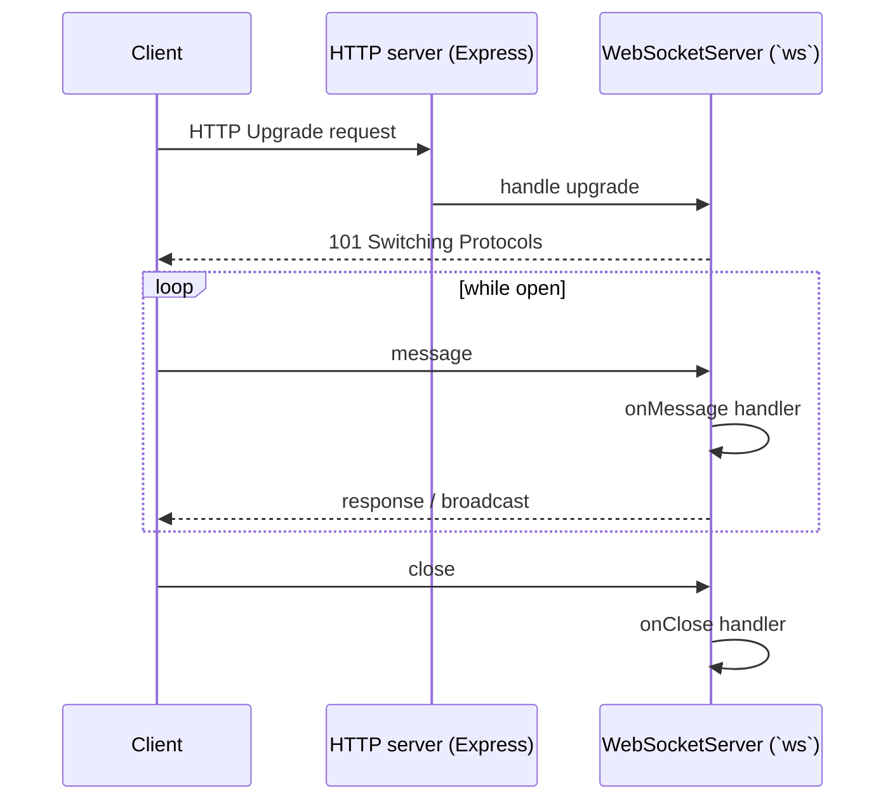

# WebSockets

The boilerplate exposes a tiny WebSocket example so the same Node process can serve both REST and real-time traffic.
It is **opt-in** scaffolding, not a production messaging stack.

## Where the code lives

| Concern                  | File                              |
| ------------------------ | --------------------------------- |
| Server setup + lifecycle | `src/utils/helpers-websockets.ts` |
| Chat lifecycle + state   | `src/utils/realtime-chat.ts`      |
| Event contracts          | `src/types/asyncapi.ts`           |
| Upgrade handler          | `src/routes/websocket.ts`         |

The implementation is built on the [`ws`](https://github.com/websockets/ws) library — the same one most Node WebSocket frameworks build on top of.

## Lifecycle



`setupWebSocketServer` accepts `connectionCallback`, `onMessage`, and `onClose` so the route file only describes what it wants to happen at each step.

## Chat example contract (`/ws/chat`)

Client -> server events:

- `chat:join` `{ username, room?: "general" }`
- `chat:message:send` `{ message }`

Server -> client events:

- `chat:joined` `{ username, room }`
- `chat:message` `{ id, username, room, message, timestamp }`
- `chat:presence` `{ room, users }`
- `chat:system` `{ message, room, timestamp }`
- `chat:error` `{ message }`

The room is in-memory only and defaults to `general`.

## Quick standalone test example

Below is a self-contained example that spins up a WebSocket server and client in the same process.
It was formerly shipped as a dev-only controller (`GET /websocket-test`) but belongs here as a learning reference.

```typescript
import type { Request, Response } from 'express';
import { setupWebSocketServer, setupWebSocketClient } from '@utils/helpers-websockets';
import { logger } from '@utils/winston';

export const getWebsocketTest = (request: Request, response: Response) => {
    const port = process.env.WEBSOCKET_PORT ? Number.parseInt(process.env.WEBSOCKET_PORT) : 3001;
    const url = `ws://localhost:${port}`;

    // Create a WebSocket server
    const wss = setupWebSocketServer({
        port,
        connectionCallback: () => logger.info('SERVER: created'),
        onMessage: (ws, message) => {
            logger.info(
                'SERVER: Client message received',
                message instanceof Buffer ? message.toString() : message
            );
            ws.send('We received your message!');
        },
        onClose: (ws, code, reason) =>
            logger.info(
                `SERVER: connection closed: ${code}`,
                reason instanceof Buffer ? reason.toString() : reason
            )
    });

    logger.info(`SERVER: running on ${url}`);

    // Create a WebSocket client after 1 second (to ensure that server started)
    setTimeout(() => {
        const ws = setupWebSocketClient(url, {
            onOpen: (ws) => {
                logger.info('CLIENT: connected to server');
                ws.send('Hello Server!');
            },
            onMessage: (ws, message) =>
                logger.info('CLIENT: Server message received', message.data),
            onClose: (ws, code, reason) =>
                logger.info(`CLIENT: connection closed: ${code}`, reason)
        });

        // Close the client after 2 seconds
        setTimeout(() => ws.close(1000, 'Test complete'), 2000);
    }, 1000);

    setTimeout(() => wss.close(() => logger.info('SERVER: closed')), 4000);

    response.status(200).json({
        success: true,
        message: 'Websocket test initiated'
    });
};
```

## Production notes

- **Clustering**: WebSocket connections are sticky to the worker that accepted them. If you run with `NODE_ENABLE_CLUSTERING=1` you need a sticky-session reverse proxy (NGINX, HAProxy, Envoy) or a pub/sub backplane (Redis pub/sub, NATS, …) to fan out messages between workers.
- **Auth**: the demo skips authentication. In real use, validate cookies/JWT during the HTTP upgrade.
- **Backpressure**: check `client.readyState === WebSocket.OPEN` before sending (the demo does this) and consider `bufferedAmount` for high-throughput streams.

## Useful links

- [`ws` documentation](https://github.com/websockets/ws#readme)
- [`ws` API reference](https://github.com/websockets/ws/blob/master/doc/ws.md)
- [MDN — WebSockets API](https://developer.mozilla.org/en-US/docs/Web/API/WebSockets_API)
- [RFC 6455 — The WebSocket Protocol](https://www.rfc-editor.org/rfc/rfc6455)
- [Scaling WebSockets with Redis pub/sub](https://redis.io/docs/latest/develop/interact/pubsub/)

## Related pages

- [Runtime](./runtime.md)
- [Clustering & graceful shutdown](../theory/clustering.md)
- [Security](./security.md)
