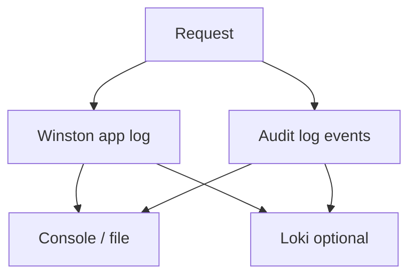

# Winston & Audit Logs

## What this page covers

This repo uses Winston for structured logs and also keeps a separate audit-oriented log stream.
When Loki is configured, those logs can be shipped out centrally.

## Logging stack

| Tool | Job |
| --- | --- |
| Winston | structured application logs |
| winston-loki | optional log shipping to Loki |
| audit logger | dedicated stream for security/admin events |

## Logging visual

## Why split logs this way

- normal app logs help with debugging,
- audit logs help with security/compliance/admin trails,
- Loki shipping is optional, not mandatory.

## Related pages

- [Grafana](./grafana.md)
- [Prometheus](./prometheus.md)
- [OpenTelemetry](./opentelemetry.md)
